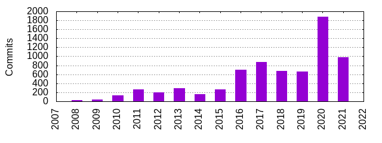
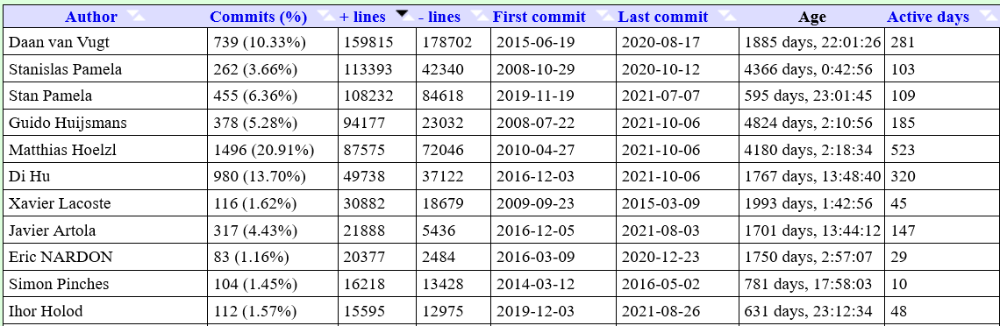
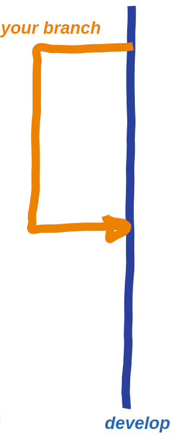
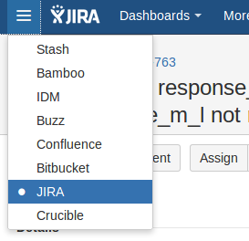
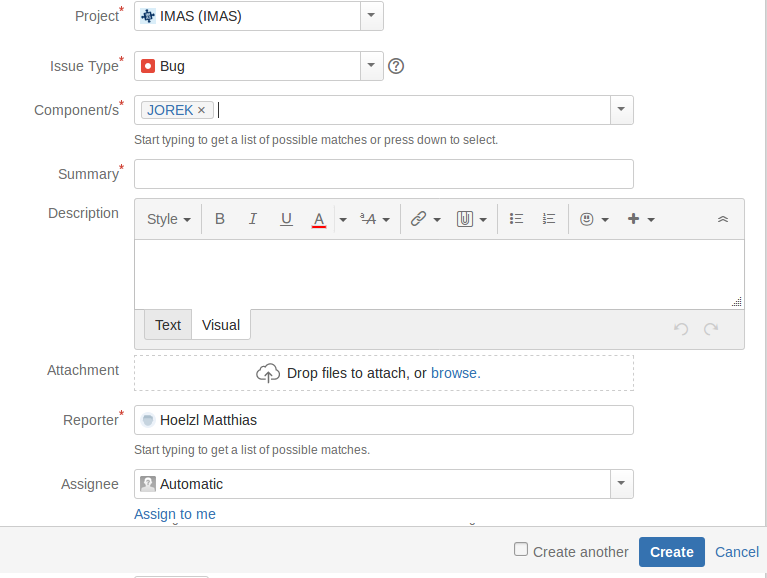
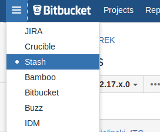
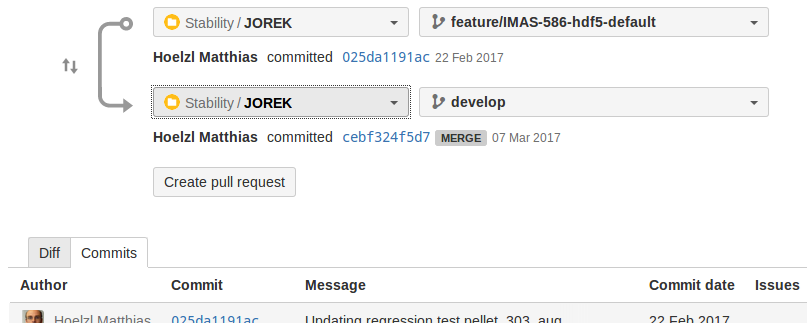
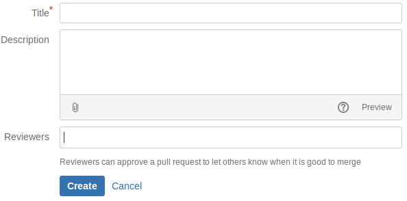

# Overview of the JOREK code development

**Date:** 10/2021  
**Author:** M. Hoelzl for the core developers team  
**Source PDF:** [2021-10-mhoelzl-development-workflow.pdf](assets/2021-10-mhoelzl-development-workflow.pdf)

## Outline

- **Why discuss this?**
- Git statistics
- The development workflow
- Recent changes
- Discussion

## Why discuss this?

- JOREK is very flexible and our research interests are expanding quickly. The code will keep evolving and never be "finished".
- Even a "pure user" might have to report or fix a bug, implement a new diagnostics, etc.
- The code license requires you to commit your own changes to the repository.
- You should be aware what changes are implemented by others.
- Coordination is crucial with so many developers and users!

## Present situation

- Large community
- Users and developers - many of course both
- Many code developments in parallel - smaller and larger
- Variety of physics models
- Many different extensions: two-fluid, neoclassical flows, double X-point, resistive wall, pellet, bootstrap current, TG stabilization, particles, runaway electrons, etc ...
- Various code applications and diagnostics

- Types of possible problems:

    - Not compiling or crashing in a reproducible way (relatively easy to catch)
    - Chaotic structure hindering further development
    - But the worst are wrong or irreproducible results!!!

## Our aim should be that...

We quickly integrate new changes. 

while we also ensure that:

- No development breaks any application.
- The code structure remains clean.

while we 

- Keep things as simple as possible for everybody involved.

## How to get there?

- Avoid unnecessary changes and bad solutions.
    - Read the coding/committing guidelines.
    - Discuss developments already before starting.
    - Review and refine carefully.
    - Stay informed via developers meetings / release notes, Wiki, and mailing list.
- Test "everything" and "always" automatically.

## Outline

- Why discuss this?
- **Git statistics**
- The development workflow
- Recent changes
- Discussion

## A few statistics (gitstats)

Disclaimer: these are of course only very rough "metrics" to be taken with care.

- Age: 4825 days (~13 years)
- Total lines of code: 333k (200k in 01/2020)
- Total commits: 7154 (40% of this in 2020/21!)
- Authors: 83 (a bit of double counting)

### Figures





## Outline

- Why discuss this?
- Git statistics
- **The development workflow**
- Recent changes
- Discussion

## What are the "tools"?

- **Jira** allows to discuss all sorts of "issues" before implementing, e.g., bugs, planned developments etc.
- **Stash** handles branches, pull requests and code reviewing.
- **Bamboo** runs regression tests whenever changes are pushed to the repository.
- **JOREK Wiki** contains documentation etc.
- **Mailing list** `everyone@jorek.eu` with release notes etc.

## Step by step development workflow

- Describe the issue.
  - Bug
  - Feature
  - Improvement
  - Problem
  - ...
- Implement the solution in a branch (with automatic tests).
- Refine solution with reviewers.
- Merge into main development branch `develop`.

### Figures


## 1) Create an "issue" and a branch

- For each bug or planned development, create a "JIRA issue", even if it is unclear who will fix the bug.
    - Unique number like "IMAS-8888"
    - Select type of Issue
    - Summary and detailed description
    - Mention people via `@name` to discuss the issue
    - Assign to yourself or somebody else
    - Created `bugfix/*` or `feature/*` branch based on `develop` (directly from JIRA)
    - Important: For each "item", create a separate issue and branch. Changes are otherwise very hard to review.

### Figures





## 2) Implement, commit and push your solution

- Check out branch:

```bash
git pull
git checkout your-branch-name
```

- Implement your changes and test locally.
- Get changes of others in case several people work on the branch (may require a `git stash` and `git stash apply`; may need to fix conflicts):

```bash
git pull
```

- Push changes to the repository:

```bash
git status      # which files were modified?
git diff        # which changes have I made?
git add <modified files>
git commit -m "Description of changes"
git push
```

- Automatic tests are carried out upon each push.

## What is automatically tested?

- Compile tests for main code and diagnostics for all physics models (also with `gfortran`)
- Unit tests not yet used much except for particles
- Main tests for many models and extensions:
  - Restart simulation in the non-linear phase
  - Just a single time step
  - Compare results with a specific accuracy

Missing:

- Some models, extensions, parameters
- Diagnostics
- ...

## How to avoid running too many tests?

The large number of regression tests we have implies that we need to wait long if we push too many things at the same time, thus best is to:

- Run some regression tests manually already before pushing (e.g., for the model you changed)
- Push several commits as a group if possible (regtests run only once for the whole push)

## 3) Raise pull request and refine

- In "Stash", select "Branches" on the left and click onto your branch.
- Create pull request into `develop`.
- Put self-explanatory title.
- Brief description of changes (understandable!)
- At least two reviewers:
  - Should know the relevant parts of the code well
  - At least one from a different lab
- Iterate with reviewers to final solution.
- Reviewers "approve" finally.

### Figures







## 4) Merge into develop

- During the reviewing, a "moderator" from the core developers team typically coordinates and may ask you to:
  - Document changes in the Wiki
  - Update with respect to `develop` (and resolve conflicts)
  - Involve additional reviewers
  - ...
- When reviewers have approved, the pull request is merged by a "gate keeper" (Matthias, Javier, Guido or Stan) into `develop`.

## 5) Release versions

- We produce a release version of the code every one to two months typically.
- You can find the release versions and the associated lists of changes in the Wiki:
  - <https://www.jorek.eu/wiki/doku.php?id=code_releases>
- It is very easy to go back to such a (hopefully) stable version for testing, when you encounter a problem.

## Larger developments

- Jira issue, discuss here first (highly recommended)
- Create branch
- Implement some part of the solution
- Pull changes from other developers - conflicts!
- Commit and push
- Merge in changes from `develop` - conflicts! (regularly for a long-lived branch)
- Raise pull request

## Why to merge in changes from develop regularly?

- In case of large developments which take months to complete, conflicts can accumulate over time. It is then very hard to resolve all of them in the end.
- Additionally, your development may profit from other changes done in the meantime.
- Thus, for large developments, it is a good idea to regularly do:

```bash
git checkout develop
git pull
git checkout <your branch>
git merge develop
```

## What is a conflict?

- When another developer changes the code in parallel to yourself, git usually does a great job creating a common version including all changes.
- That even works if the same file is modified by two developers.
- However, if two developers change the same lines, an automatic merge of changes is not possible any more such that conflicts appear, e.g., when you merge in changes from `develop`.

## How to resolve a conflict?

- When a conflict appears, git prints a warning message.
- `git status` shows you which files have conflicts.
- In the files, you find the conflicting regions marked:

```text
<<<<<<<
the remote version
=======
your local version
>>>>>>>
```

- Replace such marked parts by appropriate code.
- By `git add <file>`, you mark the conflict resolved.
- Finally, you commit the merge, e.g.:

```bash
git commit -m "merge in changes from develop"
```

## Your help is needed!

- Report problems in JIRA and mention persons that should know about the issue using `@name`
- Raise pull requests for small problems you fixed, and new features or diagnostics you implemented
- Review and help refine pull requests
- Improve documentation

## Outline

- Why discuss this?
- Git statistics
- The development workflow
- **Recent changes**
- Discussion

## Recent changes in our development organization?

We established a core development team (`jorek-dev@jorek.eu`):

- Attempts to coordinate the code development
- Meets every 1-2 months to exchange information and take decisions
- Members: Eric Nardon, Guido Huijsmans, Di Hu, Ihor Holod, Javier Artola, Matthias Hoelzl, Nina Schwarz, SangKyeun Kim, Stanislas Pamela, Nicola Isernia

We established a small group of gate keepers:

- Perform final checks and merge pull requests
- Members: Matthias Hoelzl, Javier Artola, Stanislas Pamela, Guido Huijsmans

Besides the JOREK repository, there is also a STARWALL and a CARIDDI_J repository. These are operated similarly, but with less tests etc. due to the smaller number of developers.

## Recent changes in the code?

At each core developers meeting, we create a new release version (for JOREK & STARWALL; now also CARIDDI_J).

The wiki pages of the meetings summarize recent code changes and additional discussions:

- Jun 1st
- Jul 2nd
- Aug 6th
- Oct 8th

## One particular highlight: Model family 600

Previously: One model per application 199, 303, 307, 333, 401, 500, 501, 502, ...

- Huge redundancy.
- Big risk of inconsistencies.

New: One model family 600 with many options:

```bash
./util/config.sh model=600 with_vpar=.true. with_TiTe=.true. with_neutrals=.true. n_tor=...
```

- Ready for production! (old models to be removed eventually)
- Replaces models 199, 303, 333, 401, 500 already.
- New combinations, e.g., neutrals and two temperature.
- Impurities following very soon.
- Please let us know about your experience with model 600!

## We merged more than 80 pull requests since the last general meeting. Some "highlights" (1)

Disclaimer: not all authors of a pull request mentioned here.

- Particle-fluid coupling (Guido); partly documented in PhD thesis of Daan & Anastasia
- Reduced MHD "model family" 600:
  - Model family infrastructure + model 600 option for `vpar` (Matthias)
  - Option for two temperatures in `model600` (Andres, Matthias, Javier)
  - Option for fluid neutrals in `model600` (Javier)
  - Changing boundary conditions in the input file (Javier)
  - Coming up soon:
    - Conservative momentum equation `d(rho v)/dt`
    - Fluid impurities (like 501/502)
    - Runaway electron fluid
    - ...
- Full MHD model 712 with separate `Te` and `Ti` + fluid neutrals (Stan)
  - See Stan's article on the present state of the full MHD models
  - Coming up soon:
    - Model family 800 combining the 7XX models into one
    - Fluid impurities
    - ...

## We merged more than 80 pull requests since the last general meeting. Some "highlights" (2)

Disclaimer: not all authors of a pull request mentioned here.

- Preconditioner with mode groups (Ihor)
  - See the article published by Ihor and the Wiki documentation
  - Combine several harmonics in a preconditioner block
  - Captures some non-linear interactions and improves convergence
- Impurity model 502 with separate `Te` and `Ti` (Di)
- Newton method for the Grad-Shafranov equilibrium (Javier)
- Vacuum field and wall force diagnostics (Javier)
- Improved regression test framework (Matthias, Verena, Ihor)
- Consistent 3D coils in STARWALL (Verena, Nina, Javier, Matthias): 1, 2, 3
- Improved JOREK-STARWALL parallelization (Matthias)
- Double X-point grid for both signs of the plasma current (SangJun)
- [Stellarators extension (branch) benchmarked for simple cases (Nikita et al)]
- ...

## Do things work?

Yes:

- We get quite a few things merged.
- We detect many problems before merging.
- Due to the recent creation of a core development team and a group of "gate keepers", pull requests get merged a bit quicker than before.

No:

- A few important bugs have slipped through.
- People find problems without reporting them.
- Some pull requests remain in a "NOT READY" state for a long time.
- Regression tests are presently slow, but already improved a bit.

## Outline

- Why discuss this?
- Git statistics
- The development workflow
- Recent changes
- **Discussion**

## Discussion

- Do you have comments on how our code development is going and what could be improved?
- Do you have concrete questions for how certain aspects of the code development work or should be done?
- Do you have questions on concrete developments you have planned or already started?
- Anything to discuss about "NOT READY" pull requests?
- ...
