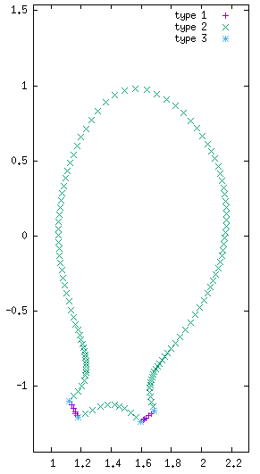

## Types of boundary conditions

* **Dirichlet:** The variable's value is kept constant over time (e.g. $\rho=cte$ or $\delta\rho = 0$)

* **Natural:** A condition on the variable's normal derivative through a boundary integral term (e.g. $\nabla T\cdot\mathbf{n} = c T$). The implementation is explained in the [JOREK overview article](https://doi.org/10.1088/1741-4326/abf99f) section 2.3.2. See also an example in "[sheath boundary conditions for the heat-flux](./sheath_heatflux_bc.md)"

* **Special conditions:** Special conditions can be applied to some variables. For example we typically set the parallel velocity to be the sound speed ($v_\parallel=c_s$) in the divertor region (the Mach=1 condition).

* **No explicit conditions:** We can choose not to apply any boundary condition for the variable. For some variables this can cause the code to crash since the system is not determined (e.g. for $\psi$). However there are variables in which not applying explicitly a condition determines implicitly another one. For example for $\rho$ and $T$ not applying any condition directly implies that ($\nabla T\cdot\mathbf{n} = 0$ and $\nabla \rho\cdot\mathbf{n} = 0$), since is equivalent to implement a boundary term that is 0.

## Types of boundaries (boundary type indices)

The JOREK boundary can be separated into different parts, for example the divertor targets (with finite $\mathbf{B}\cdot\mathbf{n}$) and the boundary which is aligned with the magnetic field ($\mathbf{B}\cdot\mathbf{n}=0$). To apply boundary conditions in different boundary regions, such regions are labeled with a "boundary type". This labeling depends on the grid that you choose, see below some examples (not complete)

* **Polar grid** (grid_polar_bezier): "2" for all the boundary
* **Polar-aligned grid** (grid_flux_surface): "2" for all the boundary
* **X-point grid** (grid_xpoint): "1" for the divertor targets, "2" for the flux-aligned boundary, "3" for the grid corners

Boundary types > 3 exist for more complex grids. You can check the boundary types that you use with [jorek2_postproc](./post_processing.md) and the command `grid_diagnostics`.



The plot was generated by using gnuplot and the following command:

```gnuplot
p 'postproc/nodes_by_boundary_type_00000001_s00000.dat' t 'type 1', 'postproc/nodes_by_boundary_type_00000002_s00000.dat' t 'type 2', 'postproc/nodes_by_boundary_type_00000003_s00000.dat' t 'type 3'
```
## Boundary types with patches

!!! RECAP !!! DEFINED BY GUIDO
  * 1: TARGET,  side 2
  * 2: TANGENT, side 3
  * 3: CORNER,  between type-1 and type-2
  * 4: TARGET,  side 2 (Same as type-1)
  * 5: TARGET,  side 3
  * 9: CORNER,  between type-4 and type-5

!!! RECAP !!! DEFINED BY STAN TO INCLUDE FIELD DIRECTION, COMPATIBLE WITH OLD GRIDS
  *  1: TARGET,  side 2                                   (inward  field)
  * 11: TARGET,  side 2                                   (outward field)
  *  5: TARGET,  side 3                                   (inward  field)
  * 15: TARGET,  side 3                                   (outward field)
  *  9: CORNER, free                                      (inward  field)
  * 19: CORNER, free                                      (outward field)
  *  2: TANGENT, side 3                                   (tangent field)
  * 12: TANGENT, side 2                                   (tangent field)
  * 20: CORNER, fixed                                     (tangent field)
  * 21: CORNER, inverted (3 elements)                     (special case)

! NOT USED IN NEW GRID
  *  3: Corner between type-1 and type-2                            (only for old grid)
  *  4: Same as type-1                                              (only for old grid)

  !!! MAPPING !!! TO GO FROM STAN'S DEFINITION TO GUIDO'S
  *  1 ->  1
  * 11 ->  1
  *  5 ->  5
  * 15 ->  5
  *  9 ->  9
  * 19 ->  9
  *  2 ->  2
  * 12 ->  not defined!
  * 20 ->  9 (because not defined!)
  * 21 ->  not defined!
  *  3 ->  3

## Specifying the boundary conditions in the input file 
The "bcs" structure allows you to add the boundary conditions in the input file. For example, to apply a Dirichlet BC for variable "rho" and boundary type "j", add the following to the input file:

```fortran
bcs(j)%dirichlet%rho = .true.
```
> **IMPORTANT**: Trying to specify a boundary condition for all boundary types with the following statement will not work: `bcs(:)%dirichlet%rho`. You have to retype each line for each boundary type index separately: `bcs(1)%dirichlet%rho=.t.`, `bcs(2)%dirichlet%rho=.t.`, etc.

> **IMPORTANT**: If you want to apply any kind of natural boundary conditions, you must set `bc_natural_open=.t.` in the input file.

### Available boundary conditions

To see all available boundary conditions, see the table below for boundary type "i":

| Variable | Dirichlet | Natural (bc_natural_open=.t.) | Special | None applied |
|----------|-----------|-------------------------------|---------|--------------|
| $\psi$ | `bcs(i)%dirichlet%psi` | None | [free-boundary](../physics/model_extensions/freebound.md) | ? |
| $u$ | `bcs(i)%dirichlet%u` | None | None | ? |
| $j$ | `bcs(i)%dirichlet%zj` | None | [free-boundary](../physics/model_extensions/freebound.md) | Determined by induction equation |
| $w$ | `bcs(i)%dirichlet%w` | None | None | ? |
| $\rho$ | `bcs(i)%dirichlet%rho` | `bcs(i)%natural%rho`<br><br>**Condition**: $D\nabla\rho\cdot\mathbf{n} = -r_\rho\rho\mathbf{v}_\parallel \cdot\mathbf{n}$<br>with $r_\rho$ = density_reflection | None | $\nabla\rho\cdot\mathbf{n}=0$ |
| $T$ | `bcs(i)%dirichlet%T` | `bcs(i)%natural%T`<br><br>[see here](./sheath_heatflux_bc.md) | None | $\nabla T \cdot\mathbf{n}=0$ |
| $T_i$ | `bcs(i)%dirichlet%Ti` | `bcs(i)%natural%Ti`<br><br>[see here](./sheath_heatflux_bc.md) | None | $\nabla T_i\cdot\mathbf{n}=0$ |
| $T_e$ | `bcs(i)%dirichlet%Te` | `bcs(i)%natural%Te`<br><br>[see here](./sheath_heatflux_bc.md) | None | $\nabla T_e\cdot\mathbf{n}=0$ |
| $v_\parallel$ | `bcs(i)%dirichlet%vpar` | `bcs(i)%natural%vpar`<br>`mach_one_bnd_integral=.t.`<br><br>**Condition**: $v_\parallel = c_s$<br>via penalization method | `bcs(i)%mach1`<br><br>**Condition**: $v_\parallel = c_s$ | ? |
| $\rho_n$ | `bcs(i)%dirichlet%rhon` | `bcs(i)%natural%rhon`<br><br>**Condition**: $D_n\nabla\rho_n\cdot\mathbf{n} = -r_{\rho_n}\rho\mathbf{v}_\parallel \cdot\mathbf{n}$<br>with $r_{\rho_n}$ = neutral_reflection | None | $\nabla\rho_n\cdot\mathbf{n}=0$ |
| $n_{RE}$ | `bcs(i)%dirichlet%nre` | None | None | ? |

### Default values

* **$\psi, u, j, w, n_{RE}$**: Dirichlet for all boundary types

* **$\rho, T, T_i, T_e, \rho_n$**:
  * None applied for boundary types "1, 4, 5, 9, 11, 15, 19"
  * Natural for boundary types "1, 4, 5, 9, 11, 15, 19" (if `bc_natural_open=.t.`)
  * Dirichlet for all other boundary types

* **$v_\parallel$**:
  * Special Mach=1 for boundary types "1, 3, 4, 5, 9, 11, 15, 19"
  * Dirichlet for all other boundary types

## Conflicts between boundary conditions

Conflicts can occur when specifying multiple conditions. For example, what happens if you specify both `bcs(i)%dirichlet%vpar=.t.` and `bcs(i)%mach1=.t.`? In such cases, the following priority order applies (1 = highest priority):

1. Special conditions (e.g., free-boundary and Mach=1)
2. Dirichlet conditions
3. Natural conditions
4. No explicit conditions

### Example 1: Apply Mach=1 to $v_\parallel$

```fortran
bcs(i)%mach1 = .t.
```

### Example 2: Apply Dirichlet to $v_\parallel$

```fortran
bcs(i)%mach1          = .f.
bcs(i)%dirichlet%vpar = .t.
```

### Example 3: Apply natural conditions to $T$

```fortran
bc_natural_open    = .t.    ! Switches on boundary integral calls
bcs(i)%dirichlet%T = .f.
bcs(i)%natural%T   = .t.
```

### Example 4: Set no conditions to $\rho$

```fortran
bc_natural_open      = .f.
bcs(i)%dirichlet%rho = .f.
bcs(i)%natural%rho   = .f.
```