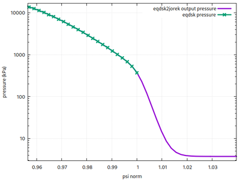
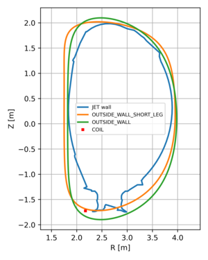
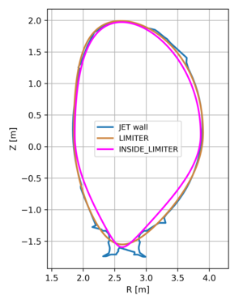
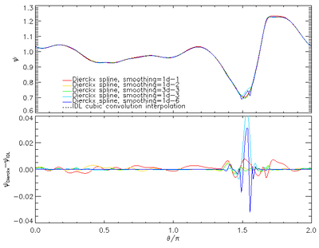

# EQDSK to JOREK (eqdsk2jorek.f90)

Equilibrium data reconstructed by EFIT and saved in the EQDSK format may be converted into JOREK input data by using `eqdsk2jorek.f90`.

## Compiling

To compile `eqdsk2jorek`, you first need to install the Dierckx library used for interpolating the poloidal flux function, provided in the EQDSK file on a rectangular $(R,Z)$ grid, along the JOREK boundary.

- Download the Dierckx library in your home directory (GitHub distribution thanks to Daan Van Vugt):

```bash
cd $HOME
git clone https://github.com/Exteris/libdierckx.git
```

- Compile the Dierckx library:

```bash
cd libdierckx
make
```

- Go to your JOREK main directory and add the path to the Dierckx library in `Makefile.inc`. For example:

```make
# --- DIERCKX Library
LIBDIERCKX = /marconi/home/userexternal/dbonfigl/libdierckx/libdierckx.a
```

- Compile `eqdsk2jorek`:

```bash
make eqdsk2jorek
```

## Running

Pipe your EQDSK file to `eqdsk2jorek`:

```bash
./eqdsk2jorek < filename.eqdsk
```

## Input files

This program reads standard **EQDSK** files. However, in some cases the **EQDSK** numeric formatting (number of digits per value) can differ. In that case, some read statements in `eqdsk2jorek.f90` may need to be adapted.

A namelist file named `eqdsk2jorek.nml` can be used to change the default behavior of **eqdsk2jorek** without recompiling. The `eqdsk2jorek_params` namelist must be defined inside `eqdsk2jorek.nml`.

Parameters in `eqdsk2jorek_params`:

- `tokamak_name`: defines the hard-coded plasma boundary parameter family
  - Available tokamak-specific families: `ITER` (default), `JET`, `DIII-D`
  - User-defined plasma boundary parameters from namelist: `USER_DEFINED`
- `boundary_type`: defines plasma boundary parameters for a specific tokamak. Parameters are magnetic-axis major radius and vertical position (`R_axis`, `Z_axis`), minor radius (`r_minor`), ellipticity ($\kappa$), upper/lower triangularity ($\delta_u$, $\delta_l$), upper/lower quadrangularity ($\zeta_u$, $\zeta_l$).

  Omitting upper/lower identifiers, the plasma boundary is computed as:

  $R = R_{axis} + r_{minor}\cos(\theta + \delta\sin(\theta) + \zeta\sin(2\theta))$

  $Z = Z_{axis} + r_{minor}\kappa\sin(\theta)$

  Available values:

  - `ITER`
    - `CLOSE_WALL_FIT`: $\kappa$: 2, $\delta_u$: 0.55, $\delta_l$: 0.65, $\zeta_u$: -0.1, $\zeta_l$: 0.15, `R_axis`: 6.2, `Z_axis`: 0.1, `r_minor`: 2.25
    - `OUTSIDE_WALL` (default): $\kappa$: 2.1, $\delta_u$: 0.58, $\delta_l$: 0.65, $\zeta_u$: -0.12, $\zeta_l$: -0., `R_axis`: 6.2, `Z_axis`: -0.05, `r_minor`: 2.34
  - `JET`
    - `OUTSIDE_WALL`: $\kappa$: 1.85, $\delta_u$: 0.4, $\delta_l$: 0.4, $\zeta_u$: -0.2, $\zeta_l$: -0.2, `R_axis`: 2.9, `Z_axis`: 0.1, `r_minor`: 1.08
    - `OUTSIDE_WALL_SHORT_LEG` (default): $\kappa$: 1.7, $\delta_u$: 0.4, $\delta_l$: 0.4, $\zeta_u$: -0.4, $\zeta_l$: -0.2, `R_axis`: 2.85, `Z_axis`: 0.15, `r_minor`: 1.1
    - `LIMITER`: $\kappa$: 1.7264, $\delta_u$: 0.276, $\delta_l$: 0.2497, $\zeta_u$: -0.07, $\zeta_l$: 0.1274, `R_axis`: 2.875, `Z_axis`: 0.2213, `r_minor`: 1.026
    - `INSIDE_LIMITER`: $\kappa$: 1.785, $\delta_u$: 0.26, $\delta_l$: 0.2497, $\zeta_u$: -0.03, $\zeta_l$: 0.29, `R_axis`: 2.865, `Z_axis`: 0.19, `r_minor`: 0.999
    - `CIRCULAR`: $\kappa$: 1, $\delta_u$: 0, $\delta_l$: 0, $\zeta_u$: 0, $\zeta_l$: 0, `R_axis`: read in EQDSK, `Z_axis`: read in EQDSK, `r_minor`: read in EQDSK
  - `DIII-D`
    - `OUTSIDE_WALL`: $\kappa$: 1.85, $\delta_u$: 0.4, $\delta_l$: 0.4, $\zeta_u$: -0.2, $\zeta_l$: -0.2, `R_axis`: 1.7, `Z_axis`: 0, `r_minor`: 0.7
    - `NIMROD_M3DC1`: $\kappa$: 1.35/0.7, $\delta_u$: 0.3, $\delta_l$: 0.3, $\zeta_u$: 0, $\zeta_l$: 0, `R_axis`: 1.7, `Z_axis`: 0, `r_minor`: 0.7

The number of poloidal angles used to discretize the plasma boundary is `n_tht_in=257` for all cases. Note that `R_axis`, `Z_axis`, and `r_minor` can be rescaled by setting `R_scale` different from 1. Examples of JET `OUTSIDE_WALL` and `OUTSIDE_WALL_SHORT_LEG` are shown in the **Tips and Tricks** section.

- `ellip_in`: user-defined ellipticity (default: 1)
- `tria_up_in`: user-defined upper triangularity (default: 0)
- `tria_low_in`: user-defined lower triangularity (default: 0)
- `quad_up_in`: user-defined upper quadrangularity (default: 0)
- `quad_low_in`: user-defined lower quadrangularity (default: 0)
- `n_tht_in`: number of poloidal angles used to discretize plasma boundary (default: 259)
- `r0_in`: major radius of magnetic axis (default: 3)
- `z0_in`: vertical position of magnetic axis (default: 0)
- `a0_in`: plasma minor radius (default: 1)
- `B_scale`: magnetic-field scaling factor (default: 1)
- `I_scale`: plasma-current scaling factor (default: 1)
- `R_scale`: spatial scaling factor (default: 1)
- `smth`: smoothing parameter of plasma profile interpolator (default: `1.d-6`, see **Tips and Tricks**)
- `eqdsk_string_r_min`: substring used to find plasma minor radius in EQDSK file (default: `MINOR RADIUS -> A [m]`). Currently used only for `JET` + `CIRCULAR`.

### Extension of the pressure profile to the SOL

EQDSK files include pressure (and FFprime) only up to the separatrix. For most JOREK runs you will need a profile defined further outside the separatrix. In recent versions, pressure is extended into the SOL by matching a linear function and a tanh function with the same value and radial derivative at the separatrix. The far-SOL value of the extended pressure profile is set to 1% of pressure at the separatrix.

You can modify this behavior in `eqdsk2jorek.f90` by searching for `p_bnd`. This is used together with a predefined density profile to produce `jorek_temperature`.



**Note:** this may misbehave if `p(sep) > p(sep-1)`.

## Output files

The program produces multiple files:

- `jorek_namelist`
- `jorek_ffprime`
- `jorek_pressure`
- `jorek_temperature`
- `jorek_density`
- `profiles_eqdsk`
- `limiter.dat`
- `boundary.dat`
- `psiRZ_eqdsk`
- `eqdsk.vtk`
- `eqdsk.ps`

The original profiles from EQDSK are written to `profiles_eqdsk` against normalized poloidal flux:

```text
psi_norm   F   pres   FdF/dpsi   dp/dpsi   q
```

`psiRZ_eqdsk` is an ASCII file containing the $\Psi(R,Z)$ map.

`eqdsk.ps` can be used to assess whether the produced data is usable for JOREK (for an expert eye).

## Tips and Tricks

The `OUTSIDE_WALL` (blue line) and `OUTSIDE_WALL_SHORT_LEG` (red line) boundaries of the `JET` family are shown below. `OUTSIDE_WALL_SHORT_LEG` is used to avoid very long divertor legs. `LIMITER` has limiter shape without legs, while `INSIDE LIMITER` is inside the limiter and includes part of a limiter leg (useful for STARWALL extensions when the first wall is used as the resistive wall, since response matrices are computed between the JOREK boundary and first wall and should not intersect).




The smoothing parameter `smth` can strongly affect interpolation and should always be checked (for example, with `jorek2.ps` produced by running JOREK) to ensure the interpolation along the JOREK boundary is smooth enough. The original choice `smth = 1.d-6` may create non-smooth interpolation near the X-point, causing artifacts in JOREK’s flux-aligned mesh. The value `smth = 3.d-3` has been found to be a good trade-off both at and away from the X-point (compared with IDL cubic interpolation as reference) for JET pulse 89800, as shown below.



