# Introduction to (some) JOREK diagnostics

This tutorial will show you how to run some of the important JOREK diagnostics. We assume that you already know the basics of how to run JOREK. Some information about how to analyze JOREK simulations was already given in the tutorial [Running JOREK for the first time](running_jorek_for_the_first_time.md). Here, you get a bit more information and learn about a few additional diagnostics.

# Coordinates

For any interpretation of simulation data (and already for setting up the simulations), you should make sure you understand the coordinate system(s) used in JOREK well and how this relates to the coordinate systems used in the experimental devices. In JOREK we have the following: 

The basic cylindrical coordinate system $` (u1,u2,u3)=(R,Z,ϕ) `$ of JOREK is given by 

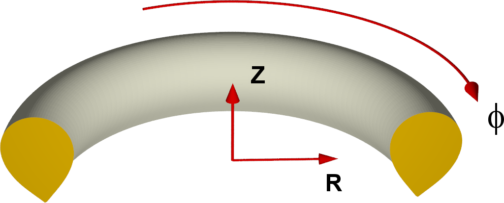

$$
\begin{aligned}
x&=R \cosϕ \\
y&=−R \sinϕ \\
z&=Z \\
\end{aligned}
$$

where $`(x,y,z)`$ denotes Cartesian coordinates. Thus, $`ϕ`$ goes clockwise if looked at from above! See [coordinates](..\physics\coordinates.md) for more details. ASDEX Upgrade, for instance, uses a definition of $`ϕ`$ going in the opposite direction! 

# qprofile.dat

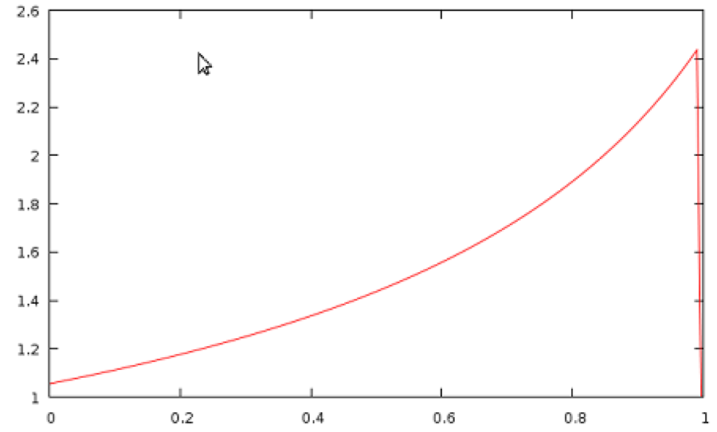

When the code is finished, calculating the equilibrium, it automatically calculates the q-profile and writes it out to `qprofile.dat`. If you need to plot the qprofile at a different time point during the simulation instead, `jorek2_postproc` described further below will help you to easily do that. 

# plot_grids.sh

The script `./util/plot_grids.sh` allows to plot the simulations grids. Via the option `-o xpoint` you can for instance plot only the X-point grid. The script uses the data written out by JOREK into the `grid_*.dat` ascii files and plots them with `gnuplot`. You can also plot directly to `.ps` or `.png` files (check with option `-h`). 

# plot_live_data.sh

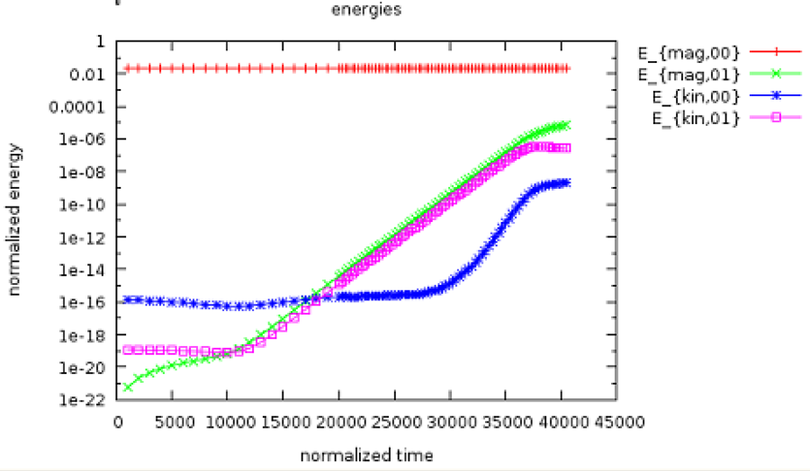

The code writes out some information to `macroscopic_vars.dat` while running. The script `plot_live_data.sh` allows to easily extract and plot data from this file. When you call the script without options, it will plot directly the evolution of the magnetic and kinetic energies (see example). When you have the plotting window open, 

- the <ins>right</ins> mouse button allows you to zoom in
- pressing `U` unzooms again
- pressing `L` switches between logarithmic and non-logarithmic y-axis
- pressing `E` updates the plot in case there is new data written by the running simulation.

If you call the script with option `-h`, the usage information is printed. You can for instance directly plot into a `.ps` file if necessary. In case you need to further adapt the plot, you can copy the `local_plot.gp` file to a different name e.g. `my_plot.gp`, adapt it and then run `gnuplot my_plot.gp`. 

The option `-l` lists all quantities you can plot. Presently this is: 

```
* axis
* betas
* current
* diag_coil_curr
* energies
* growth_rates
* heatingpower
* input_profiles
* particlecontent
* particlesource
* thermalenergy
* times
```

You can select which quantity to plot with the option `-q`. It is sufficient to type the start of the quantity. For instance the growth rates can be plotted with: 

```
./util/plot_live_data.sh -q g
```

**Note:**

- You may need to make a recent version of `gnuplot` available before you can use this diagnostics. Usually this works via `module load gnuplot`. Best add this to your `.bashrc` login script.
- The `plot_live_data.sh` script always extracts the data from `macroscopic_vars.dat` into a file called `<quantity-name>.dat` for plotting. Thus, you can easily also plot the data yourself with an arbitrary tool. This makes it simple to compare two simulations:

```
  gnuplot
  > set log y
  > plot 'case1/energies.dat' using 1:3 with lines, ''case2/energies.dat'' using 1:3 with lines
```

# jorek2vtk

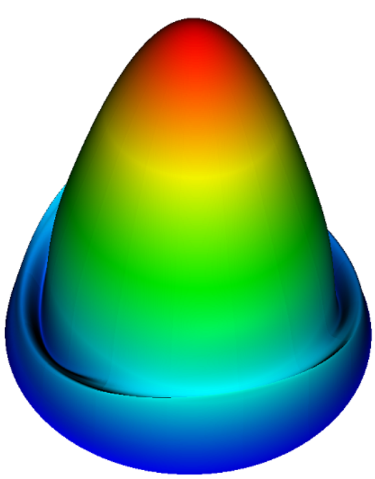

You have already come across `jorek2vtk` in the tutorial [Running JOREK for the first time](running_jorek_for_the_first_time.md). Some additional information is provided here. As a reminder, you need to compile the diagnostics via `make -j 8 jorek2vtk`. Make sure you use the same hard-coded parameters as the main binary. To actually convert the `.h5` restart files into `.vtk` files, you simply run 

```
 ./util/convert2vtk.sh -j 8 jorek2vtk inputfile
```

**Note:**

- `convert2vtk.sh` automatically puts the `.vtk` files into reasonably named sub-folders like `vtk_no0_iplane1`. Those can easily be plotted with Paraview or Visit.
- `convert2vtk.sh` automatically compares the time stamps of already existing `.vtk` files to the corresponding `.h5` files: If the `.vtk` file is newer, no conversion is needed. But if the `.h5` file is newer, then the `.vtk` file is automatically updated.

**Available options:**

- The option `-si` should denormalize all quantities.
- The option `-no0` excludes the $`n=0`$ mode from the VTK files such that you can only look at the non-axisymmetric components.
- The option `-i_tor` allows to select one of the toroidal harmonics. Cosine and sine are counted separately here.
- The option `-iplane` allows to write out data in a different toroidal plane. Default is plane 1 (i.e., $`ϕ=0`$).
- The option `-only XXXXX-XXXXX` allows to convert only some of the restart files.
- The option `-nsub X` allows to change the number of sub-points used to represent each Bezier element. The default value is 5.
- The option `-h` explains how the script is used.

**Identifying a problem:** In case something goes wrong with the conversion it is a good idea to compile `jorek2vtk` again with debugging options, and first try the conversion the “manual” way with 

```
  cp jorekXXXXX.h5 jorek_restart.h5
  ./jorek2vtk < ./inputfile
```

Typical problems you may run into are that you compiled `jorek2vtk` with the wrong model or wrong hard-coded parameters or that an `.h5` restart file is damaged such that it cannot be read into `jorek2vtk` properly. 

# jorek2vtk_3d

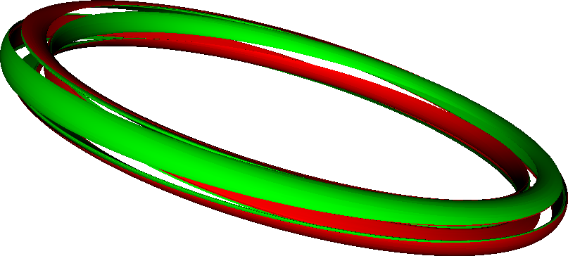

The compilation and usage is almost identical to jorek2vtk, however:

- 3D data is written out.
- That means you will end up with huge files. You should use the `-only` option to convert only some of the files.
- You may need to edit the `jorek2vtk_3d.f90` file to adapt the number of toroidal planes written out.
- The `.vtk` files end up on subfolders called `vtk3d_no0` or similar.

$\rightarrow$ Consider to use the [Paraview-plugin](running_jorek_for_the_first_time.md) instead

# jorek2_poincare

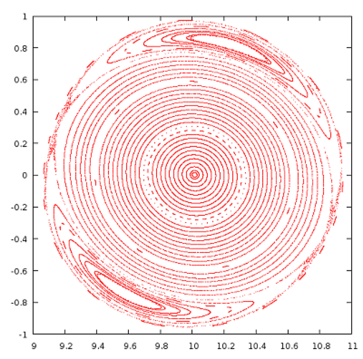

To visualize the magnetic topology, Poincare plots are a very useful tool. `jorek2_poincare` allows to trace a specific field lines for a given number of toroidal turns. A point is then marked each time the field line passes through the $`ϕ=0`$ plane. You need to create a small additional file named `stpts` which describes the field lines to be traced. The following example traces 100 field lines started between $`Z=0`$ and $`Z=1`$ at $`R=10`$ and $`ϕ=0`$. $`R,Z,ϕ`$ and `n_turns` is interpolated for the field lines not explicitly in between the given ones: 

```
# n_lines
   40
# nr   R_start   Z_start    phi_start   n_turns
    1    10.000     0.00      0.000      1000
   40    10.000     1.00      0.000      2500
```

It is also possible to specify each field line individually: 

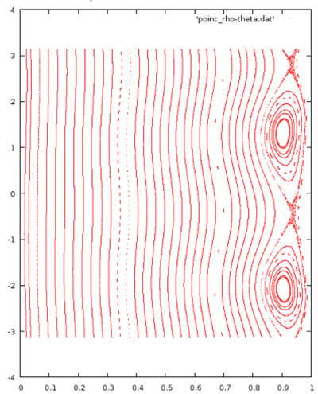

```
# n_lines
   3
# nr   R_start   Z_start    psi_start   n_turns
    1    10.000     0.00      0.000      1000
    2    10.000     0.50      0.000      1200
    3    10.000     1.00      0.000      3000
```

Or you can specify several sets of field lines: 

```
# n_lines
   80
# nr   R_start   Z_start    phi_start   n_turns
    1    10.000     0.00      0.000      1000
   40    11.000     0.00      0.000      2500
   41    10.000     0.00      0.000      1000
   80    10.000     1.00      0.000      2500
```

Now you can simply run the diagnostics by doing: 

```
cp jorekXXXXX.h5 jorek_restart.h5
./jorek2_poincare < ./inputfile
```

As a result, you get two [ASCII](## "American Standard Code for Information Interchange") files which contain the data in two different representations: 

- `poinc_R-Z.dat` contains the points in $`(R, Z)`$ coordinates
- `poinc_rho-theta.dat` contains the points in $`(ρ_\text{pol}, θ)`$ coordinates, where $`θ`$ is the poloidal angle and $`ρ_\text{pol}=\sqrt{Ψ_N}`$.

**Warning:** `jorek2_poincare` is a useful but rather old diagnostics. You may need to edit the source code to increase manually the `n_phi` value in order to get a clean Poincare plot (in particular for larger mode numbers). The program should in principle be re-implemented in a cleaner way at some point… 

# jorek2_powers

This diagnostics makes only sense for `model3XX` and X-point cases. It calculates for instance the heat fluxes to the divertor targets. Note that you presently need to set manually in the source code `diagnostics/jorek2_powers.f90` source code three parameters before compilation: 

```
R_in_out     # set to a value between the inner and outer target plate
Z_wall_in    # upper limit of inner divertor target
Z_wall_out   # lower limit of outer divertor target
```

It might be a nice exercise for one of you to detect these three values automatically, which would not be too complicated… 

The tool writes out the calculated quantities directly onto the screen: 

```
 inner/outer wall/divertor parallel convection :  -0.11942676E-08 -0.34636717E-20  0.10706467E+00  0.48405278E+00 [MW]
 inner/outer wall/divertor parallel kinetic energy :  -0.38361754E-10  0.13592082E-46  0.53535814E-01  0.24202235E+00 [MW]
 inner/outer wall/divertor parallel conduction :   0.54521383E-06  0.11287870E-07 -0.57674292E-01 -0.80325170E-01 [MW]
 inner/outer wall/divertor perp. conduction    :   0.12950011E+01  0.40278144E+01 -0.13424678E+00 -0.26235797E+00 [MW]
 inner/outer wall/divertor energy diffusion    :   0.85255108E-02  0.76551935E-01  0.10318817E-02 -0.51809035E-03 [MW]
 inner/outer wall/divertor particle diffusion  :   0.23624058E+02  0.21243131E+03  0.25594812E+01  0.18333358E+00 [10^20 /s]
 inner/outer wall/divertor particle convection :  -0.20010146E-05 -0.58675714E-17  0.39754300E+02  0.13068614E+03 [10^20 /s]
 inner/outer wall/divertor total area          :   0.61033015E+02  0.87484798E+02  0.42806246E+01  0.67975876E+01 [m^2]
 inner/outer wall/divertor total length        :   0.38794511E+01  0.38347953E+01  0.26095161E+00  0.32175932E+00 [m]
 inner/outer wall/divertor total radius (avg)  :   0.25038867E+01  0.36308686E+01  0.26107620E+01  0.33623569E+01 [m]
 inner/outer wall/divertor Q                   :   0.16895744E-07  0.30984143E-19  0.39588715E-01  0.23191647E+00 [MW/m^2]
 inner/outer wall/divertor wetted area         :  -0.70684526E-01 -0.11178852E+00  0.27044239E+01  0.20871859E+01 [m^2]
 inner/outer wall/divertor wetted length         :  -0.44929316E-02 -0.49001212E-02  0.16486467E+00  0.98795565E-01 [m]
 ```

It also exports them to `powers_time.out` and `powers_time_sum.out`. Since the code appends to the files, you can do something in bash like the following to collect the data from all restart files: 

```bash
for f in `ls jorek[0-9]*.h5`; do
  cp $f jorek_restart.h5
  ./jorek2_powers < ./inputfile
done
```
For a detailed understanding of the output of these diagnostics, you will need to look in detail at the source code itself and/or ask. 

# jorek2_target2vtk


Allows to write out the target heat fluxes to the divertor targets as a VTK file for plotting. Compile: 

```
make -j 8 jorek2_target2vtk
```

Run: 

```
cp jorekXXXXX.h5 jorek_restart.h5
jorek2_target2vtk < inputfile
```

Now you can plot the `jorek_tmp.vtk` file. 

# jorek2_postproc 

This tool is meant to allow for analyzing simulations in various ways with simple scripts. It can also be used interactively. Integrating new own diagnostics is comparably easy. 

## First interactive example

Let's start with an example of interactive usage. After you call `./jorek2_postproc` (don't pipe in the namelist input file), you get a simple prompt where you can type your commands. The basic usage is also printed for you: 

```
 =========================================================================
 Help topic: getting_started
 -------------------------------------------------------------------------
 Welcome to the interactive postprocessing tool JOREK2_POSTPROC!
 
 An example to get you started:
 
   namelist input               # Read namelist input file
   jorek-units                  # Select JOREK units
   for step 100 to 200 do       # Do the following for severl time steps:
 
     expressions Psi_N T rho      # Select physical expressions
     mark_coords 1                # Mark first expression as coordinate
     set surfaces 200             # Number of flux surfaces
     average                      # Toroidal and poloidal average
 
     expressions R rho T Psi Er   # Select expressions
     mark_coords 1                # Mark first expression as coordinate
     set linepoints 200           # Number of points along a line
     midplane                     # Midplane profiles
   done
 
 All output is written into subfolder postproc/
 
 Type "help" for general usage information or, e.g., "help average" for
 command-specific help.
 
 Documentation: http://jorek.eu/wiki/doku.php?id=jorek2_postproc
 =========================================================================
```

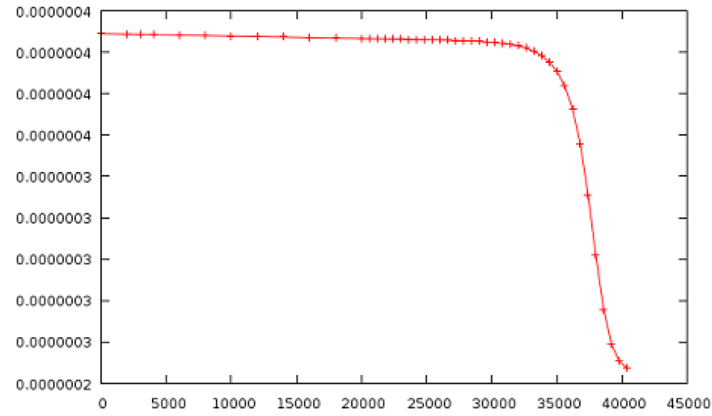

As a very simple example, you can type to write out the evolution of the temperature at the center over time: 

```
namelist intear
expressions t T
for step 0 to 999 do
  point 9.6 -0.7 0.
done
```

To check what “expressions” are available, simply type in `expressions`. 

`jorek2_postproc` will read in all restart files available in the specified range and evaluate the commands inside the loop for each of them. It is possible to have many different evaluations in the same loop of course.

The result is written out to `postproc/exprs_at_R9.6000_Z-0.700_p0.000_s00000..00999.dat`, which can easily be plotted with gnuplot or other tools. 

## Running with a script

If you put the same commands from above into a text file, e.g., `postproc_script`, you can easily re-run your analysis when the simulation has continued further, or apply the same analysis to a different case: 

```
./jorek2_postproc < ./postproc_script
```

## A few examples for analysis you can do 

#### Averaged profiles

```
 =========================================================================
 Help topic: average
 -------------------------------------------------------------------------
 Usage:
   average
 
 Determine poloidally and toroidally averaged profiles.
 
 Examples:
   set surfaces 200
   expressions Psi_N rho T Er
   mark_coords 1
   for step 1 to 200 do
     average
   done
 =========================================================================
```

This provides profiles only up to $`Ψ_N=1`$. 

#### Basic properties of the plasma state

```
 =========================================================================
 Help topic: equil_params
 -------------------------------------------------------------------------
 Usage:
   equil_params
 
 Output equilibrim parameters (axis, X-point, limiter).
 
 Examples:
   for step 1 to 200 do
     equil_params
   done
 =========================================================================
```

#### Average energy spectrum during a specified time window

```
 =========================================================================
 Help topic: energy_spectrum
 -------------------------------------------------------------------------
 Usage:
   energy_spectrum tmin tmax
 
 Output the energy spectrum in the given time window.
 
 Examples:
   for step 200 do
     energy_spectrum 150. 3000.
   done
 =========================================================================
```

#### Flux surfaces (Psi contours)

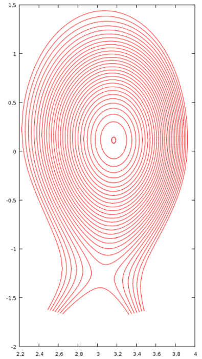

```
 ===========================================================
 Help topic: fluxsurfaces
 -----------------------------------------------------------
 Usage:
   fluxsurfaces
 
 Output flux surfaces of the axisymmetric part of the field.
 
 Examples:
   set surfaces 100
   for step 100 do
     fluxsurfaces
   done
 
 ===========================================================
```

#### Various integral quantities like particle content, current, etc.

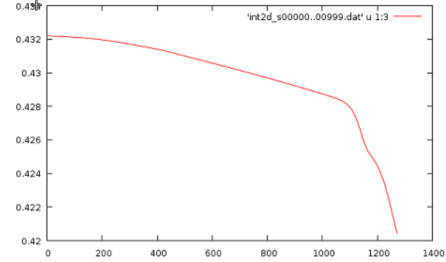

```
 =========================================================================
 Help topic: int2d
 -------------------------------------------------------------------------
 Usage:
   int2d
 
 "int2d" calculates various 2d integrals (calls integrals.f90) and outputs
 the results to file the file int2d_...
 
 Examples:
   int2d
 =========================================================================
```

#### Integral along a line in a poloidal plane (e.g. line integrated density)

```
 =========================================================================
 Help topic: int_along_pol_line
 -------------------------------------------------------------------------
 Usage:
   int_along_pol_line R0 Z0 R1 Z1 phi
 
 Integrate expressions along line from (R0,Z0,phi) to (R1,Z1,phi).
 
 Examples:
   set linepoints 500
   expressions R rho T E_r
   mark_coords 1
   for step 0 to 100 do
     int_along_pol_line 1.6 0.5 1.7 0.5 0.
   done
 =========================================================================
```

#### Profiles across the midplane

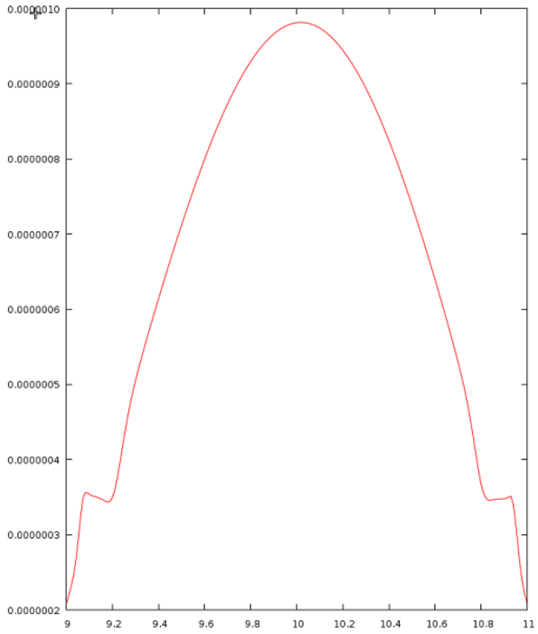


```
 =========================================================================
 Help topic: midplane
 -------------------------------------------------------------------------
 Usage:
   midplane
 
 Output toroidally averaged midplane profiles.
 
 Examples:
   set linepoints 200
   for step 1 to 100 do
     expressions R rho T Psi Er
     mark_coords 1                    # mark first expression as coordinate
     midplane
   done
 =========================================================================
```

#### Values at a given point

```
 =========================================================================
 Help topic: point
 -------------------------------------------------------------------------
 Usage:
   point R Z phi
 
 Determine the value of a variable at position (R,Z,phi).
 
 Examples:
   for step 1 to 100 do
     expressions rho T Psi Er
     point 1.6 0.0 0.0
   done
 =========================================================================
```

#### Profiles along a straight line

```
 =========================================================================
 Help topic: pol_line
 -------------------------------------------------------------------------
 Usage:
   pol_line R0 Z0 R1 Z1 phi
 
 Expressions along line from (R0,Z0,phi) to (R1,Z1,phi).
 
 Examples:
   set linepoints 500
   expressions R rho T E_r
   mark_coords 1
   for step 0 to 100 do
     pol_line 1.6 0.5 1.7 0.5 0.
   done
 =========================================================================
```

#### Quantities in a rectangular area in HDF5 format (often requested by experimentalists)

```
 =========================================================================
 Help topic: rectangle
 -------------------------------------------------------------------------
 Usage:
   rectangle Rmin Rmax nR Zmin Zmax nZ phi
 
 Expressions on a rectangular area in R,Z. Produced an HDF5 file.
 
 Examples:
   expressions phi rho T E_r
   for step 0 to 100 do
     rectangle 1.7 2.1 10 -0.3 0.3 10 0.
   done
 =========================================================================
```

#### q-profile during the simulation

```
 =========================================================================
 Help topic: qprofile
 =========================================================================
```

#### Separatrix location

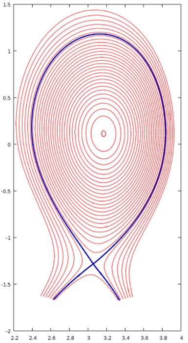

```
 =========================================================================
 Help topic: separatrix
 -------------------------------------------------------------------------
 Usage:
   separatrix
 
 Output the separatrix of the axisymmetric part of the field.
 
 Examples:
   for step 100 do
     separatrix
   done
 
 =========================================================================
```

(In the plot on the right, the separatrix and the fluxsurfaces are plotted at the same time) 

#### Profiles at given R,Z versus phi

```
 =========================================================================
 Help topic: tor_line
 -------------------------------------------------------------------------
 Usage:
   tor_line R Z phi0 phi1
 
 Expressions along line from (R,Z,phi0) to (R,Z,phi1).
 
 Examples:
   set linepoints 500
   expressions phi rho T E_r
   mark_coords 1
   for step 0 to 100 do
     tor_line 1.6 0.1 0. 3.141592
   done
 =========================================================================
```

## Expressions available

One of the main advantages here is, that **a lot of different “expressions”** are ready for you to use already, not only the JOREK variables. The following expressions are available for analysis at present. It is pretty easy to add new ones yourself in `diagnostics/new_diag/mod_expression.f90` (see also further below). **The command `si-units` allows to switch to denormalized units.** You can list the available expressions by simply typing `expressions` in `jorek2_postproc` interactively. 

```
 List of Diagnostic Expressions:
 
 --------------------------------------------------------------------------------
 Number | Name         | Description
 --------------------------------------------------------------------------------
 000001 | R            | Cylindrical Coordinate R (== Major Radius)            
 000002 | Z            | Cylindrical Coordinate Z                              
 000003 | phi          | Cylindrical Coordinate phi                            
 000004 | theta        | Poloidal Angle With Respect to Magnetic Axis          
 000005 | theta_star   | Poloidal Straight Field Line Angle (for flux surfaces)
 000006 | length       | Length Along Poloidal Line (for poloidal lines)       
 000007 | r_minor      | Minor Radius From A = r_minor^2 pi (for flux surfaces)
 000008 | x            | Cartesian Coordinate x                                
 000009 | y            | Cartesian Coordinate y                                
 000010 | z            | Cartesian Coordinate z (== Cylindrical Z)             
 000011 | Psi_N        | Normalized Poloidal Magnetic Flux                     
 000012 | xjac         | 2D Jacobian in the Poloidal Plane                     
 000013 | t            | Simulation time                                       
 000014 | Psi          | Poloidal Magnetic Flux                                
 000015 | u            | Velocity Stream Function                              
 000016 | Phi          | Electric Potential Phi                                
 000017 | zj           | Toroidal Current Density Multiplied by 1/R            
 000018 | currdens     | Physical Toroidal Current Density (== zj/R)           
 000019 | omega        | Toroidal Vorticity Component                          
 000020 | rho          | Mass Density                                          
 000021 | ne           | Electron Density                                      
 000022 | T            | Temperature (Electrons plus Ions)                     
 000023 | Te           | Electron temperature (assuming Ti=Te)                 
 000024 | vpar         | Parallel Velocity (along magnetic field lines)        
 000025 | eta_T        | Temperature Dependent Resistivity                     
 000026 | visco_T      | Temperature Dependent Viscosity                       
 000027 | zkpar_T      | Temperature Dependent Parallel Heat Diffusivity       
 000028 | dprof        | Particle Diffusivity                                  
 000029 | zkprof       | Perpendicular Heat Diffusivity                        
 000030 | pres         | Total Pressure                                        
 000031 | B_abs        | Norm of the Magnetic Field Vector                     
 000032 | B_tor        | Toroidal Magnetic Field Component                     
 000033 | B_R          | Magnetic Field Component Along R                      
 000034 | B_Z          | Vertical Magnetic Field Component                     
 000035 | B_theta      | Poloidal Magnetic Field Component                     
 000036 | Er           | Radial Electric Field                                 
 000037 | Vtheta_i     | Ion Poloidal Velocity                                 
 000038 | Mach_par     | Parallel Mach Number                                  
 000039 | Mach_pol     | Poloidal Mach Number                                  
 000040 | V_sound      | Sound Speed                                           
 000041 | V_neo        | Neoclassical Velocity                                 
 000042 | Vperp_e      | Electron Perpendicular Velocity                       
 000043 | Vperp_i      | Ion Perpendicular Velocity                            
 000044 | V_ExB        | ExB Velocity                                          
 000045 | Vstar_e      | Electron Diamagnetic Velocity                         
 000046 | Vstar_i      | Ion Diamagnetic Velocity                              
 000047 | ki_neo       | Neoclassical Heat Diffusivity                         
 000048 | mu_neo       | Neoclassical Friction Coefficient                     
 --------------------------------------------------------------------------------
```

## new_diag

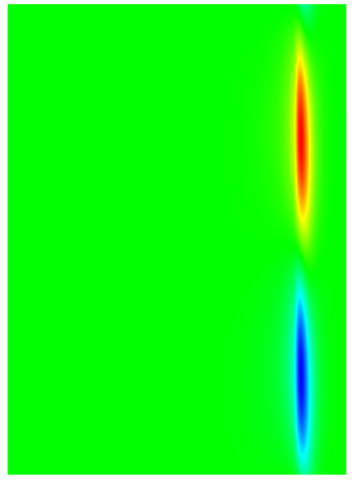

This is a framework you can use to build quite a few diagnostics yourself. It is also used for a lot of the `jorek2_postproc` features in the background. The implementation is in `diagnostics/new_diag/` and split into a few different modules:

- `mod_new_diag`: Main module you need to include to access the functionality of this framework.
- `mod_expressions`: Provides a lot of expressions you can easily evaluate as described above for `jorek2_postproc`
- `mod_position`: Data structure for selecting pol/tor positions to evaluate expressions at.
- `mod_straight_field_line`: Used for reconstructing straight field line coordinates (see `jorek2_four` below).
- `mod_four_filter`: Allows to select specific Fourier modes of evaluated expressions.
- `mod_diag_output`: Write out the data in various ways.

You can try out the functionality by editing `diagnostics/new_diag_demo.f90` and compiling with `make -j 8 new_diag_demo`. An example of what you can put there: 

```
[...]
  ! --- Normal initialization
  allocate(node_list)
  allocate(element_list)
  allocate(bnd_elm_list)
  allocate(bnd_node_list)
  my_id = 0
  call initialise_parameters(my_id, "__NO_FILENAME__")
  call det_modes()
  call import_restart(node_list, element_list, 'jorek_restart',  rst_format, ierr)
  call initialise_basis()
  call boundary_from_grid(node_list, element_list, bnd_node_list, bnd_elm_list, .false.)
  
  ! --- Initialize the plasma equilibrium data structure
  call update_equil_state(node_list, element_list, bnd_elm_list, xpoint, xcase, equil_state)
  call print_equil_state(equil_state, .false.)
  
  ! --- Initialize the new_diag framework and print some information (.true.)
  call init_new_diag(.true.)
  
  expr_list = exprs((/'R    ', 'phi  ', 'pres ' /), 3, 2)
  call create_pol_pos(pol_pos_list, ierr, node_list, element_list, equil_state, &
    Rstart=3.17, Rend=3.92, n=150, Z=0.116)
  
  call create_tor_pos(tor_pos_list, ierr, nphi=150)
  
  call eval_expr(equil_state, JOREK_UNITS, expr_list, pol_pos_list, tor_pos_list, result, ierr)
  
  call reduce_result_to_2d(ierr, result, res2d, i2=1)
  call write_vtk_2d(ierr, expr_list, res2d, 'testA.vtk', (/1,2/))
  
  call apply_four_filter(result, simple_filter(n=6), 2, ierr)
  call reduce_result_to_2d(ierr, result, res2d, i2=1)
  call write_vtk_2d(ierr, expr_list, res2d, 'testB.vtk', (/1,2/))
[...]
```

# jorek2_four

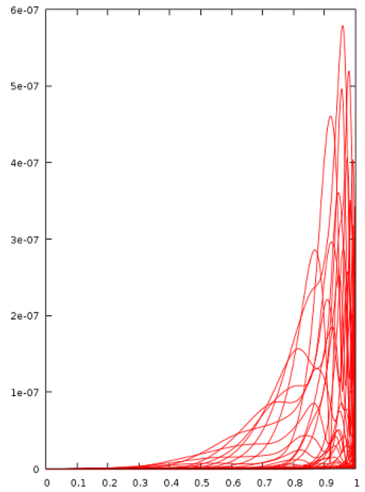

Compile via `make -j 8 jorek2_four`. Then create a file in the run folder called `four_params.nml`: 

```
&four_params
nstpts = 600 ! number of psi_N values
nmaxsteps = 2000
deltaphi = 0.2
nsmallsteps = 3
rad_range = 0.001, 0.999
nTht = 120
/
```

`jorek2_four` performs the 2D Fourier analysis in magnetic coordinates (straight field line coordinates; Pest coordinates). 

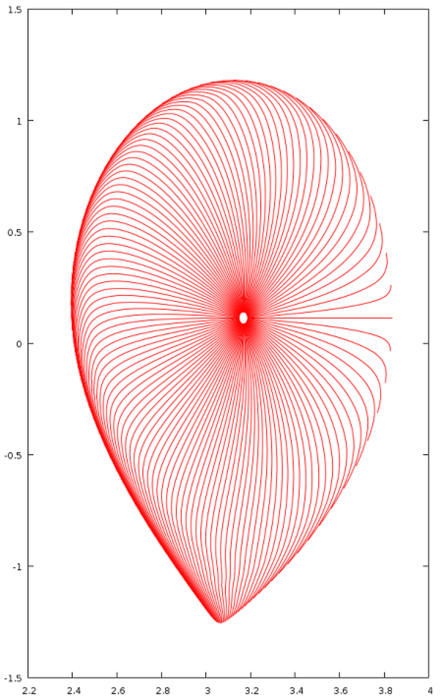

# Beyond

A lot more diagnostics exist, for example: 

```
jorek2_connection2
jorek2_diagno
jorek2_fieldlines_vtk
jorek2_import_perturbation
jorek2_povray
jorek2vtk_GaussVortTerms
jorek_diagnostics
jorek_to_helena
...
```

Some of them in active use, some may need repair before they become useful again. In case you need to look at a particular aspect of a simulation, it's always a good idea to quickly ask whether a solution for your problem already exists. If not, it would be great if you implement your diagnostics in a way that makes it useful for the whole community. Feel free to ask for advice regarding the best way to do that (new program, integrated with `jorek2_postproc` etc). 