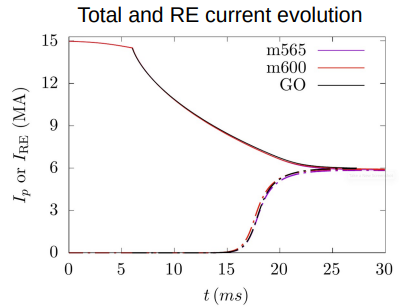
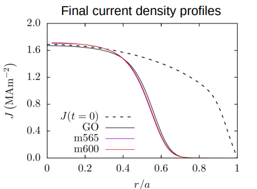
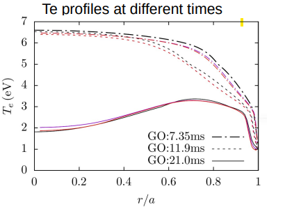

# RE fluid tutorial

This case corresponds to a GO benchmark similar to the one described in [this reference](https://doi.org/10.1103/PhysRevE.99.063317), where an RE beam creation is modeled. It including the Tritium decay and Compton scattering as primary sources as well as the secondary avalanche source.
An inital, uniform impurity density is imposed.

The input file can be found in [intear_REfluid](assets/RE_fluid/intear_REfluid).
The path to the ADAS data needs to be specified in the input file `adas_dir` (see [ADAS](adas.md)). 

To run, check-out the RE fluid branch (develop after merge) and apply the following settings.
```bash
git checkout feature/m600refluid
./util/config.sh model=600 with_refluid=.true. with_neutrals=.true. with_vpar=.false. n_tor=1 n_plane=1
```

Compile and run using the input file given above. (If you are running JOREK for the first time, have a look at [how to run JOREK](running_jorek_for_the_first_time.md)).

For extracting the current density/$T_e$ profile, compile [jorek2_postproc](post_processing.md) create the file postproc_input with the following lines

```bash
namelist input_REfluid
si-units
expressions R Z Psi_N curr_dens Te
for step XXX to XXX by XXX do
average
done 
```
and execute the following line.
```bash
jorek2_postproc < postproc_input  
```
The results should look like the following figures.
<div style="display: flex; justify-content: space-between;">
  <div style="width: 30%;">
    
  </div>
  <div style="width: 30%;">
    
  </div>
  <div style="width: 30%;">
    
  </div>
</div>
