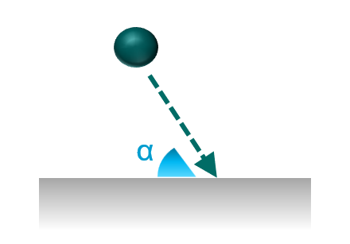
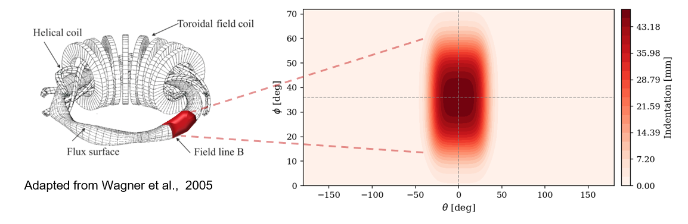
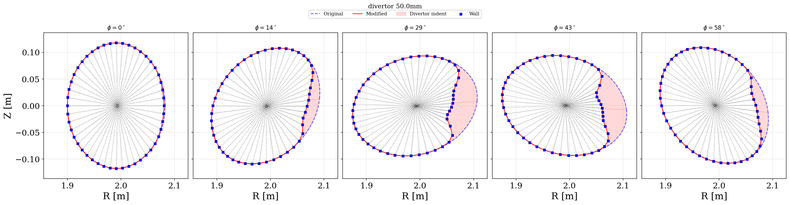
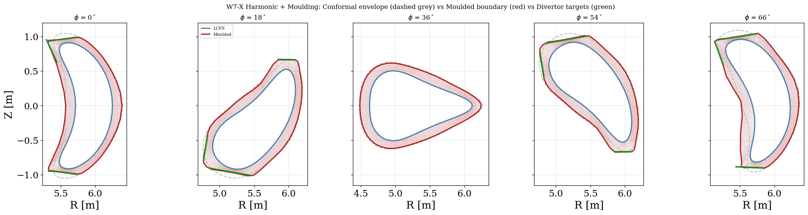

# Running Stellarator with Divertor Region

Unlike tokamak models, JOREK does not have a built-in equilibrium solver for stellarator but uses an ideal MHD equilibrium solver from GVEC, assuming nested flux surfaces. Historically, this meant that the simulation domain has been limited to the Last Closed Flux Surface (LCFS). To go beyond the LCFS, one typically either needs:

1. Dommaschk potentials 
2. Vacuum field $\nabla \chi$ from coils

For further conceptual details, see the [stellarator](stellarator.md) page. This page illustrates the minimal building blocks to get started with creating and running simulations with stellarator grids with divertors. 

For the baseline stellarator import chain (GVEC to JOREK restart files), first see [Run Stellarator Simulations](stellarator_setup.md).

Minimal context for this page:
1. Start from `gvec2jorek.dat` (or its modified variant).
2. Run model 180 to build a consistent restart state (`jorek000000.h5`, `jorek000001.h5`).
3. Use `jorek000001.h5` as `jorek_restart.h5` for model 183.

`USE_EXT_FIELD` controls where the vacuum field used by stellarator boundary diagnostics/BCs comes from:
1. `USE_EXT_FIELD=0`: use the chi-based pathway (no explicit `B_vac_*` arrays required in `gvec2jorek.dat`).
2. `USE_EXT_FIELD=1`: use explicit vacuum-field arrays (`B_vac_R`, `B_vac_Z`, `B_vac_phi` and derivatives) in `gvec2jorek.dat`.

For W7-X divertor workflows where coil-field topology at the boundary is required, this page assumes `USE_EXT_FIELD=1` and a `gvec2jorek.dat` that already contains `B_vac_*` blocks.

To realistically capture divertor physics, **sheath boundary conditions** (SBC) are necessary to capture the dynamics close to the first wall when open magnetic field intersect the boundary. The well-established main physics formulae, already implemented in the JOREK tokamak model and in other divertor physics codes, state that for flux surfaces intersecting boundaries with angle $\alpha$, we have:

1. **The Bohm criterion**: $$v_{\parallel} \geq \pm c_s f(\alpha), \quad \alpha = \arcsin\left(\frac{|\hat{n} \cdot \mathbf{B}|}{\Vert\mathbf{B}\Vert}\right), \quad f(\alpha)=\tanh\left(\frac{\alpha}{\alpha_0}\right)$$


2. **Particle flux** at sheath entrance: $$\Gamma_n = n \cdot v_{\parallel}$$

3. **Heat flux** (simplest case with single $T$): $$q = \gamma \cdot k T_e \Gamma_n$$

More physics details on SBC and their implementation can be found in P.C Stangeby (2000), CRC Press, and M. Hoelzl et al., Nucl. Fusion 61, 065001 (2021). The stellarator model 183 now contains a working stellarator SBC path, but unlike tokamaks we must handle strongly 3D, toroidally varying incidence angles $\alpha(\theta,\phi)$ and represent BC targets consistently in the toroidal Fourier basis.




## Simplistic case: W7-A with artificial divertor

The first minimum viable stellarator divertor grid example features an artificial divertor indentation in the stellarator Wendelstein 7-A (sketch for illustrative purposes only):



The indentation used is a smooth inward radial displacement of the boundary shell, with depth parameter $d$ (here $d=50$ mm, the more extreme test case). For this artificial W7-A test divertor, the indentation patch can be described analytically:

$$
\Delta r(\theta,\phi) = d\,\frac{f_\theta(\theta)\,f_\phi(\phi)}{\sqrt{\cos^2\theta + \left(\sin\theta/\kappa\right)^2}}
$$

where $f_\theta$ and $f_\phi$ are tanh-window envelopes, based on smoothing functions:

```python
def tanh_smooth(x, center, width, smooth_width):
    """Smooth envelope: 1 inside [center-width, center+width], 0 outside."""
    left = 0.5 * (1 + np.tanh((x - (center - width)) / smooth_width))
    right = 0.5 * (1 - np.tanh((x - (center + width)) / smooth_width))
    return left * right
```

and $\kappa$ is the ellipticity factor (in this example, $\kappa=1.5$). In practice, boundary nodes are moved inward by $\Delta r$ and interior shells are scaled proportionally from axis (0) to boundary (1). An example usage to plot this artificial indentation is found in `assets/stellarator_with_divertor/plot_w7a_example_indentation_map.py`

Bezier-Hermite handling in this W7-A step is intentionally simple: geometry is modified in real space and first/mixed derivatives (`_s`, `_t`, `_st`) are recomputed with `scipy.interpolate.PchipInterpolator` in radial and poloidal directions (including periodic closure in poloidal angle). This avoids stale handles after boundary displacement.

The main ingredients can be found in `assets/stellarator_with_divertor/modify_w7a_gvec2jorek_to_divertor.py`. Inputs are the original `gvec2jorek.dat` geometry/Fourier fields and a geometric indentation prescription. Output is a modified `gvec2jorek_divertor_<depth>mm.dat`, then model180/model183 follow the standard chain from [Run Stellarator Simulations](stellarator_setup.md).

This step is a first direct geometry-indentation workflow for W7-A, to demonstrate grid modification principles before any bloating or harmonic mapping is needed.



## W7-X divertor grids

### Grid construction

#### Incorporating the vacuum field in the gvec2jorek.dat file 

In step20, vacuum field is added by sampling the W7-X mgrid coil field on the JOREK flux grid, transforming to toroidal Fourier modes, and appending `B_vac_*` blocks to `gvec2jorek.dat`. The reference script is `runs/019_w7x_half_beta_island_divertor/step20_w7x_bean_scaling/mgrid2bvac_step20.py`.

Minimal example from that script:

```python
GVEC2JOREK_IN = Path('.../gvec2jorek_harmonic_12.dat')
MGRID_FILE = Path('.../mgrid_w7x_nv36_hires.nc')
EXTCUR = [13470.0, 13470.0, 13470.0, 13470.0, 13470.0, 0.0, 0.0]

# 1) evaluate geometry R(s,theta,phi), Z(s,theta,phi)
# 2) interpolate mgrid B(R,Z,phi)
# 3) Fourier transform in phi
# 4) write B_vac_R/Z/phi (+ _s, _t, _st)
```

Practical requirement: the mgrid file and `EXTCUR` values must correspond to the same magnetic configuration used to generate the target equilibrium (otherwise imported vacuum topology is inconsistent).

Compilation/runtime requirement for this path: `USE_EXT_FIELD=1` and a `gvec2jorek.dat` that contains the `B_vac_*` blocks.

#### Harmonic mapping

Harmonic mapping constructs smooth, nested extension shells in strongly non-axisymmetric geometry by solving the mapping problem per toroidal plane and then rebuilding a toroidally consistent Fourier representation. This reduces geometric distortion and helps preserve positive Jacobians during extension/moulding. See also Robert Babin et al., Plasma Phys. Control. Fusion 67 (2025) 035005.

In `extend_grid_harmonic.py`, Step 1 is the harmonic mapping stage: for each toroidal plane, LCFS is mapped to an additive conformal envelope (`CONFORMAL_EXT_M = 0.150` m), then transformed back to Fourier modes over all planes.

#### Divertor moulding

In the same script, Step 2 is divertor moulding: a displacement/scale field is built from ray intersections with divertor target segments, then extension shells are rescaled toward those targets with smooth angular tapers (`DIVERTOR_SMOOTH_DEG`, `PHI_TAPER_DEG`) and safety bounds (`SCALE_MIN`, `SCALE_MAX`) to keep the mesh regular.

