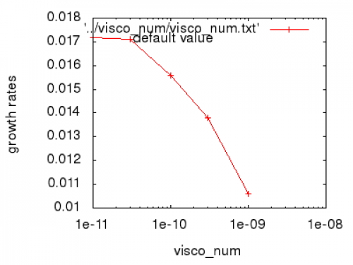
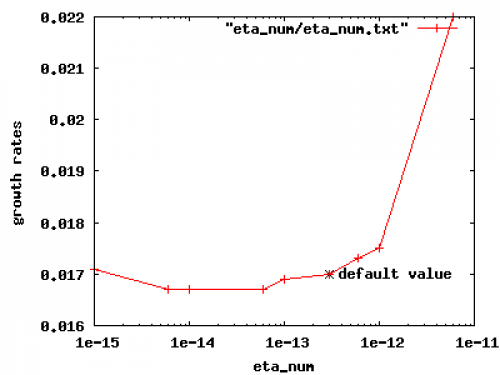
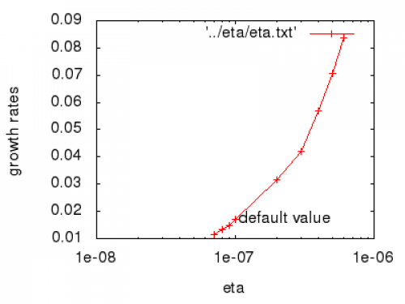
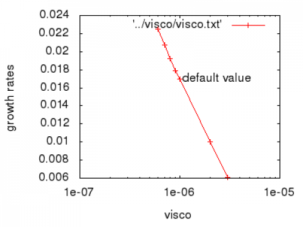
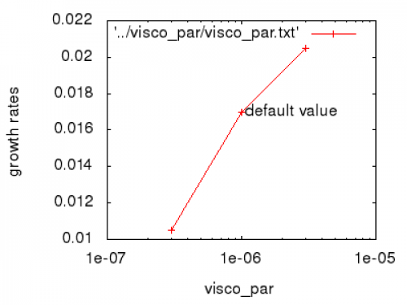
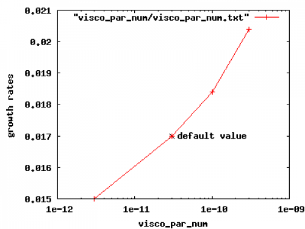

# Scans for AUG #31128ed7

- [base input file used for the scans](assets/asdex_upgrade/31128-7-scans-inputfile.txt)

We varied certain parameters of the code and analysed the resulting linear growths rates.

Scans performed:
- visco_num
- eta_num
- visco_par_num
- eta (using eta_num=30*eta^2)
- visco (using visco_num=30*visco^2)
- visco_par (using visco_par_num=30*visco_par^2)

The run-folders are in tokp/work/dtaray/

## Conclusions (M. Hoelzl)

- **It is acceptable to increase eta_num and visco_num by another factor of three: eta_num=100*eta^2 and visco_num=100*visco^2**
- **visco_par_num should probably be decreased further!**
- **Since linear growth rates depend on resistivity, the ELMs we are simulating are a resistive instability.**

## visco_num

```text
value   growth rate
1e-11   0.0172
3e-11   0.0171 (default)
1e-10   0.0156
3e-10   0.0138
1e-9    0.0106
```

Plot:



## eta_num

```text
value   growth rate
1e-15   0.0171
6e-15   0.0167
1e-14   0.0167
6e-14   0.0167
1e-13   0.0169
3e-13   0.0171 (default)
6e-13   0.0173
1e-12   0.0175
6e-12   0.0220
```

Plot



## eta

For these tests eta_num was set 30*eta^2

```text
eta   growth rate
7e-8  0.0115
8e-8  0.0132
9e-8  0.0149
1e-7  0.0170 (default)
2e-7  0.0317
3e-7  0.0419
4e-7  0.0569
5e-7  0.0705
6e-7  0.0838
```

Plot



## visco

For these tests visco_num was set 30*visco^2

```text
visco   growth rate
6e-7    0.0225
7e-7    0.0207
8e-7    0.0192
9e-7    0.0179
1e-6    0.0170 (default)
2e-6    0.0100
3e-6    0.0061
```

Plot



## visco_par

For these tests visco_par_num was set 30*visco_par^2

```text
visco_par  growth rates
3e-7       0.0105
1e-6       0.0170 (default)
3e-6       0.0205
```

Plot



## visco_par_num

```text
visco_par_num   growth rate
3e-12           0.015
3e-11           0.0170 (default)
1e-11           0.0184
3e-10           0.0204
```




