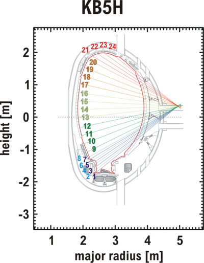
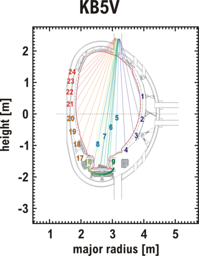

# Synthetic JET KB5 bolometer

Information on the diagnostic may be found [here](https://users.euro-fusion.org/pages/data-dmsd/jetdatahandbook/php/entry.php?type=0&name=KB5#basic_information).

KB5H is in Octant 6 ($\phi=3\pi/4$ in JOREK, considering that $\phi=0$ is Octant 1) and KB5V in Octant 3 ($\phi=3\pi/2$).




Here is an example of [postproc script](jorek2_postproc) to produce synthetic KB5 data:

```text
namelist JET85943_R3P4Z0P9

si-units

for step 10 to 90000 by 100 do

  expressions t
  point 3.0 1.0 0.

  expressions radiation
  int_along_pol_line       3.5537   -0.7886   2.3929    -1.7272   2.3562
  int_along_pol_line       3.6198   -0.6856    2.4205   -1.6093   2.3562
  int_along_pol_line       3.6645   -0.6048    2.4024   -1.5325   2.3562
  int_along_pol_line       3.6985   -0.5363    2.4129   -1.4351   2.3562
  int_along_pol_line       3.7260   -0.4758    2.3884   -1.3671   2.3562
  int_along_pol_line       3.7493   -0.4208    2.3041   -1.3344   2.3562
  int_along_pol_line       3.7675   -0.3720    2.2458   -1.2875   2.3562
  int_along_pol_line       3.7841   -0.3259    2.1943   -1.2311   2.3562
  int_along_pol_line       3.8090   -0.2474    2.1298   -1.0753   2.3562
  int_along_pol_line       3.8427   -0.1170    2.0286   -0.8316   2.3562
  int_along_pol_line       3.8648   -0.0028    1.9325   -0.5836   2.3562
  int_along_pol_line       3.8785    0.0993    1.8676   -0.3282   2.3562
  int_along_pol_line       3.8873    0.2074    1.8220   -0.0333   2.3562
  int_along_pol_line       3.8903    0.2996    1.8063    0.2302   2.3562
  int_along_pol_line       3.8891    0.3913    1.8135    0.4950   2.3562
  int_along_pol_line       3.8835    0.4840    1.8427    0.7559   2.3562
  int_along_pol_line       3.8718    0.5897    1.8812    1.0398   2.3562
  int_along_pol_line       3.8541    0.6950    1.9414    1.2977   2.3562
  int_along_pol_line       3.8278    0.8125    2.0362    1.5449   2.3562
  int_along_pol_line       3.7872    0.9494    2.1493    1.7824   2.3562
  int_along_pol_line       3.7575    1.0320    2.2663    1.9060   2.3562
  int_along_pol_line       3.7147    1.1353    2.4163    1.9787   2.3562
  int_along_pol_line       3.6507    1.2648    2.6031    2.0164   2.3562
  int_along_pol_line       3.6406    1.3661    2.8588    1.9835   2.3562
  int_along_pol_line       4.0300    0.1625    3.5548    1.4896   4.7124
  int_along_pol_line       3.9230   -0.3750    3.4211    1.6180   4.7124
  int_along_pol_line       3.7079   -0.8068    3.3274    1.6931   4.7124
  int_along_pol_line       3.4131   -1.1351    3.2523    1.7433   4.7124
  int_along_pol_line       3.1063   -1.3412    3.1932    1.7827   4.7124
  int_along_pol_line       2.8439   -1.5236    3.1511    1.8046   4.7124
  int_along_pol_line       2.6213   -1.6009    3.1176    1.8204   4.7124
  int_along_pol_line       2.4191   -1.5177    3.0853    1.8357   4.7124
  int_along_pol_line       2.9144   -1.4676    3.1408    1.8094   4.7124
  int_along_pol_line       2.8312   -1.5336    3.1256    1.8166   4.7124
  int_along_pol_line       2.7433   -1.5750    3.1098    1.8241   4.7124
  int_along_pol_line       2.6580   -1.6053    3.0948    1.8312   4.7124
  int_along_pol_line       2.5786   -1.5958    3.0794    1.8385   4.7124
  int_along_pol_line       2.4990   -1.5794    3.0647    1.8454   4.7124
  int_along_pol_line       2.4255   -1.5226    3.0500    1.8524   4.7124
  int_along_pol_line       2.3592   -1.4631    3.0361    1.8590   4.7124
  int_along_pol_line       2.1879   -1.1918    2.9925    1.8775   4.7124
  int_along_pol_line       2.0029   -0.8796    2.9502    1.8909   4.7124
  int_along_pol_line       1.8463   -0.5303    2.9040    1.9055   4.7124
  int_along_pol_line       1.7538   -0.1535    2.8574    1.9203   4.7124

done
```
