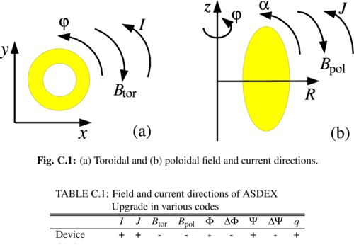
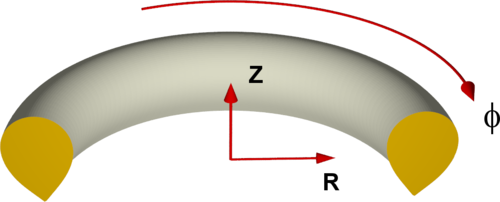
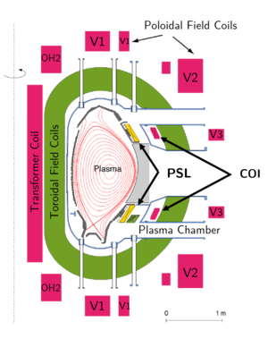

# Information relevant for simulating ASDEX Upgrade
<!-- For some specific test cases see also [ASDEX Upgrade JOREK Wiki](asdex_upgrade_wiki) (**OLD**) -->

The standard signs in ASDEX Upgrade correspond to the following in JOREK:

```
F0       > 0
Psi_axis < Psi_xpoint
```

## Overview by Erika Strumberger

<!-- {: width="500"} -->


## JOREK Coordinate System

<!-- {: width="500"} -->


## Equilibria

<!-- ### cliste2jorek Script -->

<!-- - The [cliste2jorek script](cliste2jorek_script) extracts the equilibrium information of ASDEX Upgrade shotfiles for JOREK. -->

### Conversion of NEMEC Equilibria

- $J_{pol}$ from Cotrans mode0 (`xm_jpol_spol`) $\rightarrow$ calculate $FF'$ from it as below, make fit to smooth
- $\Delta\Psi_\text{NEMEC}$ is $\Psi_{bnd} - \Psi_{axis}$ in NEMEC coordinates
- Signs might need to be corrected (see above)

$$
\begin{align}
F &= \frac{\mu_0}{2\pi}\; J_{pol} \\
\Psi_\text{JOREK} &= \frac{1}{2\pi}\;\Psi_\text{NEMEC} \\
F' &= \frac{\partial F}{\partial\Psi_\text{JOREK}} = \frac{\partial F}{\partial\Psi_N}\underbrace{\frac{\partial\Psi_N}{\partial\Psi_\text{JOREK}}}_{=1/(\Delta\Psi_\text{JOREK})} = \frac{2\pi}{\Delta\Psi_\text{NEMEC}}\;\frac{\partial F}{\partial\Psi_N} \\
FF' &= \frac{2\pi}{\Delta\Psi_\text{NEMEC}}\;\frac{\mu_0^2}{4\pi^2}J_{pol}\frac{\partial J_{pol}}{\partial\Psi_N} = \frac{\mu_0^2}{2\pi\Delta\Psi_\text{NEMEC}}\;J_{pol}\frac{\partial J_{pol}}{\partial\Psi_N}
\end{align}
$$

### Simplified Equilibria for Tests

- [Simplified Equilibria for Tests](asdex_upgrade_simplified-equilibria-for-tests)
- [Large aspect ratio tearing mode benchmark](asdex_upgrade_large-aspect-ratio-tearing-mode-benchmark)
- [Simplified X-point tearing mode test case](asdex_upgrade_simplified-x-point-tearing-mode-test-case)

## Coil geometry

### PF coils
The coil geometry for STARWALL was extracted from the machine description file provided by Mike Dunne and contains all PF coils.

The tar file contains the original machine description file, the geometry of conducting structures of AUG, the vessel geometry, the PF coils for STARWALL as filaments, the thick band model of the PSL (which was benchmarked against CASTOR3D), and an example input file for STARWALL:
[aug_freeb_input.tar](assets/asdex_upgrade/aug_freeb_input.tar)
<!-- [aug_freeb_input.tar](https://www.jorek.eu/wiki/lib/exe/fetch.php?media=aug_freeb_input.tar) -->

See also [pf coils](asdex_upgrade_pf-coils-cliste) for the geometry of the PF coils (in magenta in the picture below) and an explanation of the Machine Description file.

<!-- {: width="300"} -->


The coil currents for a specific shot can be directly extracted by cliste from the shotfile. During the free-boundary equilibrium the V2 coils are used for the feedback.
When using the [controller](active_controller_model_for_vertical_stabilization) for active stabilization during the simulation, the CoI coils are used like in the experiment for fast feedback.

<!-- [Coil feedings as ascii and sw input](https://www.jorek.eu/wiki/lib/exe/fetch.php?media=aug_feeding.tar.gz) -->
The coil feedings were provided by I. Zammuto and transformed into STARWALL data.
The OH2o and OH2u coils are connected to the OH feeding and also have separate inputs.

```
1. +OH1
2. -OH1 > +OH2o
3. -OH2o > +OH2u
4. -OH2u > +OH3u
5. -OH3u > +OH3o
6. -OH3o
The OH2 coils get additional currents (in fact they have additional feeders, the reserve in the mesh file):
1. the OH2o has the current IOH+dIOH2s and
2. the OH2u has the current IOH+dIOH2s+dIOH2u 
All these feedings are included in the OH file.
The V1+V2 coils consist of two different circuits each, so there is also a line connecting the two circuits.
```

<!-- # RMP Coils

- [R. Nazikian's slides 16-07-2015](assets/asdex_upgrade/nazikian_ipp_07152015.pdf) -->

## Literature
- [Literature on ELM Physics](asdex_upgrade_literature_on_elm_physics)
- [Literature on Disruption Physics](asdex_upgrade_literature_on_disruption_physics)