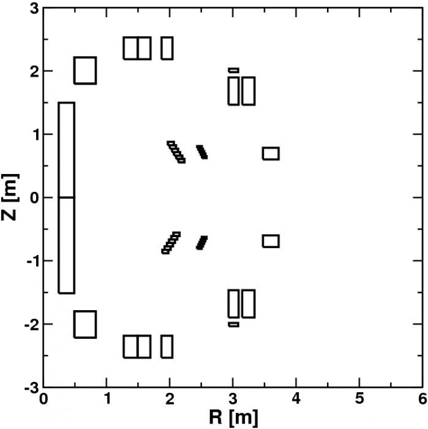

# PF coils

**E-Mail 2.3.2016:**

*I've copied the lines from the AUG MachineDescription file below - it's not exactly easy to read, but I can't really think of a better way to present it. The first chunk is just the coil names, the second is the number of "active" segments in the two following descriptions. The third chunk is the number of turns per 'segment' - the divisions are relatively arbitrary as far as I can see, but made such that each segment isn't too large or non-rectangular. It's an 18x6 array, for 18 coils with a maximum of 6 segments each - many also have fewer segments. The final one then is a more complicated array of 18 lines x 6 segments x 4 data points each for R,z,dr,dz data for each segment, with the number of turns from the third data chunk.*

*Let me know if this is not clear - it's not exactly easy to get your head around. If you're reading out coil data from a shotfile, then the current just gets equally distributed over all of the turns.*

*Mike*

**Coil ordering:**

```
'V1o', 'V1u', 'V2o', 'V2u', 'V3o', 'V3u', 'PSLu', 'PSLo', 'Coio', 'Coiu', 'OHo', 'OHu', 'PSLQuhi', 'PSLQulo', 'PSLQolo', 'PSLQohi', 'OH2o', 'OH2u'
```

**Number of segments with non-zero values below:**

```
3, 3, 2, 2, 1, 1, 6, 6, 5, 5, 3, 3, 3, 3, 3, 3, 1, 1
```

**Number of turns per segment, one conductor per line:**

```
35.0000, 31.0000, 27.0000, 0.0000, 0.0000, 0.0000,
35.0000, 31.0000, 27.0000, 0.0000, 0.0000, 0.0000,
39.0000, 47.0000, 0.0000, 0.0000, 0.0000, 0.0000,
39.0000, 47.0000, 0.0000, 0.0000, 0.0000, 0.0000,
28.0000, 0.0000, 0.0000, 0.0000, 0.0000, 0.0000,
28.0000, 0.0000, 0.0000, 0.0000, 0.0000, 0.0000,
0.16667, 0.16667, 0.16667, 0.16667, 0.16667, 0.16667,
0.16667, 0.16667, 0.16667, 0.16667, 0.16667, 0.16667,
1.0000, 1.0000, 1.0000, 1.0000, 1.0000, 0.0000,
1.0000, 1.0000, 1.0000, 1.0000, 1.0000, 0.0000,
255.0000, 81.000, 5.0000, 0.0000, 0.0000, 0.0000,
255.0000, 81.000, 5.0000, 0.0000, 0.0000, 0.0000,
0.50000, 0.3660, 0.1340, 0.0000, 0.0000, 0.0000,
0.1340, 0.3660, 0.5000, 0.0000, 0.0000, 0.0000,
0.50000, 0.3660, 0.1340, 0.0000, 0.0000, 0.0000,
0.1340, 0.3660, 0.5000, 0.0000, 0.0000, 0.0000,
81.0000, 0.0000, 0.0000, 0.0000, 0.0000, 0.0000,
81.0000, 0.0000, 0.0000, 0.0000, 0.0000, 0.0000
```

**Segment information (R, z, dr, dz, one conductor per line):**

```
1.3836,2.3582,0.2182,0.3463, 1.5979,2.3582,0.1985,0.3463, 1.9572,2.3582,0.1724,0.3463,0.00,0.00,0.00,0.00,0.00,0.00,0.00,0.00, 0.00,0.00,0.00,0.00,
1.3816,-2.3583,0.2178,0.3466, 1.5956,-2.3583,0.1981,0.3466, 1.9562,-2.3583,0.1720,0.3466,0.00,0.00,0.00,0.00,0.00,0.00,0.00,0.00, 0.00,0.00,0.00,0.00,
3.0110,1.6815,0.1590,0.4310, 3.2462,1.6815,0.1945,0.4310, 0.00, 0.00, 0.00, 0.00, 0.00, 0.00, 0.00, 0.00, 0.00, 0.00, 0.00, 0.00, 0.00,0.00,0.00,0.00,
3.0120,-1.6815,0.1590,0.4310, 3.2458,-1.6815,0.1945,0.4310,0.00, 0.00, 0.00, 0.00, 0.00, 0.00, 0.00, 0.00, 0.00, 0.00, 0.00, 0.00, 0.00,0.00,0.00,0.00,
3.5995,0.6937,0.2479,0.1836, 0.00, 0.00, 0.00, 0.00, 0.00, 0.00, 0.00, 0.00, 0.00, 0.00, 0.00, 0.00, 0.00, 0.00, 0.00, 0.00, 0.00,0.00,0.00,0.00,
3.6001,-0.6914,0.2480,0.1836, 0.00, 0.00, 0.00, 0.00, 0.00, 0.00, 0.00, 0.00, 0.00, 0.00, 0.00, 0.00, 0.00, 0.00, 0.00, 0.00, 0.00,0.00,0.00,0.00,
2.109, -0.583, 0.096, 0.054, 2.074, -0.637, 0.096, 0.054, 2.038, -0.691,  0.096, 0.054, 2.003, -0.745, 0.096, 0.054, 1.967, -0.799, 0.096, 0.054,  1.932, -0.853, 0.096, 0.054,
2.1845, 0.583, 0.095, 0.054, 2.1515, 0.637,  0.095, 0.054, 2.1185, 0.691, 0.095, 0.054, 2.0855, 0.745, 0.095, 0.054,  2.0525, 0.799, 0.095, 0.054, 2.0195, 0.853, 0.095, 0.054,
2.5480,0.6380,0.0750,0.0320, 2.5293,0.6775,0.0750,0.0320, 2.5105,0.7170,0.0750,0.0320, 2.4918,0.7565,0.0750,0.0320, 2.4730,0.7960,0.0750,0.0320, 0.00,0.00,0.00,0.00,
2.5463,-0.6380,0.0750,0.0320, 2.5276,-0.6775,0.0750,0.0320, 2.5088,-0.7170,0.0750,0.0320, 2.4901,-0.7565,0.0750,0.0320, 2.4713,-0.7960,0.0750,0.0320,0.00,0.00,0.00,0.00,
0.3685, 0.7490,0.2450,1.4980, 0.6610, 2.0073, 0.3380, 0.4145, 3.0119, 2.0081, 0.1458, 0.0528, 0.00, 0.00, 0.00, 0.00, 0.00, 0.00, 0.00, 0.00, 0.00,0.00,0.00,0.00,
0.3685,-0.7570,0.2450,1.5140, 0.6610,-2.0073, 0.3380, 0.4145, 3.0112,-2.0086, 0.1458, 0.0528, 0.00, 0.00, 0.00, 0.00, 0.00, 0.00, 0.00, 0.00, 0.00,0.00,0.00,0.00,
2.109, -0.583, 0.096, 0.054, 2.074, -0.637, 0.096, 0.054, 2.038, -0.691,  0.096, 0.054, 0.00, 0.00, 0.00, 0.00, 0.00, 0.00, 0.00, 0.00, 0.00,0.00,0.00,0.00,
2.003, -0.745, 0.096, 0.054, 1.967, -0.799, 0.096, 0.054,  1.932, -0.853, 0.096, 0.054, 0.00, 0.00, 0.00, 0.00, 0.00, 0.00, 0.00, 0.00, 0.00,0.00,0.00,0.00,
2.1845, 0.583, 0.095, 0.054, 2.1515, 0.637,  0.095, 0.054, 2.1185, 0.691, 0.095, 0.054, 0.00, 0.00, 0.00, 0.00, 0.00, 0.00, 0.00, 0.00, 0.00,0.00,0.00,0.00,
2.0855, 0.745, 0.095, 0.054,  2.0525, 0.799, 0.095, 0.054, 2.0195, 0.853, 0.095, 0.054, 0.00, 0.00, 0.00, 0.00, 0.00, 0.00, 0.00, 0.00, 0.00,0.00,0.00,0.00,
0.6610,2.0072,0.3380,0.4145, 0.00, 0.00, 0.00, 0.00, 0.00, 0.00, 0.00, 0.00, 0.00, 0.00, 0.00, 0.00, 0.00, 0.00, 0.00, 0.00, 0.00,0.00,0.00,0.00,
0.6610,-2.0072,0.3380,0.4145, 0.00, 0.00, 0.00, 0.00, 0.00, 0.00, 0.00, 0.00, 0.00, 0.00, 0.00, 0.00, 0.00, 0.00, 0.00, 0.00, 0.00,0.00,0.00,0.00
```

<!-- - [aug-pf-coils.tar.gz](assets/asdex_upgrade/aug-pf-coils.tar.gz) -->


