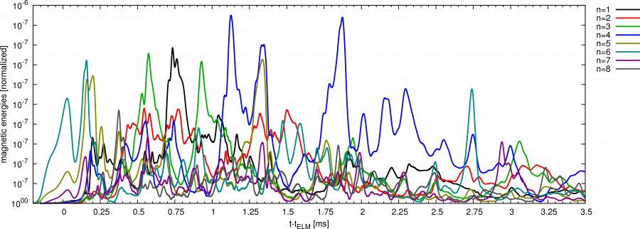

<!-- #TODO_BY_HAOWEI -->
<!-- The missing attachments need to be downloaded from: https://jorek.eu/aug/doku.php?id=2018-01-data-export-for-soeren-jose-elisee -->

# Overview AUG ELM Simulation for #33616 and data export

### Data exported

- You are free to use the data of course. However, before using the data for publications, please make sure you discuss with me to exclude misunderstandings etc.
- If publishing, please state that the data is taken from a JOREK [Huysmans GTA and Czarny O, NF 47, 659 (2007)] simulation and the data corresponds to the case described in [Hoelzl M., et al. Contributions to Plasma Physics (accepted)](assets/asdex_upgrade/2018-mhoelzl-cpp-accepted.pdf) and [Mink F., Hoelzl M., et al. Nuclear Fusion 58, 026011 (2018)](https://doi.org/10.1088/1741-4326/aa98f7)

- **Soeren**: $R=2\dots2.2 m$, $Z=-0.35\dots0.35 m$, 201x701 points (1 mm distance)
  - [step00640](assets/asdex_upgrade/exprs_rmin2.000_rmax2.200_zmin-0.350_zmax0.350_phi0.000_s00640.h5.gz): $t-t_{ELM}=-0.25 ms$ (essentially unperturbed equilibrium)
  - [step00870](assets/asdex_upgrade/exprs_rmin2.000_rmax2.200_zmin-0.350_zmax0.350_phi0.000_s00870.h5.gz): $t-t_{ELM}=0.00 ms$ (ELM onset)
  - [step01410](assets/asdex_upgrade/exprs_rmin2.000_rmax2.200_zmin-0.350_zmax0.350_phi0.000_s01410.h5.gz): $t-t_{ELM}=0.25 ms$
  - [step02320](assets/asdex_upgrade/exprs_rmin2.000_rmax2.200_zmin-0.350_zmax0.350_phi0.000_s02320.h5.gz): $t-t_{ELM}=0.50 ms$
  - [step03580](assets/asdex_upgrade/exprs_rmin2.000_rmax2.200_zmin-0.350_zmax0.350_phi0.000_s03580.h5.gz): $t-t_{ELM}=0.75 ms$
  - [step04770](assets/asdex_upgrade/exprs_rmin2.000_rmax2.200_zmin-0.350_zmax0.350_phi0.000_s04770.h5.gz): $t-t_{ELM}=1.00 ms$
  - [step06210](assets/asdex_upgrade/exprs_rmin2.000_rmax2.200_zmin-0.350_zmax0.350_phi0.000_s06210.h5.gz): $t-t_{ELM}=1.25 ms$
  - [step07690](assets/asdex_upgrade/exprs_rmin2.000_rmax2.200_zmin-0.350_zmax0.350_phi0.000_s07690.h5.gz): $t-t_{ELM}=1.50 ms$
  - [step08920](assets/asdex_upgrade/exprs_rmin2.000_rmax2.200_zmin-0.350_zmax0.350_phi0.000_s08920.h5.gz): $t-t_{ELM}=1.75 ms$
  - [step10040](assets/asdex_upgrade/exprs_rmin2.000_rmax2.200_zmin-0.350_zmax0.350_phi0.000_s10040.h5.gz): $t-t_{ELM}=2.00 ms$ (approximately the end of the crash)
  - [step11910](assets/asdex_upgrade/exprs_rmin2.000_rmax2.200_zmin-0.350_zmax0.350_phi0.000_s11910.h5.gz): $t-t_{ELM}=2.50 ms$
  - [step13000](assets/asdex_upgrade/exprs_rmin2.000_rmax2.200_zmin-0.350_zmax0.350_phi0.000_s13000.h5.gz): $t-t_{ELM}=3.00 ms$
  - [step19100](assets/asdex_upgrade/exprs_rmin2.000_rmax2.200_zmin-0.350_zmax0.350_phi0.000_s19100.h5.gz): $t-t_{ELM}=7.00 ms$
  - Time steps 4000...7990: [Part A](assets/asdex_upgrade/exprs_rmin2.000_rmax2.200_zmin-0.350_zmax0.350_phi0.000_s04000-s07990_a.tar.gz) | [Part B](assets/asdex_upgrade/exprs_rmin2.000_rmax2.200_zmin-0.350_zmax0.350_phi0.000_s04000-s07990_b.tar.gz) | [Part C](assets/asdex_upgrade/exprs_rmin2.000_rmax2.200_zmin-0.350_zmax0.350_phi0.000_s04000-s07990_c.tar.gz) | [Part D](assets/asdex_upgrade/exprs_rmin2.000_rmax2.200_zmin-0.350_zmax0.350_phi0.000_s04000-s07990_d.tar.gz) | [Part E](assets/asdex_upgrade/exprs_rmin2.000_rmax2.200_zmin-0.350_zmax0.350_phi0.000_s04000-s07990_e.tar.gz) | [Part F](assets/asdex_upgrade/exprs_rmin2.000_rmax2.200_zmin-0.350_zmax0.350_phi0.000_s04000-s07990_f.tar.gz) | [Part G](assets/asdex_upgrade/exprs_rmin2.000_rmax2.200_zmin-0.350_zmax0.350_phi0.000_s04000-s07990_g.tar.gz) | [Part H](assets/asdex_upgrade/exprs_rmin2.000_rmax2.200_zmin-0.350_zmax0.350_phi0.000_s04000-s07990_h.tar.gz)
- **Jose**: $R=2.12\dots2.17025 m$, $Z=-0.1\dots0.10025 m$, 135x535 points (0.375 mm distance)
  - [step00600..02890](http://www.ipp.mpg.de/~mhoelzl/download/2018-01-augelm-33616-jose-steps00600..02890.tar.bz2)
  - [step02900..05190](http://www.ipp.mpg.de/~mhoelzl/download/2018-01-augelm-33616-jose-steps02900..05190.tar.bz2)
  - [step05200..07490](http://www.ipp.mpg.de/~mhoelzl/download/2018-01-augelm-33616-jose-steps05200..07490.tar.bz2)
  - [step07500..09790](http://www.ipp.mpg.de/~mhoelzl/download/2018-01-augelm-33616-jose-steps07500..09790.tar.bz2)
  - [step09800..11990](http://www.ipp.mpg.de/~mhoelzl/download/2018-01-augelm-33616-jose-steps09800..11990.tar.bz2)
- **Elisee**: $R=1.55\dots2.19 m$, $Z=-0.75\dots0.91 m$, 641x1661 points (1 mm distance)
  - in `/ptmp1/scratch/mhoelzl/for-elisee/`

### Overview of the simulation

- **ELM simulation for ASDEX Upgrade**
  - **long type-I ELM -- crash over about 2 ms**

- **Cliste** equilibrium reconstruction `micdu/eqb/33616/7.2s/ed1`
  - pre-ELM equilibrium reconstruction
  - $q_0=1.08$, $I_\text{tor}=800 kA$, $n_{e,0}=7.5\cdot10^{19}m^{-3}$, deuterium
  - Profiles from Mike: [33616-profiles.tar.gz](assets/asdex_upgrade/33616-profiles.tar.gz) versus $\rho_\text{pol}=\sqrt{\Psi_N}$
  - qprofile as function of $\Psi_N$ (ASCII data): [qprofile.dat.gz](assets/asdex_upgrade/qprofile.dat.gz)
- **ELM simulation**:
  - Raw data in (information for me): `/ptmp1/scratch/mhoelzl/FROM-DRACO/data/2016-09-AUGELMs-33616/eta2e-7_R3_simplifiedNEO/n0-8_dia_neo_par_JN333bs_higherchipar_e1e-7_CORRVTOR/`
  - n=0...8 harmonics included
  - See [Hoelzl M., et al. Contributions to Plasma Physics (accepted)](assets/asdex_upgrade/2018-mhoelzl-cpp-accepted.pdf)
  - See [Mink F., Hoelzl M., et al. Nuclear Fusion 58, 026011 (2018)](https://doi.org/10.1088/1741-4326/aa98f7)
  - JOREK normalization factors: $\sqrt{\mu_0\rho_0}=5.6\cdot10^{-7}$, $\sqrt{\mu_0/\rho_0}=2.2$
  - The data written out for you should not be normalized
  - **Table of times**: Correspondence between time step, normalized simulation time, simulation time, and time with respect to ELM onset: [see here](2018-01-augelm3-times2); note that the steps are not equidistant in time
    - A file with the time step in the first column and the JOREK normalized time in the second column: [2018-02-aug-33616-times.dat.gz](assets/asdex_upgrade/2018-02-aug-33616-times.dat.gz)
    - Time normalization: $t [ms]=t_{JOREK}\cdot5.6\cdot10^{-4}$
    - ELM crash starts at $t_{ELM}=0.9 ms$
    - Example: time step 5000 corresponds to simulation time $3.470620000E+03$, thus to $t=1.944 ms$ and to $t-t_{ELM}=1.04 ms$, i.e., it is in the middle of the ELM crash
  - The simulation only has a single temperature, thus the electron temperature written out for you is done with the assumption $T_e=T_i$

#### Some additional notes (not self-explanatory for you)

- See http://www2.ipp.mpg.de/~mhoelzl/augelm3/ for an overview over the available simulations
- The relevant simulation is `n0-8_dia_neo_par_JN333bs_higherchipar_e1e-7_CORRVTOR`
- See input files for details
- Simulations carried out on DRACO
- The JOREK version used is close to release 2.17.2.0 (currently in preparation)
- Reduced MHD with parallel, diamagnetic, and neoclassical flows (model333)
- Bohm boundary conditions, ideal wall
- Grid resolution is `n_flux=69` and `n_tht=173`; `n_elements=14028`, this is well converged for the relevant mode numbers in the simulation
- Realistic low viscosity
- Realistic high parallel conductivity (temperature dependent)
- Consistent evolution of bootstrap current (???)
- Temperature-dependent resistivity (`eta=1e-7`)
  - core resistivity is about $2\cdot10^{-7}\Omega m$ in the simulation
  - local resistivity at the edge ($\Psi_N=0.95$) is $9.8\cdot10^{-6}\Omega m$ in the simulation
    - $\eta_{Spitzer,\bot}$ at this location ($T_e\approx327eV$) is $2\cdot1.65\cdot10^{-9}\cdot17/(0.327)^{3/2}=3\cdot10^{-7}\Omega m$
    - so we are off by a factor of $15\pm5$ (error bars for exp temp profile)
    - After $Z_\text{eff}>1$ correction of Spitzer resistivity, **our resistivity is too large by a factor of $8\pm3$** (assuming $Z_\text{eff}\approx 2$)
- Hyperresistivity and -viscosity are chosen low enough not to influence results
- JOREK normalization factors (assuming pure deuterium plasma):
    - $n_0=7.55\cdot10^{19} m^{-3}$
    - $\rho_0=2.52\cdot10^{-7} kg m^{-3}$
    - $\sqrt{\mu_0\rho_0}=5.63\cdot10^{-7}$ -- time normalization factor: $t[s] = \sqrt{\mu_0\rho_0} \cdot t_\text{norm}$
    - $\sqrt{\mu_0/\rho_0}=2.23$
- Some drawbacks:
  - Sources/diffusivities are not optimal to preserve the pedestal structure in absence of instabilities
  - Parallel velocity is not set up totally realistic (the more important ExB and diamagnetic velocities should be realistic)
  - SOL perpendicular diffusivities are very high
