# ffp - scans

We varied the ffp_fitted_wo_SOL_current2.dat profile by adding a term of the form: a*exp[-(x-b)^2/c^2] to eliminate the step around 0.94 in the profile. By varriing the parameters a,b,c we tried to make the qprofile locally steeper around 0.94 .

## Plots

We did the all tests for F0=3.03593 (default) and F0=2.38.
The optained ffp and q profiles for different values of a,b,c  and F0 are shown here:

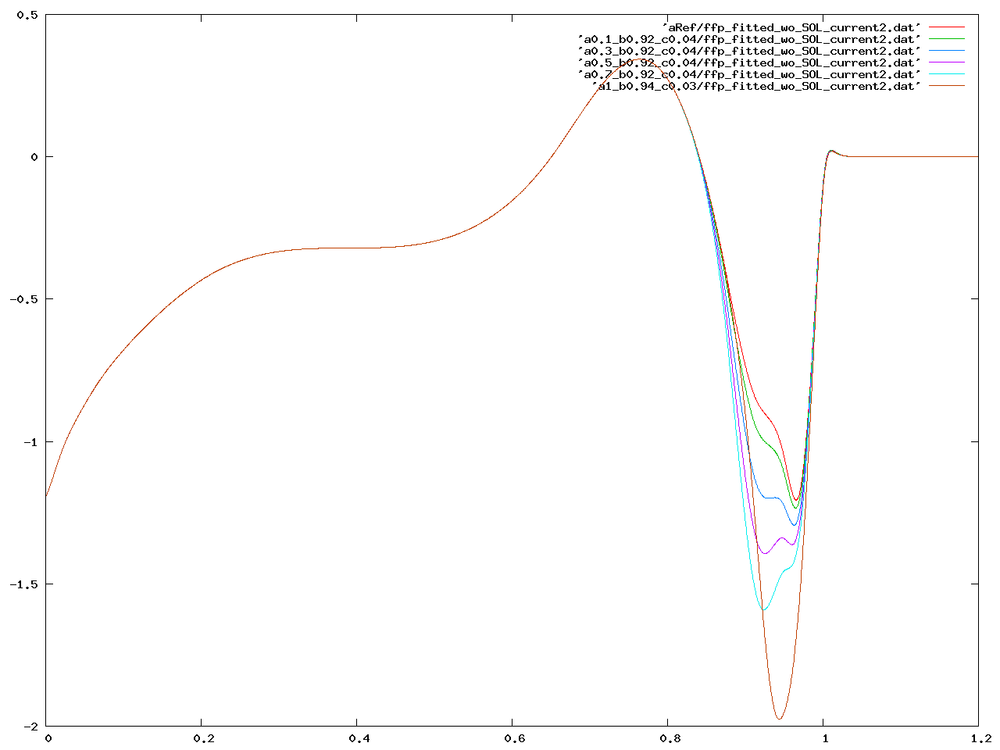

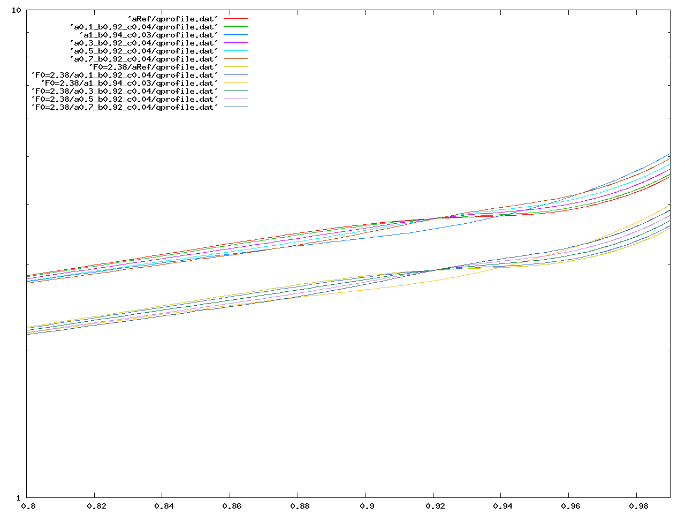

The resulting energies for F0 default:

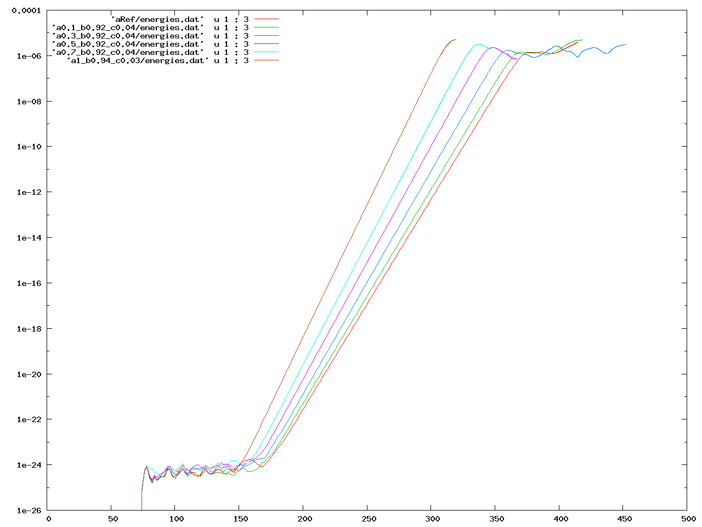

F0=2.38

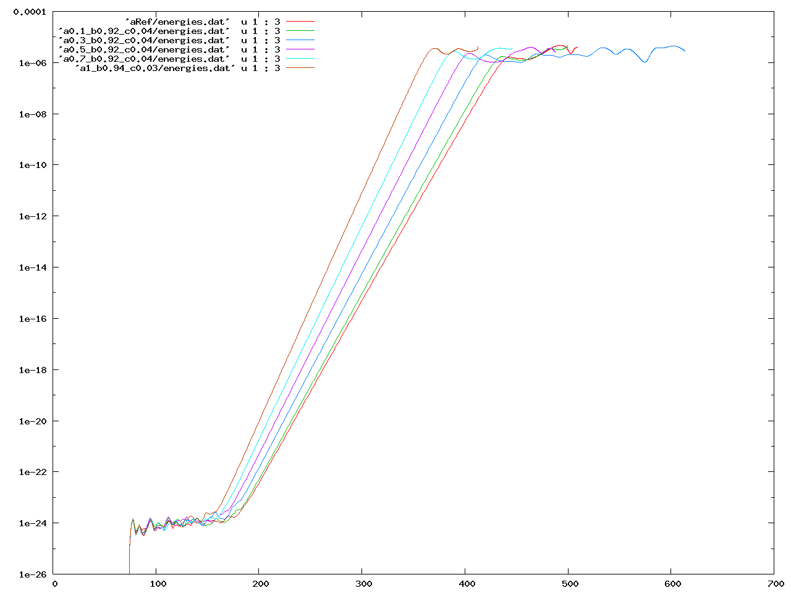

and some together

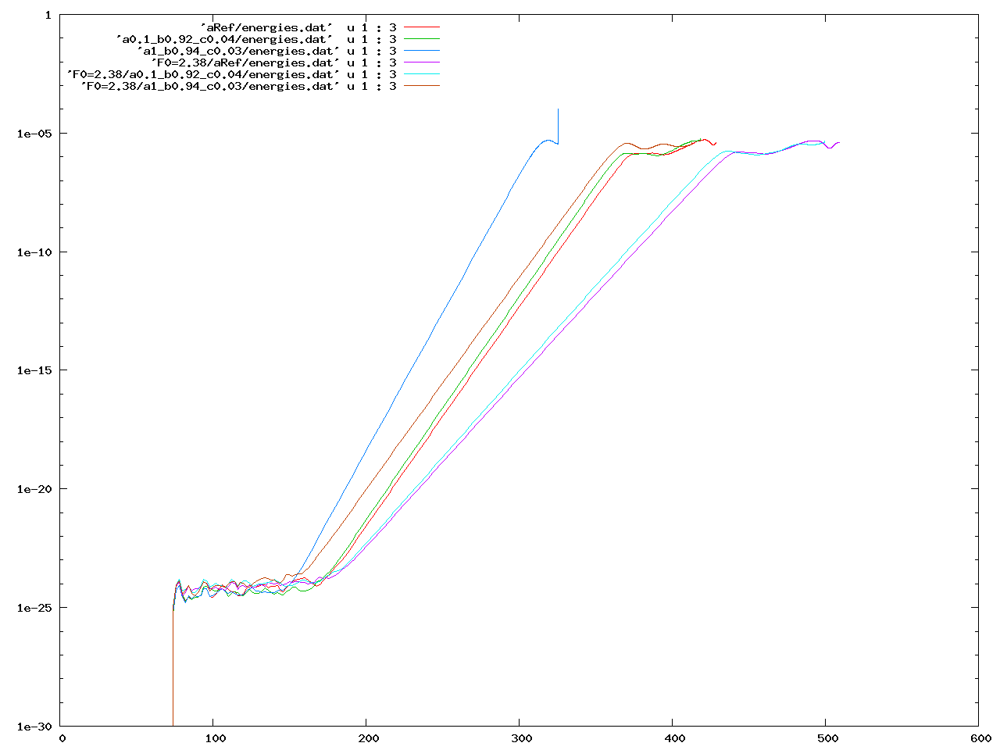

Here the end of the a1... run is of course nonsense.

## Observations

The growth rates are a lower for F0=2.38 and lower amplitudes of the added term. (lower values of a)

The repletion energy is higher for higher values of a.
The dependation of the repletion energy on a is stronger for F0=3.03593. E.g. the energy for
 F0=2.38/Ref is higher than for F0 default, but for a1 F0 default has the higher energy. 

For repletion we choose the time when γ = γ_lin/e

## density and pressure

We also observed the total density and pressure for all runs. 
The plots show the evolution of the quantity after the repletion normalized with its value at repletion. 

### pressure:

F0 default
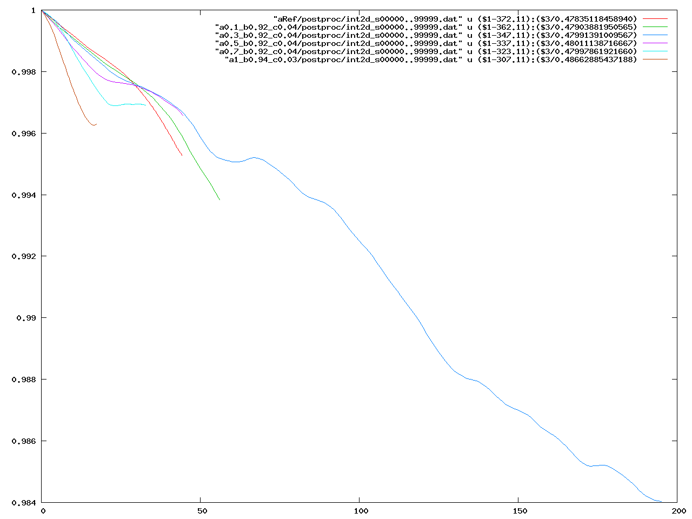

F0=2.38
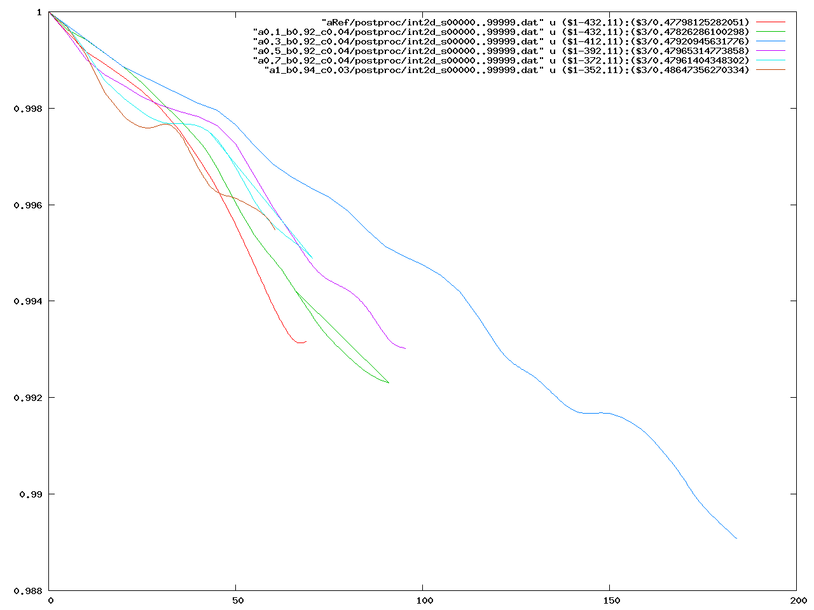

in one plot
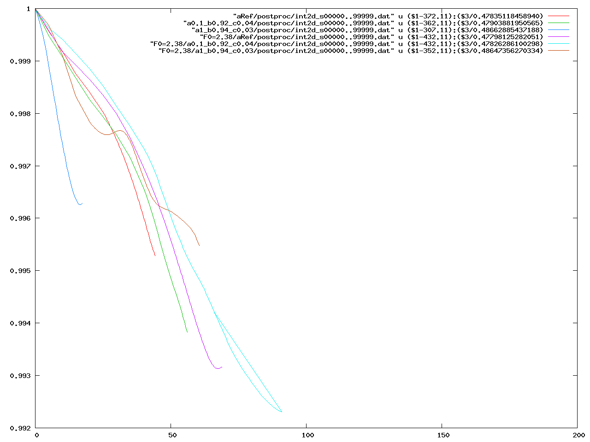

### density

F0 default
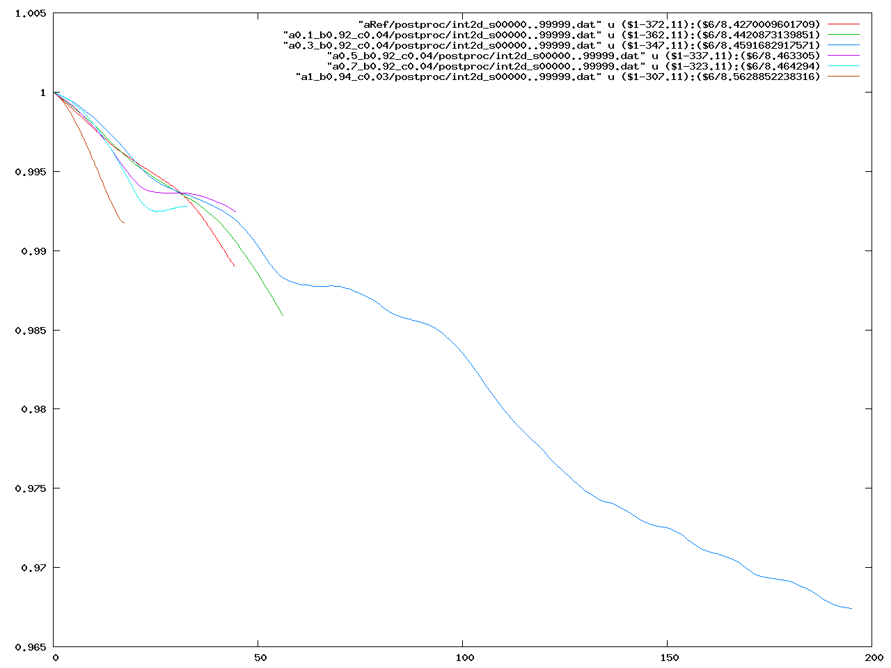

F0=2.38
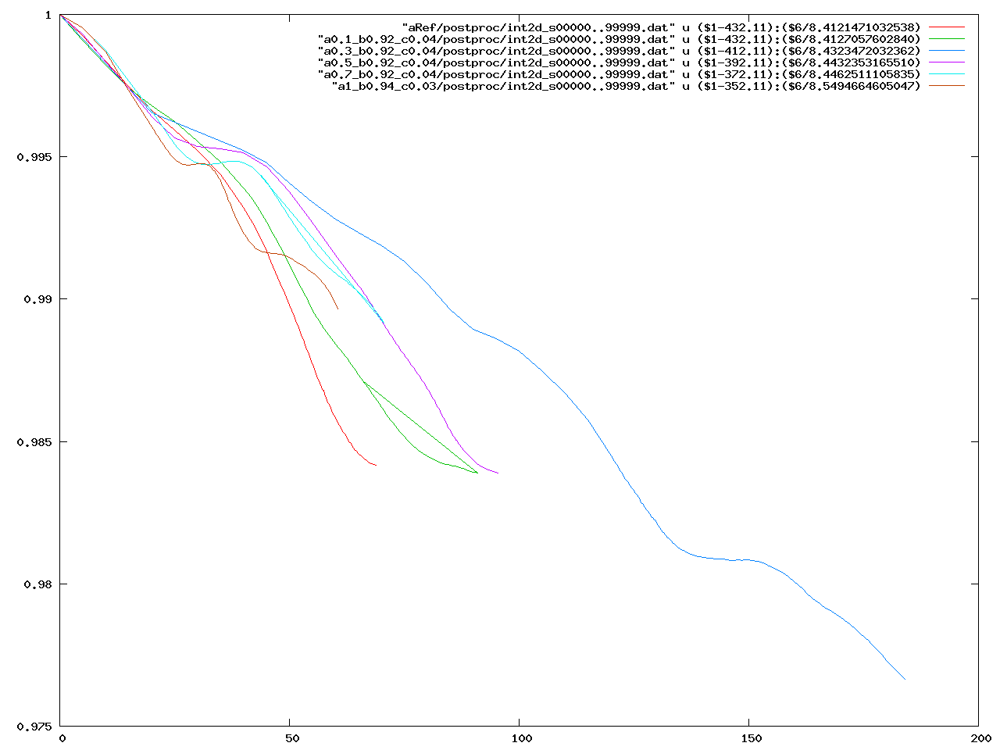

in one plot
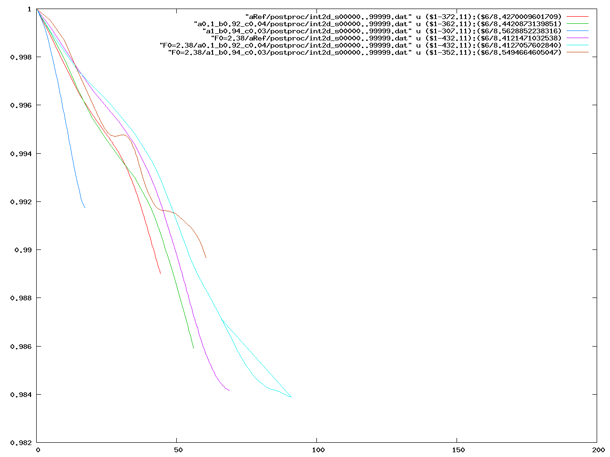

## vtk comparism

### Ref vs a1

#### linear growth
a1 has more expansion in x-direction, Ref more in ydirection

#### repletion
a1 has more and wider diffuse areas esp. on the bottom 
Ref is sharper
a1 is more significant on the left top,  Ref on the right bottom side
a1 develops tiny spots on the bottom, Ref develops them later and less significant

in density Ref is only significant on the right bottom, a1 on the whole right side up to the top. (see pictures) 

a1:

Ref:

### F02.38Ref vs F02.38a1

In the repletion Ref and a1 look similar indensity and current , but a1 is much stronger (higher values). But has less fade out.

Ref

a1

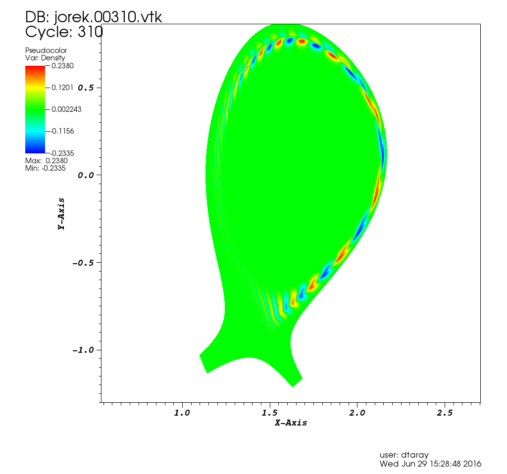

/tokp/work/dtaray/ffp_scan
