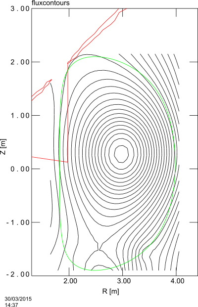
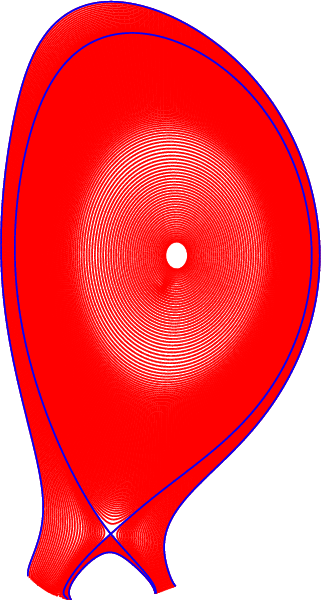
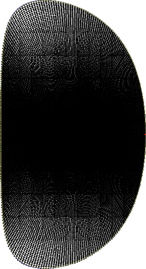
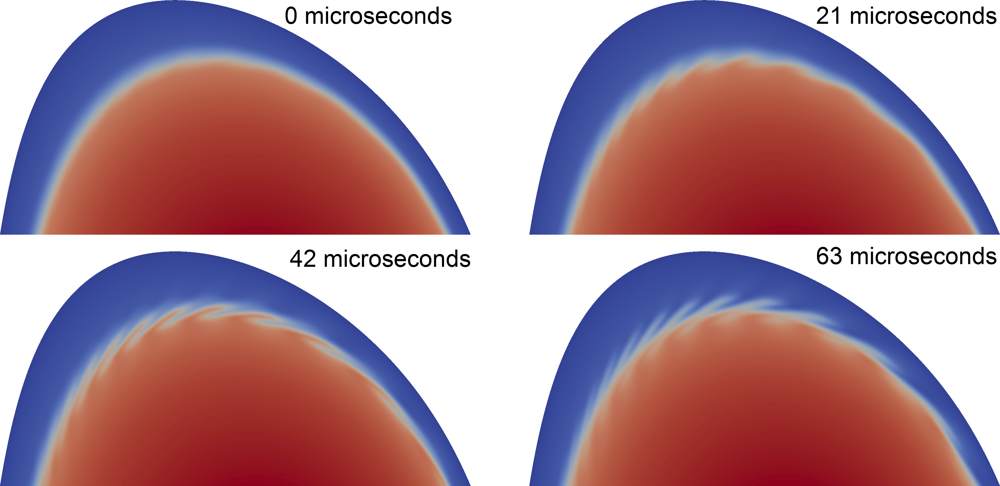

# JET ELM tutorial
One of the more usual cases to run is a JET elm.
This page will explain the steps required to run this case successfully on a cluster.

## Setup
First you will have to compile a working version of JOREK, using the instructions on [compiling](../compiling/cat_compiling). We will use model 303 in the rest of this tutorial.
There are two different executables that we need to compile to run this simulation.
The first is used to calculate the equilibria, and uses toroidal symmetry.
The second has the right number of fourier modes for this testcase.
These are [hard-coded_parameters](../compiling/getting_started/hard-coded_parameters) which must be set at compile time.

Check your `Makefile.inc` to remove debugging flags and extra checks if the simulation takes too much time.
### Equilibrium executable
First set the hard-coded parameters to the correct values to calculate the equilibrium.

```bash
./util/config.sh model=303 n_tor=1 n_period=1 n_plane=1
make clean
make -j4
mv jorek_model303 jorek_model303_equil
```
This produces an executable called `jorek_model303` and renames this to `jorek_model303_equil`.

### Simulation executable
For the real calculation we will use more harmonics.

```bash
./util/config.sh model=303 n_tor=3 n_period=10 n_plane=8
make clean
make -j4
```
We can keep the name of this executable as-is.

## Running the simulation
The simulation consists of three steps. The first step is calculating the equilibrium (solving Grad-Shafranov), the second step is calculating the equilibrium including flows, and the last step is calculating the solution in the situation with a specified number of harmonics.

You can obtain the required input files from [jet_tutorial.zip](assets/jet/jet_tutorial.zip).
This contains 3 input files for the different stages of the simulation.
These are generated from an `eqdsk` file, using the program `eqdsk2jorek.f90`. Both are included in the archive. A plot of the equilibrium flux contours (linearly interpolated) is shown below.


The important differences between these files are highlighted below, but most of the content is identical.
For a list of parameters and their meanings, see [Running JOREK](../compiling/getting_started/running).
### Equilibrium
Calculating the equilibrium is done by setting in the input file `in_jet_equil` the following parameters

```text
restart = .f.
nstep   = 0
```
which tells JOREK to calculate a new equilibrium for the other parameters in this input file.
We can then use `jorek_model303_equil` to calculate the equilibrium and save it in `jorek_restart.rst`

### Equilibrium with flows
To add flows we only need to set a nonzero number of timesteps and timestep sizes, in the file `in_jet_n0`.
For numerical stability it is required to start with small timesteps and increase these gradually.

```text
restart = .t.
tstep_n = 0.01, 0.1, 1., 2.,  5.
nstep_n =   25,  25, 50, 50, 450,
```
Here we also use `jorek_model303_equil` to calculate this equilibrium.
We will denote this part as the `n0` stage for the $n=0$ mode.

### Full simulation
For this simulation we only set a single timestep size in the file `in_jet`, and simulate for 2000 steps.

```text
restart = .t.
tstep   = 5.
nstep   = 2000
```
Use `jorek_model303` to do this.

### Submitting to a batch node
There are two convenience-scripts included in the zip-file. The first is used to calculate the equilibrium (first without and then with flows) in the n=0 mode.
First change your email address in this file, change the queue, number of systems and number of processes to suit your computer system and then run it with

```bash
./launch_jet_equil.sh
```

The first line in the script of 'launch_jet_equil.sh' is #!/bin/sh . You might need to change this line to  #!/bin/bash . The same goes for the 'launch_jet_run.sh'script.

After these jobs are done, you can start the ELM run with

```bash
./launch_jet_run.sh
```


If you can't run './launch_jet_equil.sh', because the system replies with: 'Permission denied'; enter the command: chmod u+x launch_jet_equil.sh
The same goes for './launch_jet_run.sh'

### Restarting the simulation

The easiest way of restarting a simulation to longer time simulated is copiing the last restart (.rst) file to the jorek_restart.rst file and then rerun JOREK.

```bash
cp jorekXXXXX.rst jorek_restart.rst
./launch_jet_run.sh
```

### Watching output
You can see the output using the command

```bash
tail --retry -n 20 -f jet_{equil,n0,run}.{err,out}
```
This will keep watching for these files to appear and print new changes from them.

## Output
The equilibrium calculation will create a file `jorek2.ps` containing plots of the grid and flux surfaces.
These are shown below.




The output files can be converted using jorek2vtk(.sh), and then processed with paraview to create movies. The image below shows the density in a poloidal cross-section.
[jorek_jet.mp4](jorek_jet.mp4)
