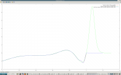
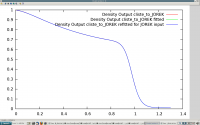
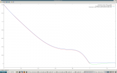
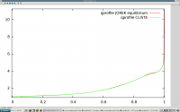
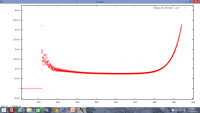

## Plots for midcu / eqb / 31128 / 2.4s / Edition 7

- Comparison of the different profiles given above:
- FFprime: 
- Density: 
- temperature: 
- qprofile in CLISTE and JOREK: 

- ELM ??? without diamagnetic drift
- ELM unstable with diamagnetic drift. Test n=8 started: 

