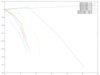

# tauIC scans

We varied tauIC for different values of eta and for n_period=04,08 and analised the resulting growth rates (γ) in the linear growth.
We did most of the runs linear, but also some nonlinear.

This plot shows on the y axis the growth rates divided by the growth rate at tauIC=0.
And on the x axis the decorrelation frequency divided by the growth rate at tauIC=0. We calculated the decorrelation frequency using a default value and assuming linear dependencies on the maximum pressure gradient, n_period and tauIC.

We would expect all curves to drop simliar from the point (0,1) but the plot shows this only for the linear runs. the nonlinear runs drop slower or even increases. So there is something we do net yet understand.



The exakt values of the growth rates and used maximum pressure gradients:

```text
tauIC   γ      γ/γ_0   max grad(p)

n=04 eta=3e-7
  0.e-3  0.064   1
  2.e-3  0.060   0.938
  4.e-3  0.052   0.812
  5.e-3  0.04    0.625

n=04 eta=4e-7
  0.e-3  0.087  1
  2.e-3  0.073  0.829
  4.e-3  0.064  0.736
  5.e-3  0.057  0.655
  6.e-3  0.05   0.574
  7.e-3  0.04   0.460

n=04 eta=5e-7
  0.e-3  0.088  1
  2.e-3  0.0829 0.942
  4.e-3  0.073  0.829
  5.e-3  0.067  0.761
  6.e-3  0.061  0.693
  7.e-3  0.05   0.568
  8.e-3  0.04   0.454

n=08 eta=3e-7
  0.e-3  0.12   1
  2.e-3  0.11   0.917
  4.e-3  0.083  0.692

n=08 eta=4e-7
  0.e-3  0.14  1
  2.e-3  0.13  0.929
  4.e-3  0.10  0.833
  5.e-3  0.083 0.593

n=08 eta=5e-7
  0.e-3  0.155  1          6.07e5
  2.e-3  0.141  0.910      5.87e5
  4.e-3  0.115  0.742      4.67e5
  5.e-3  0.089  0.574      4.49e5
  6.e-3  0.077  0.496      4.67e5

n=04 eta=1e-7 nonlin
  0.e-3  0.0076   1        4.55e5
  2.e-3  0.008    1.053    4.55e5

n=08 eta=5e-7	nonlin
  0.e-3  0.132    1       4.31e5
  2.e-3  0.131    0.992   5.49e5
  4.e-3  0.104    0.788   5.04e5
  5.e-3  0.082    0.654   5.83e5
  6.e-3  0.055    0.417   5.11e5

n=04 eta=2e-7	nonlin
  0.e-3  0.030    1       5.60e5
  2.e-3  0.031    1.03    4.67e5
  4.e-3  0.021    0.70    5.17e5
  6.e-3  0.008    0.27    5.29e5
```

The run folders and further data are in /tokp/work/dtaray/tauic-scan