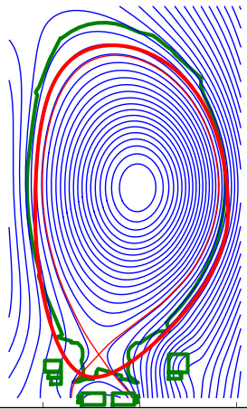
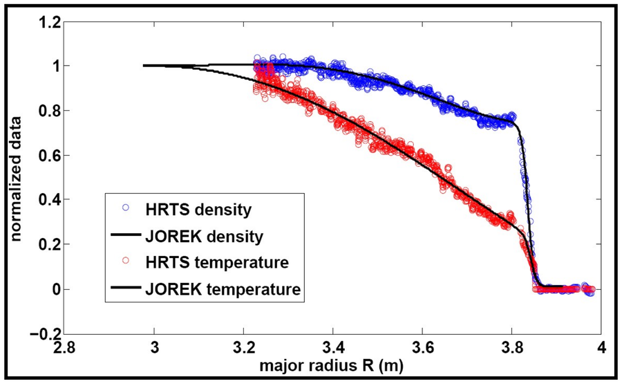
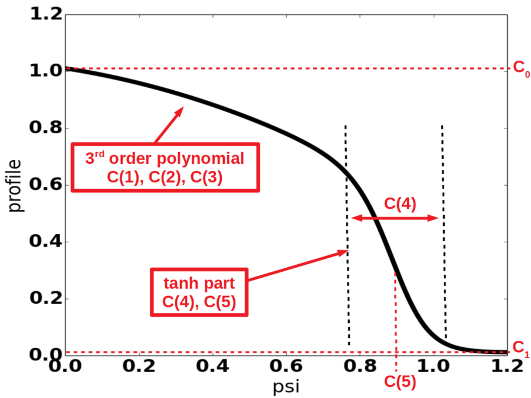
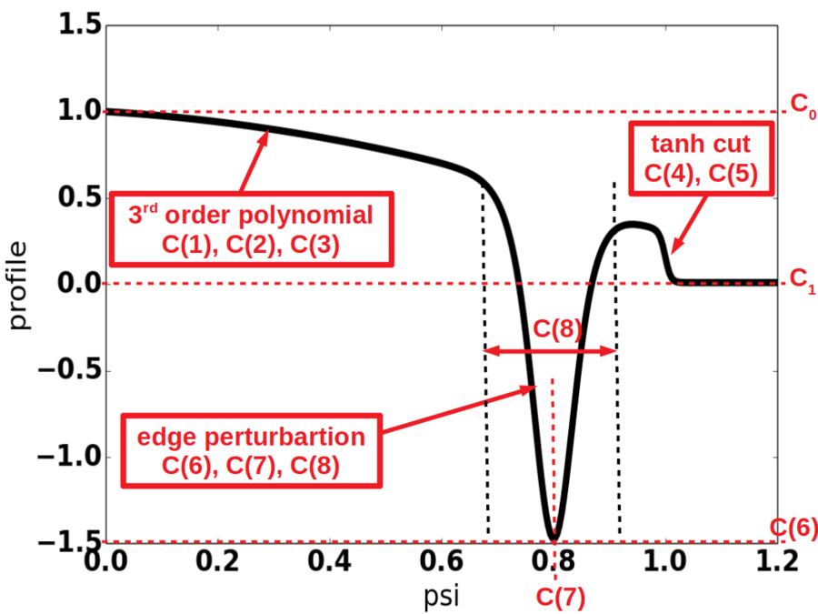
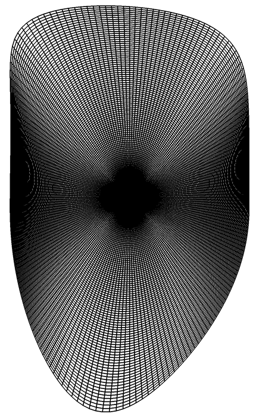

# Grad-Shafranov Tutorial

This tutorial describes how to reconstruct a Grad-Shafranov equilibrium
in JOREK.

------------------------------------------------------------------------

# GS inputs

The Grad-Shafranov (GS) equation reads:

$$ \Delta^{\ast}\psi =
-\mu_0 R^{2}\displaystyle\frac{dp(\psi)}{d\psi} -
F(\psi)\displaystyle\frac{dF(\psi)}{d\psi} $$

where $p$ and $F$ are functions of $\psi$ of course.

There are three essential inputs required to solve the GS inside an
ideal wall:

-   pressure profile
-   $FF'$ profile
-   $\psi$-contour around the plasma

We will now go through each input and how to obtain it, based on
experimental data. For this tutorial, we will use JET data, but in a
generic manner, so that this can apply to any experimental input.

However, before starting, it should be noted that the simplest method to
import data into a JOREK input file is to use the JOREK executable
`eqdsk2jorek`, which takes an `eqdsk` equilibrium file as input. Some
documentation about this tool can be found in the [eqdsk2jorek](eqdsk2jorek.md) page. It is helpful to be aware that very often a normalization factor of $ 2\pi $ is used for the poloidal magnetic flux $ \Psi = \psi/(2\pi)$ (this is the case when the COCOS number has two digits). When this is done, users should account for it both in the psi value on the boundary and in the ffprime profile (as F' is the derivative with respect to $\psi$ and __not__ $\psi_\mathrm{norm}$). 

------------------------------------------------------------------------

# The $\psi$-contour for the boundary conditions



Given an eqdsk file, or any equilibrium input, a boundary is needed
around the plasma, including the $\psi$-values for each point of the
contour. The input to feed into the JOREK input file takes the form:

```
mf = 0
n_boundary = 100
R_boundary( 1) = 3.90, Z_boundary( 1) = 0.01, psi_boundary( 1) = -1.48
R_boundary( 2) = 3.91, Z_boundary( 2) = 0.02, psi_boundary( 2) = -1.46
R_boundary( 3) = 3.92, Z_boundary( 3) = 0.03, psi_boundary( 3) = -1.44
...
R_boundary(100) = 3.90, Z_boundary(100) = 0.01, psi_boundary(100) = -1.48
```

where the __first and last points need to be the same__.

It is important to reall that the actual value of $\psi$ is important as a relative quantity to the value either on the magnetic axis and/or the separatrix. When constructing a magnetic equilibrium completely inside of the separatrix (either by giving an R,Z,psi boundary describing a speficic flux-surface or using Fourier coefficients with `mf => 2` and corresponding coefficients for the series with `fbnd(1:mf)` and `fpsi(1:mf)`), the default behaviour in the code is to assign a value of zero for the flux on the boundary and find the correct sign and value for `psi_axis`.

------------------------------------------------------------------------

# The pressure profile



JOREK solves for
density and temperature, such that the input pressure profile must be
decomposed into density and temperature profiles. We will not describe
here how to convert experimental data into JOREK profiles, but we will
here describe the basic modified tanh profiles commonly used in JOREK. A
simple way to have input profiles is just to use the `num_profiles`
option, where you can simply feed an array profile to JOREK. For example, for the FF' profile with `ffprime_file = 'jorek_ffprime.dat'`.

------------------------------------------------------------------------



JOREK density and temperature profiles are described as modified tanh profiles:

$\rho(\psi) = (C_0-C_1) f_{poly} f_{tanh} + C_1, $
where

$f_{poly}(\psi) = 1 + C(1)\psi + C(2)\psi^2 + C(3)\psi^3$

$f_{tanh}(\psi) = 0.5 - 0.5 \tanh\left(\displaystyle\frac{\psi-C(5)}{C(4)}\right)$

The generic inputs for a JOREK profile are:

-   $C_0$ : Value at magnetic axis
-   $C_1$ : Value outside separatrix
-   $C(1)$ : linear slope of modified tanh
-   $C(2)$ : quadratic slope of modified tanh
-   $C(3)$ : cubic slope of modified
-   $C(4)$ : width of tanh
-   $C(5)$ : position of tanh

In JOREK, the density and temperature profiles input are given as:

|  density | temperature | 
|  --- |  --- | 
|  `rho_0` | `T_0` |
|  `rho_1` | `T_1` | 
|  `rho_coef(1)` | `T_coef(1)` |
|  `rho_coef(2)` | `T_coef(2)` |
|  `rho_coef(3)` | `T_coef(3)` |
|  `rho_coef(4)` | `T_coef(4)` |
|  `rho_coef(5)` | `T_coef(5)` |

------------------------------------------------------------------------

# The FF\' profile



The JOREK $FF' $ profile is also a modified tanh profile, but with an
additional perturbation at the plasma edge to account for the bootstrap
current:

$$ FF'(\psi) = \left( (C_0-C_1) f_{poly} + f_{pert}\right) f_{tanh} + C_1, $$

where

$$ f_{poly}(\psi) = 1 + C(1)\psi + C(2)\psi^2 + C(3)\psi^3, $$
$$ f_{tanh}(\psi) = 0.5 - 0.5 \tanh\left(\frac{\psi-C(5)}{C(4)}\right), $$
$$ f_{pert}(\psi) = \frac{C(6)}{2C(8)} \left[ \cosh\left(\frac{\psi-C(7)}{C(8)}\right)\right]^{-2}. $$

Hence, the inputs for a JOREK FF\' profile are:

-   $C_0$ : Value at magnetic axis
-   $C_1$ : Value outside separatrix
-   $C(1)$ : linear slope of modified tanh
-   $C(2)$ : quadratic slope of modified tanh
-   $C(3)$ : cubic slope of modified
-   $C(4)$ : width of tanh (to switch off profile in SOL)
-   $C(5)$ : position of tanh
-   $C(6)$ : amplitude of edge perturbation
-   $C(7)$ : position of edge perturbation
-   $C(8)$ : width of edge perturbation

In JOREK, the FF\' profile input is given as:

 
 | FF\' profile |
 | --- | 
 | `FF_0` |
 | `FF_1` |
 | `FF_coef(1)` | 
 | `FF_coef(2)` | 
 | `FF_coef(3)` | 
 | `FF_coef(4)` | 
 | `FF_coef(5)` | 
 | `FF_coef(6)` | 
 | `FF_coef(7)` | 
 | `FF_coef(8)` | 

------------------------------------------------------------------------

# Other inputs

Note, another input required for the GS solver is `F0` ($= R_0 B_{\phi}$). Note the [sign convention](/docs/physics/coordinates.md) is that a positive `F0` corresponds to a toroidal magnetic field which is __clockwise__ as seen from above. This is opposite to the standard coordinate system in ASDEX Upgrade and DIII-D, for example. Similarly, a positive current 

------------------------------------------------------------------------

# The Polar grid



At last, the GS must be solved on an initial grid, typically a polar
grid. The contour of this polar grid is given by the $\psi$-contour
provided as in the first section. The centre of the grid is defined by
the inputs `R_geo` and `Z_geo`. The polar grid resolution is given by
`n_radial` and `n_pol`. To summarise:

| Polar grid inputs            | definition | 
| ---| ---: |
| `R_geo`                      | R-coord of grid centre | 
| `Z_geo`                      | z-coord of grid centre | 
| `n_radial`                   | radial resolution of the grid | 
| `n_POL`                      | poloidal resolution of the grid | 
| `n_boundary`                 | number of boundary points for edge of grid |
| `R_boundary(1:n_boundary)`   | R-coords of grid contour points | 
| `Z_boundary(1:n_boundary)`   | Z-coords of grid contour points | 
| `psi_boundary(1:n_boundary)` | $\psi$-values of grid contour points |
