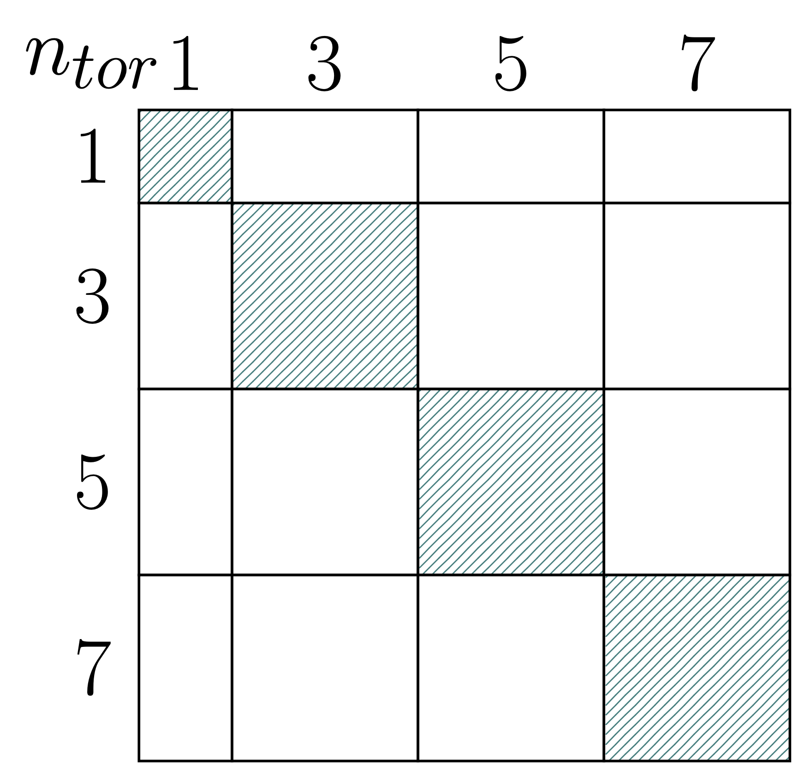
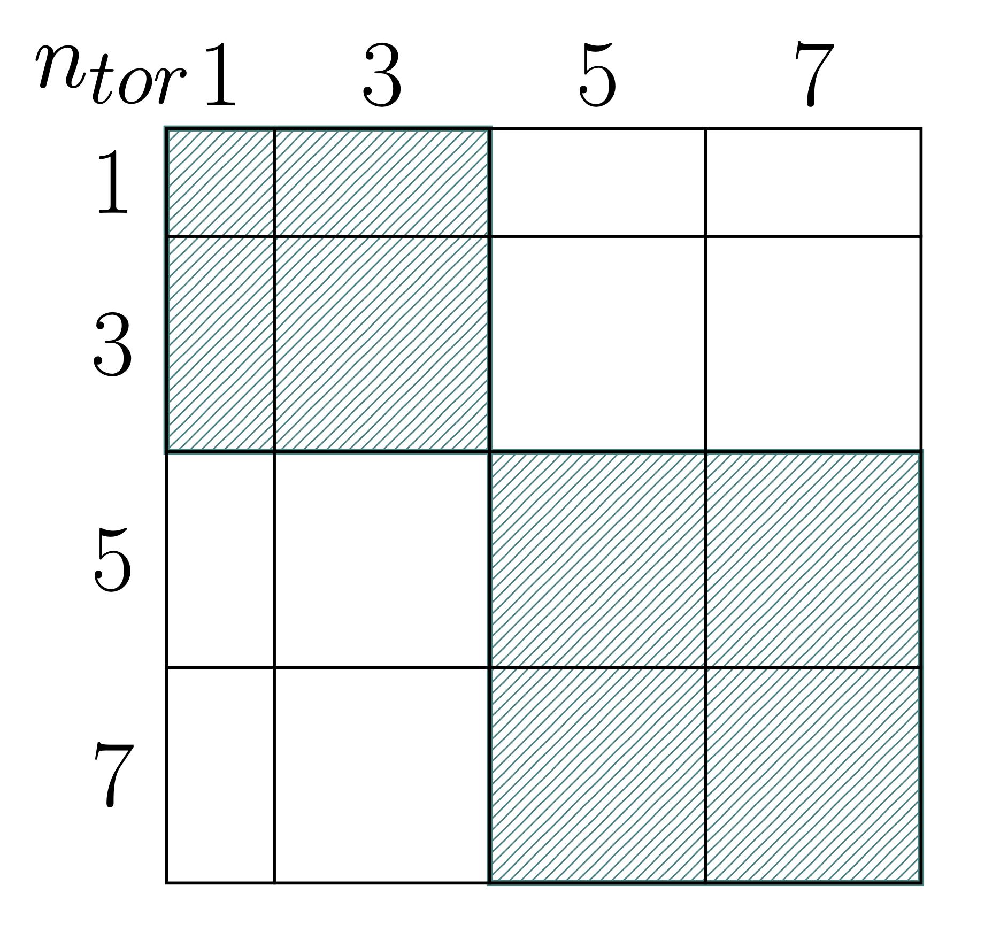

# JOREK Solver
The implicit time integration scheme implemented by JOREK leads to a **large** and **sparse** linear system of the general form:
$$Ax = b$$
The linear system is assembled in a distributed block-COO format (which can be converted to a distributed block-CSR format) partitioned by
**toroidal Fourier harmonics** and **finite-element nodes**, and the solver
infrastructure is designed to exploit that block structure both at the
factorisation and preconditioning level.

Two high-level solution strategies are supported:

| Strategy | When to use |
|---|---|
| **Direct solve** | Robustness-first; Moderate problem sizes |
| **Iterative solve (GMRES / BiCGSTAB + block preconditioner)** | Large problems; Reuse of factorisation across time steps |

Both strategies support multiple third-party libraries as back-ends and can
optionally run the matrix–vector products on GPU hardware.

The main entry point is `solve_sparse_system()` in
`solvers/mod_sparse.f90`.

---

## Direct Solvers

When `gmres = .false.` in the input file, the system is passed directly to one
of the supported sparse-direct libraries.  The library is selected at compile
time via flags (`USE_MUMPS`, `USE_PASTIX`, `USE_STRUMPACK`) and at
runtime by the corresponding `use_*` input flags.

Warning: Factorization of large sparse matrices is an expensive operation and will create a lot of fill-in resulting in increased memory requirements. Thus, for most cases use of the **iterative solver** is recommended! 

---

## Iterative Solvers

When `gmres = .true.`, a Krylov iterative method is used, preconditioned by the
**block harmonic preconditioner** described in the next section.

### GMRES

Left-preconditioned restarted GMRES(m) is implemented in `solvers/mod_gmres.f90`. (A more modern implementatoin avaliable in selected branches is implemented in `solvers/mod_gmres2.f90`).

The algorithm applies the preconditioner $M^{-1}$ to both the initial residual
and to each new Krylov vector.  Orthogonalisation is performed by a
Gram–Schmidt variant (classical or modified, with or without
re-orthogonalisation, controlled at compile time).  Givens rotations maintain
the upper Hessenberg in triangular form in-place.  After each restart the
solution is updated as $x \leftarrow x + V y$, where $y$ minimises the
preconditioned residual over the current Krylov subspace.

Convergence is declared when
$$\frac{\|r_k\|}{\|r_0\|} < \texttt{gmres\_tol}$$
or when the absolute residual drops below a secondary threshold.

Key input parameters:

| Parameter | Default | Description |
|---|---|---|
| `gmres_m` | 40 | Restart dimension |
| `gmres_max_iter` | 400 | Maximum number of outer (restarted) iterations |
| `gmres_tol` | — | Relative residual tolerance |

### BiCGSTAB

BiCGSTAB `solvers/mod_bicgstab.f90` is an
alternative that requires no restart and uses $O(n)$ memory independent of the
iteration count.  It applies the preconditioner **twice per iteration** (once
for the search direction, once for the stabilizer), which is more expensive per
step than GMRES but avoids restarting costs.  Enable it at compile time with the
`USE_BICGSTAB` preprocessor flag.

Warning: Use of BiSCSTAB is generally not recommended.

---

## Preconditioner

The _block harmonic_ preconditioner exploits the **toroidal Fourier structure** of
the MHD system to construct a preconditioner $M$ whose application requires only
independent sparse-direct solves on smaller sub-systems, one per **mode family**.

The preconditioner is set up and applied by
`solvers/mod_preconditioner.f90`.
### Concept

For a purely axisymmetric geometry, toroidal harmonics decouple completely: the
mode-$n$ rows of the system matrix have no coupling to mode-$m \ne n$ columns.
JOREK's matrix does contain inter-harmonic coupling terms (from non-linear MHD),
but the dominant, physics-relevant coupling is intra-harmonic.  The
preconditioner $M$ is therefore built by **grouping the toroidal modes into
families** and assembling one block-diagonal preconditioner matrix per family
that retains all intra-family coupling while discarding the inter-family terms.
Each mode family is then factorised independently by the selected direct-solver
library.

### Mode Family Distribution

Toroidal modes $0, 1, 2, 3, \ldots$ are partitioned into mode families.
Two strategies are available:

- **Automatic** (`autodistribute_modes = .true.`): mode 0 (axisymmetric) forms
  its own family; remaining modes are paired as $(n_1, n_2), (n_3, n_4), \ldots$
- **Manual**: the user specifies `n_mode_families`, `modes_per_family(:)`, and
  `mode_families_modes(:,:)` explicitly.

MPI ranks are distributed among families in the same way:

- **Automatic** (`autodistribute_ranks = .true.`): ranks are distributed as
  equally as possible across families.
- **Manual**: specified via `ranks_per_family(:)`.

  
  <figure style="width: 40%; margin: 0;">
    
    <figcaption><i>Single harmonic pair per block</i></figcaption>
  </figure>

  <figure style="width: 40%; margin: 0;">
    
    <figcaption><i>Grouped harmonic families</i></figcaption>
  </figure>

### Preconditioner Solve Workflow

Each GMRES / BiCGSTAB preconditioner application performs the following steps:

1. **Scatter RHS** — extract the rows belonging to this mode family from the
   global residual vector (via pre-computed `row_index` mapping).
2. **Solve** — the family's direct solver (MUMPS / PaStiX / STRUMPACK)
   factorises (or reuses) and solves the preconditioner matrix for the local
   RHS.
3. **Gather solution** — contributions from all families are reduced by
   `MPI_AllReduce` (sum) into the global solution vector; each family's rows are
   weighted by `row_factor` (normally 1).

### Factorisation Reuse

Refactorising the preconditioner at every time step is expensive.  JOREK reuses
the existing factorisation (the `solve_only` path) when:

$$\texttt{iter\_gmres} + \texttt{iter\_prev} \le 2 \times \texttt{iter\_precon}
\quad \text{and} \quad
\texttt{n\_since\_update} < \texttt{max\_steps\_noUpdate}$$

where `iter_precon` and `max_steps_noUpdate` are input parameters.  When
neither condition is satisfied, the preconditioner matrix is reassembled and
refactorised.

### Preconditioner Matrix Assembly

Two assembly strategies are available (selected by compile-time flag
`DIRECT_CONSTRUCTION`):

- **Direct construction**: each MPI rank assembles its part of the
  preconditioner matrix directly at the finite-element level, without the
  distribution step.
- **Distributed construction**: the full system matrix is communicated via
  `MPI_ALLTOALLV` to the rank groups that own each mode family, which then
  extract their rows locally.

---

## PETSc Integration

> **Note:** PETSc-based solver paths are under active development.
> This section will be expanded once the implementation stabilises.

When compiled with `USE_PETSC, an alternative solver path is
available that uses PETSc's KSP framework for both direct and iterative solves.
The PETSc integration layer lives in `solvers/mod_petsc.f90` and exposes:

- A persistent `KSP` context that is reused across time steps.
- An MPIBAIJ system matrix that can be filled from JOREK's native BCSR data.
- Plug-in preconditioners implemented as PETSc `PCSHELL` or `PCFIELDSPLIT`
  objects.

Details of the PETSc-based preconditioners and their configuration will be
documented separately.