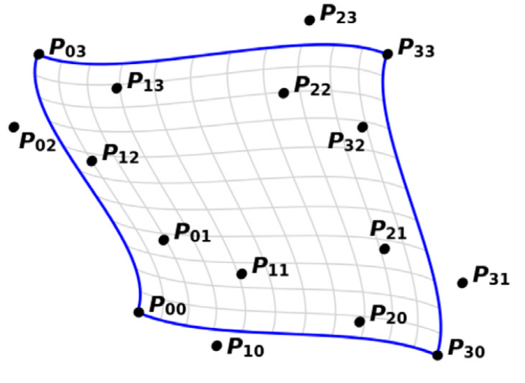

# WARNING: still work in progress
Giacomo is working on this

# Spatial Discretization in JOREK

The discretization of JOREK is well described in the papers [O. Czarny, G. Huysmans, J.Comput.Phys 227, 7423 (2008)](https://www.sciencedirect.com/science/article/pii/S0021999108002118) and [S. Pamela et al. J. Comput. Phys. 464, 111101 (2022)](https://www.sciencedirect.com/science/article/pii/S0021999122001632?via%3Dihub). Here we present a summary of the most important aspects and the code implementation.

As extensively explained [here](http://localhost:4000/doc_repo/docs/physics/coordinates.html), JOREK uses the cylindrical coordinates $(R,Z,\phi)$. The discretization on the poloidal plane (variables $R$ and $Z$) is discretized using 2D Bezier finite elements, discussed in the [following section](#2d-bezier-finite-elements-in-the-poloidal-plane) whereas the discretization along the toroidal direction (variable $\phi$) is performed with a truncated real Fourier series, as explained in [this section](#real-fourier-series-in-toroidal-direction).

On a finite element $K$, using a local coordinate system $s,t$ (see [Appendix A](#appendix-a-introduction-on-bezier-curves-and-bezier-surfaces)), the two discretizations combined read as follows:

$$
\mathbf{X}^{(K)}(s,t,\phi) = \left(\sum_{l=1}^{N_\text{tor}} Z_l(\phi) \left (\sum_{i = 1}^{N_\text{vert}}\sum_{j = 1}^{\text{dof}} h^{ij} \vec{u}^{ijl} b_{i,j}(s,t)\right) \right ) \tag{1}
$$

with $\mathbf{X}$ the vector of variables (i.e. $\rho$, $T$, $u$, ...).
For the geometrical poloidal variables $R,Z$, there is a similar relation:

$$
\begin{pmatrix}
R \\
Z
\end{pmatrix}^{(K)}
(s,t,\phi) 
= \left(\sum_{l=1}^{N_{\text{coord_tor}}} Z_l(\phi) \left (\sum_{i = 1}^{N_{vert}}\sum_{j = 1}^{\text{dof}} h^{ij} \vec{v}^{ijl} b_{i,j}(s,t)\right) \right ) \tag{2}
$$

The inner parenthesis is the poloidal discretization, which uses the basis functions $b_{i,j}$, while $Z_l$ are the basis functions for the toroidal discretization.

Note that when building the mesh, all the degrees of freedom $\vec{v}^{ijl}$ in $(2)$ are fixed as well as $h^{ij}$ (for both $(2)$ and $(1)$).

### Parameters of the formulation
- $N_\text{tor}$, in the code `n_tor` and $N_\text{coord_tor}$, in the code `n_coord_tor`, are two parameters to be specified at compile time (see [this section](#toroidal-discretization-with-real-fourier-series))
- $N_\text{vert}$ is fixed to $4$ 
- $\text{dof}$ (`n_degrees`), that is the number of degrees of freedom for each vertex for each problem variable (ex: $T$), is determined by the polynomial degree `n_order` (user can choose it) with the following relation: `n_degrees = ((n_order+1)/2)^2`.

## 2D Bezier finite elements in the poloidal plane

JOREK uses isoparametric $G_m$-continuous Bezier finite elements for spatial discretization on the poloidal plane $RZ$. Instead of using control points as "direct" degrees of freedom, a different formulation, called *nodal formulation* (see [here](#bezier-finite-element-nodal-representation)), is used, which greatly facilitate imposing $G_m$-continuity across multiple finite elements. What isoparametric and $G_m$-continuous (with $m\in \mathbb{N}$) mean will be explained soon.

For an overview of Bezier curves, Bezier surfaces and how to pass from these to the concept of Bezier finite elements see the [Appendix A](#appendix-a-introduction-on-bezier-curves-and-bezier-surfaces)

We use the parameters $s,t\in [0,1]$ as local coordinates of a Bezier finite element, so the discretization on a single Bezier finite element of degree $n$ reads as

$$
X_\text{pol}^{(K)}(s,t) = \sum_{i=0}^{n}\sum_{j=0}^{n} \mathbf{P}_{ij} B_i^n(s)B_j^n(t) \tag{3}
$$

with $B_i^n$ and $B_j^n$ Bernstein polynomials and $P_{ij}$ control points of the surface.

As explained in the following section, Equation $(3)$ is rewritten in a more convenient way, that is:

$$
X_\text{pol}^{(K)}(s,t) = \sum_{i=0}^{N_\text{vert}-1} \sum_{j=0}^{\text{dof_per_vertex}} h^{ij} \vec{u}^{ij} b_i(s,t)
$$

### Bezier finite element nodal representation
In JOREK a particular formulation of the Bezier finite elements is used, called nodal representation.  
A node is an interpolation point. On a Bezier surface, independently of the polynomial order chosen, the interpolation points are always $4$.  
With nodal representation we mean that the degrees of freedom (the control points) are associated to a node, an interpolation point, instead to an element. Furthermore, control points are divided into groups, based on which node they are auxiliary to (basically, which node they are close to, see illustration in next paragraph), and then are rewritten as the node they are associated to plus some vectors (which are the new degrees of freedom): $\mathbf{P}\_{ij} = \mathbf{P}\_{00} + \sum_l c_l \vec{u}^l$.

When the degree $n$ is odd, each group has $(n+1)^2/4$ points. The nodal representation is not defined in JOREK for $n$ even.  
The vectors used to construct all auxiliary control points of a node $\mathbf{P}\_{00}$ form a vectorial basis local to the node.

In the following of this section we provide an example with bi-cubic Bezier finite element, which is the most used finite element in JOREK. 
Next we discuss about the **generalized nodal representation** to any polynomial order, not only bi-cubic, that is implemented in JOREK and we
show that $G_m$ continuity is simpler to be imposed on such a representation.
Finally we provide an insight on why this particular formulation is chosen and is meaningful.

#### Nodal representation of bi-cubic Bezier finite element
This formulation is based on the following work: [O. Czarny, G. Huysmans, J.Comput.Phys 227, 7423 (2008)](https://www.sciencedirect.com/science/article/pii/S0021999108002118).

With bi-cubic Bezier finite element the Bernstein polynomials' basis is a cartesian product of the cubic Bernstein polynomials' basis. 

The control points are divided in 4 groups as shown in the following illustration with 4 different colors:

$$
\begin{matrix}
\color{red}{30}      &&& \color{red}{31}      &&& \color{green}{32}      &&& \color{green}{33} \\
\color{red}{\times} &&& \color{red}{\bullet} &&& \color{green}{\bullet} &&& \color{green}{\times} \\ \\
\color{red}{20}      &&& \color{red}{21}      &&& \color{green}{22}      &&& \color{green}{23} \\
\color{red}{\bullet} &&& \color{red}{\bullet} &&& \color{green}{\bullet} &&& \color{green}{\bullet} \\ \\
10      &&& 11      &&& \color{blue}{12}      &&& \color{blue}{13} \\
\bullet &&& \bullet &&& \color{blue}{\bullet} &&& \color{blue}{\bullet} \\ \\
00      &&& 01      &&& \color{blue}{02}      &&& \color{blue}{03} \\
\times &&& \bullet &&& \color{blue}{\bullet} &&& \color{blue}{\times} \\ \\
\end{matrix}
$$

Where the $\times$ indicate a node (an interpolation point) and $\bullet$ non-interpolating control points

Then for each group $i$ the vectors $p_i, v_i, u_i$ and $w_i$ are introduced along with 
certain pre-defined quantities $d_{u,i}$ and $d_{v,i}$

$$
\begin{align}
\mathbf{P}_{0,0} &= p_1 \\
\mathbf{P}_{0,1} &= p_1 + v_1\, d_{v,1} \\
\mathbf{P}_{1,0} &= p_1 + u_1\, d_{u,1} \\
\mathbf{P}_{1,1} &= P_{0,1} + P_{1,0} - p_1 + w_1\, d_{u,1}\, d_{v,1} \\ \\
\mathbf{P}_{3,0} &= p_2 \\
\mathbf{P}_{3,1} &= p_2 + v_2\, d_{v,2} \\
\mathbf{P}_{2,0} &= p_2 + u_2\, d_{u,2} \\
\mathbf{P}_{2,1} &= P_{3,1} + P_{2,0} - p_2 + w_2\, d_{u,2}\, d_{v,2} \\ \\
\mathbf{P}_{3,3} &= p_3 \\
\mathbf{P}_{3,2} &= p_3 + v_3\, d_{v,3} \\
\mathbf{P}_{2,3} &= p_3 + u_3\, d_{u,3} \\
\mathbf{P}_{2,2} &= P_{2,3} + P_{3,2} - p_3 + w_3\, d_{u,3}\, d_{v,3} \\ \\
\mathbf{P}_{0,3} &= p_4 \\
\mathbf{P}_{0,2} &= p_4 + v_4\, d_{v,4} \\
\mathbf{P}_{1,3} &= p_4 + u_4\, d_{u,4} \\
\mathbf{P}_{1,2} &= P_{0,2} + P_{1,3} - p_4 + w_4\, d_{u,4}\, d_{v,4}
\end{align}
\tag{4}
$$

In particular, when patching together multiple Bezier finite elements, except for special points (grid axis and x point) or the boundary, each node will be shared by $4$ elements. 
Instead of viewing the _amount of DoF per element_ we look at the _amount of DoF per node_. So instead of the previous illustration, which is useful only to introduce the division of DoF in groups, the following one, centered on one node $\mathbf{P}\_{00}$ where 4 finite elements are glued together, reflects better the formalism used:

$$
\begin{matrix}
\text{-11}      &&& \text{01}      &&& \text{11}      \\ 
\bullet &&& \bullet &&& \bullet  \\ 
\text{-10}      &&& \text{00}      &&& \text{10}      \\ 
\bullet &&& \times &&& \bullet  \\ 
\text{-11} &&& \text{0-1}      &&& \text{1-1}      \\ 
\bullet &&& \bullet &&& \bullet  \\ 
\end{matrix}
$$

In the above illustration, $G_0$ continuity is assumed, indeed the 4 "glued" finite elements share the same control points on the edges (and hence the same edges).

We call $\xi_{11}$ the finite element on the top right of $P_{00}$, $\xi_{-11}$ the one on the top left, $\xi_{-1-1}$ the one on the bottom left and $\xi_{1-1}$ the one on the bottom right.

#### Generalized nodal representation of Bezier finite element
The work [S. Pamela et al. J. Comput. Phys. 464, 111101 (2022)](https://www.sciencedirect.com/science/article/pii/S0021999122001632?via%3Dihub) generalizes what has been shown in the previous paragraph for bi-cubic elements to any degree $n$ and always imposing $G_m$ continuity with $m=(n-1)/2$.
Instead of using $p_i,u_i,v_i,w_i$ vectors, the notation is $u_{ij}$ and $d_{u,i}$ are replaced with $h^{ij}$ For example, in the bi-cubic case we have $u_{i0}:=p_i, u_{i1}:=u_i, ...$. 
Then the generalized formulation, only for group of node $\mathbf{P}_{00}$, reads as follows:

$$
\mathbf{P}_{ij} = h^{ij}\vec{u}^{ij} + \sum_{k=0}^i\sum_{l=0}^j (-1)^{1+i+j+k+l}(1-\delta_{ki}\delta_{lj}) 
\begin{pmatrix}
i \\ k
\end{pmatrix}
\begin{pmatrix}
j \\ l
\end{pmatrix}
\mathbf{P}_{kl} \tag{5}
$$

with $0\leq i,j \leq (n+1)/2$

Technically this formulation is only for the element of 1 of the 4 glued patches sharing $\mathbf{P}\_{00}$, that is for element $\xi_{11}$.
See [Appendix B](#appendix-b-full-generic-nodal-formulation) to see the formulation also for $\xi_{-1-1}$, $\xi_{-11}$, $\xi_{1-1}$.

#### <u>Imposing the continuity on generalized nodal representation</u>
$G_m$ continuity on the shared nodes is obtained by imposing the following constrains.

$\forall j, \ \ h^{-ij}$ is constrained by:

$$
h^{-ij} = 
\begin{cases}
-\alpha h^{ij} & \text{for } i = 1 \text{ and } \alpha > 0 \\
h^{ij} & for i \neq 1
\end{cases} \tag{6a}
$$

$\forall i, \ \ h^{i-j}$ is constrained by:

$$
h^{i-j} = 
\begin{cases}
-\beta h^{ij} & \text{for } j = 1 \text{ and } \beta > 0 \\
h^{ij} & for j \neq 1
\end{cases} \tag{6b}
$$

where negative indexes are used to indicate sizes of elements $\xi_{-11}$ or $\xi_{1-1}$ or $\xi_{-1-1}$. For example $h^{-21}$ would belong to $\xi_{-11}$ ("first negative, second positive").

See [S. Pamela et al. J. Comput. Phys. 464, 111101 (2022)](https://www.sciencedirect.com/science/article/pii/S0021999122001632?via%3Dihub) for the derivation.

#### <u>Brief intuition on the formulation</u>
As demonstrated in Corollary 1 of [S. Pamela et al. J. Comput. Phys. 464, 111101 (2022)](https://www.sciencedirect.com/science/article/pii/S0021999122001632?via%3Dihub), in the particular nodal formulation used, the vectors $u^{ij}$ are **equal** in direction and sign (but not absolute value) with the **derivative** 

$$
\frac{\partial^{i+j} \mathbf{P}}{\partial^{i} s \partial^{j} t}(s=0,t=0)
$$

This is extremely helpful, for instance, when building the mesh, since derivatives of $R$ and $Z$ are used to obtain a flux aligned grid.

### Finite element basis with nodal formulation
Nodal formulation, as shown in the previous paragraph, refers to associating the degrees of freedom (the control points) to a node instead of an element.
Furthermore, control points are rewritten as the node they are associated to plus some vectors (which are the new degrees of freedom). 
This change in the representation of degrees of freedom (from control point to vectors local to one node) implies that formulation $(3)$ has to change and in particular the basis $\{B_i^n(s)B_j^n(t) \}_{i,n=0\dots n}$, associated to the control points, needs to be substituted by a basis associated to vectors $\vec{u}^{ij}$. 
This is obtained by rewriting $(5)$ such that on the right-hand side no $\mathbb{P}\_{xy}$ appears, so that each $\mathbb{P}\_{ij}$ depends uniquely on $h^{xy}$ and $\vec{u}^{xy}$, then substituting this result in $(3)$ and grouping on $\vec{u}^{ij}$. 

The new formulation for an element $K$ reads:

$$
X_{\text{pol}}^{(K)} = \sum_{i=0}^{\text{n_vertices}} \sum_{j=0}^{\text{n_degrees}} h^{ij}\vec{u}^{ij} b_{ij}^n(s,t) \tag{7}
$$

In the cubic case the following basis is obtained:
$$
\begin{array}{r l}
b_{1,1} &= (1 - s)^{2} (1 - t)^{2} (1 + 2 s) (1 + 2 t) \\
b_{1,2} &= 3 (1 - s)^{2} (1 - t)^{2} s (1 + 2 t) \\
b_{1,3} &= 3 (1 - s)^{2} (1 - t)^{2} (1 + 2 s) t \\
b_{1,4} &= 9 (1 - s)^{2} (1 - t)^{2} s t \\
b_{2,1} &= s^{2} (1 - t)^{2} (3 - 2 s) (1 + 2 t) \\
b_{2,2} &= 3 s^{2} (1 - t)^{2} (1 - s) (1 + 2 t) \\
b_{2,3} &= 3 s^{2} (1 - t)^{2} (3 - 2 s) t \\
b_{2,4} &= 9 s^{2} (1 - t)^{2} (1 - s) t \\
b_{3,1} &= s^{2} t^{2} (3 - 2 s) (3 - 2 t) \\
b_{3,2} &= 3 s^{2} t^{2} (1 - s) (3 - 2 t) \\
b_{3,3} &= 3 s^{2} t^{2} (3 - 2 s) (1 - t) \\
b_{3,4} &= 9 s^{2} t^{2} (1 - s) (1 - t) \\
b_{4,1} &= (1 - s)^{2} t^{2} (1 + 2 s) (3 - 2 t) \\
b_{4,2} &= 3 (1 - s)^{2} t^{2} s (3 - 2 t) \\
b_{4,3} &= 3 (1 - s)^{2} t^{2} (1 + 2 s) (1 - t) \\
b_{4,4} &= 9 (1 - s)^{2} t^{2} s (1 - t) .
\end{array}
\tag{8}
$$

### True degrees of freedom, sizes and separation of geometrical coordinates from physical variables
When using Bezier surfaces of degree $n$ and with $\mathbf{P} \in \mathbb{R}^{d}$, each vertex has a basis of $\left(\frac{n+1}{2}\right)^2$ vectors (ex: with $n=3$, 4 vectors). 
Theoretically every entry of $\vec{u}^{ij}$ is a degree of freedom , so the total number of theoretical degrees of freedom is $d$ times the number of vectors.

However spatial coordinates $R$ and $Z$, corrisponding to the first two entries of $\vec{u}^{ij}$, are **fixed** when **building the mesh**. 
So the true number of degrees of freedom is
$$
N_{\text{dof}} = (d-2)\left(\frac{n+1}{2}\right)^2
$$

When building the mesh also the values of the sizes $h^{ij}$ are determined. 

This difference between the use of Bezier curves for geometrical coordinates and for physical coordinates implies that it makes sense to have two separate formulations:

$$
X_\text{pol}^{(K)}(s,t) = \sum_{i=0}^{N_\text{vert}-1} \sum_{j=0}^{\text{dof_per_vertex}} h^{ij} \vec{u}^{ij} b_{ij}(s,t)
$$

and

$$
\begin{pmatrix} R \\ Z
\end{pmatrix}
_\text{pol}^{(K)}(s,t) = \sum_{i=0}^{N_\text{vert}-1} \sum_{j=0}^{\text{dof_per_vertex}} h^{ij} \vec{v}^{ij} b_{ij}(s,t)
$$

Note that $h^{ij}$ and $b_{ij}$ are the same for both formulations! A formulation that has the same basis $\{b_{ij}}$ for both geometical and physical variables is called **isoparametric**.

### Discretization with nodal formulation
With the nodal representation, 

- SPLIT COORDINATE AND PHYSICAL FORMULATION FROM THE VERY BEGINNING or at least be more clear
- talk about vertex ordering (I enumerate them 0,1,2,4 but in which direction? Clockwise or anticlockwise?)
  - does it matter where I set the origin $(s,t)=(0,0)$

## Toroidal discretization with real Fourier series
Toroidal discretization is applied both to the physical variables both to the coordinate variables. As the two formulations are distinct in the poloidal case, as well here are separate. The difference lies in how many elements of the Fourier series are used in the two discretizations.

A real Fourier series ($\cos$, $\sin$) is used, as shown in the following table:

| JOREK harmonic | Toroidal mode number | Toroidal basis function |
|--|--|--|
| 1 | 0 | 1 |
| 2 | $n_\text{period}$ | $\cos(n_\text{period}\phi)$ |
| 3 | $n_\text{period}$ | $\sin(n_\text{period}\phi)$ |
| 4 | $2n_\text{period}$ | $\cos(2n_\text{period}\phi)$ |
| 5 | $2n_\text{period}$ | $\sin(2n_\text{period}\phi)$ |
| ... | ... | ... |
| n_$\text{tor}-1$ | $\frac{n_\text{tor}-1}{2} n_\text{period}$ | $\cos(\frac{n_\text{tor}-1}{2}n_\text{period}\phi)$ |
| n_$\text{tor}$ | $\frac{n_\text{tor}-1}{2} n_\text{period}$ | $\sin(\frac{n_\text{tor}-1}{2}n_\text{period}\phi)$ |

For the physical discretization, **hard-coded parameters** `n_tor` and `n_period` are used to select the harmonics included in the simulation:
  * `n_tor`: Total number of real Fourier modes (odd integer number)
  * `n_period`: Toroidal periodicity (positive integer number)

For the coordinate/geometrical discretization, `n_coord_tor` and `n_coord_period` are used in the same manner.

The **maximum toroidal mode number** included in a simulation is `n_max=(n_tor-1)/2*n_period`.  
A **sufficient number of toroidal planes** is required to avoid aliasing. The minimal requirement is typically `n_plane >= 2 * n_tor`. It is always a good idea to scan `n_plane` for a simulation to ensure convergence. `n_plane` must be a power of 2, if FFTW is not used. If FFTW is used (see [here](/docs/compiling/cat_compiling.md) for more), `n_plane` can be an arbitrary positive integer number, but not for all values FFTW is similarly efficient.

## Putting all together: toroidal and poloidal discretization
When the two discretizations are combined, the poloidal degrees of freedom are now replicated for each poloidal mode $l$. That is, the total number of degrees of freedom is

$$
N_{\text{dof}} = \text{n_tor} (d-2) \left( \frac{n+1}{2}\right)^2
$$

So the formulations $(1)$ and $(2)$ are obtained.

## Implementation in the code
There are 2 fundamental types: `type_node` and `type_element` (see `data_structure.f90`).

`type_node` contains the degrees of freedom $\vec{u}^{ij}$ (for physical variables) in `node%values` array and $\vec{v}^{ij}$ (for coordinates) in `node%x` array.

`type_element` contains the sizes $h^{ij}$ for each vertex.

Here are some examples showing how DoF and sizes are stored. 

Fixed a toroidal number $l \in [0, \text{n_tor}]$, physical degrees of freedom can be accessed as follows:

$$
\begin{align}
&\texttt{node\%values(l,1,1)} \rightarrow p_k  \\
&\texttt{node\%values(l,2,1)} \rightarrow u_k  \\
&\texttt{node\%values(l,3,1)} \rightarrow v_k  \\
&\texttt{node\%values(l,4,1)} \rightarrow w_k 
\end{align}
$$

the first index is the toroidal mode, the second index the degree of freedom and the third index the variable 

$$
\begin{align}
&\texttt{element\%size(k,1)} \rightarrow h^{00} := 1  \\
&\texttt{element\%size(k,2)} \rightarrow h^{10} \\
&\texttt{element\%size(k,3)} \rightarrow h^{01} \\
&\texttt{element\%size(k,4)} \rightarrow h^{11}
\end{align}
$$

$$
\begin{align}
 &\texttt{node\%x(1,\mu)} \rightarrow p_k  \\
 &\texttt{node\%x(2,\mu)} \rightarrow u_k  \\
 &\texttt{node\%x(3,\mu)} \rightarrow v_k  \\
 &\texttt{node\%x(4,\mu)} \rightarrow w_k 
\end{align}
$$

For all $\nu = 1\ldots N_{var}$ and $i_G, j_G = 1\ldots N_{Gauss}$ and $p = 1\ldots N_{plane}$, the variable values at a given Gaussian point $(s_{i_G}, t_{j_G})$ at the toroidal position $\phi_p$ in a given finite element can be expressed by

$$
\begin{align}
X_{\nu}(s_{i_G},t_{j_G},\phi_{p}) &= \sum_{k = 1}^{N_{vert}}\sum_{j = 1}^{N_{ord}}\sum_{l = 1}^{N_{tor}} \mathrm{nodes}(i)\text{\%}\mathrm{values}(1,j,\nu) \\
&\qquad \cdot \mathrm{H}(k,j,i_G,j_G) \cdot \mathrm{element}\text{\%}\mathrm{size}(k,j) \cdot \mathrm{HZ}(1,p)
\end{align}
\tag{9}
$$

### Gaussian points
For the heavy part, that is the integration, precomputed values of basis functions $b_{ij}$ at gaussian points are used. 
These values are computed by the `initialize_basis()` function in `basis_at_gaussian.f90`, called at the start up fo the code.

### Using high order finite elements
When using high order finite elements ($n\geq 7$), basis functions files and their evaluation at gaussian points has to be calculated before compiling the code. To do this, `tools/util/generate_codes_for_norder_gt_7.py` must be invoked. At the beginning of the file there are some parameters to be set, such as `n_order`.

## Appendix A: Introduction on Bezier curves and Bezier surfaces

We start with a brief overview of Bezier curves and then move from this background to the particular formalism used in JOREK.

#### <u>Bezier curves</u>

Bezier curves are parametric curves $\mathbf{P}(t)$ which are controlled by a set of points, intuitively called *control points*.
The parameter $t$ is in the range $[0,1]$.
The first and the last points, namely $\mathbf{P}\_0$ and $\mathbf{P}\_{n - 1}$ on the sequence of control points are interpolation points, that is $\mathbf{P}(0) = \mathbf{P}\_0$ and $\mathbf{P}(1) = \mathbf{P}\_1$.
The influence of the control points on the shape of the curve is determined by the a base $\{B_0(t), \dots, B_n(t)\}$, called *Bernstein polynomials*. Point `i` is associated to the polynomial $\mathbf{P}\_i$, indeed the mathematical expression of the Bezier curve is

$$
\mathbf{P}(t) = \sum_{i = 0}^{n}\mathbf{P}_iB_i(t)
$$

Bernstein polynomial are defined by the following formula:

$$B_{i}^{n}(s) = \frac{n!}{i!(n - i)!} s^{i}(1 - s)^{n - i}\qquad i = 0\ldots n$$

Bernstein polynomials' basis is fundamental in the Bezier finite element framework. In JOREK, it is **not** the basis local to the single finite element, but the latter is derived from the Bernstein basis. More on this in the section [Bezier finite element nodal representation](#bezier-finite-element-nodal-representation).

When referring to Bezier curves of degree $n$ we mean that we have $n + 1$ points and $n + 1$ polynomials of degree $n$.

> **Intuition on Bezier curves**: Bezier curves were invented by the French engineer Pierre Bézier and the intuitive way of building them is through the [de Casteljau's algorithm](https://en.wikipedia.org/wiki/De_Casteljau%27s_algorithm). You can see Bezier curves as Linear intERPolation (in graphics vocabulary, LERP) applied recursively. First, you linearly interpolate with parameter `t` every two consecutivive control points, so you generate `n` points. Then you do the same with this new "derived" control point, again with parameter `t`, until you reach only one point. This is $\mathbf{P}(t)$ The following image depicts what just described:
> 
> 

> **Important note on dimensionality**: It is important to underline that points $\mathbf{P}_i$ can belong to a space $\mathbb{R}^m$ with **any** $m$, given that $m > 1$. Bezier curves are generally though with $\mathbf{P}_i \in \mathbb{R}^2$ but it my be as well $\mathbf{P}_i \in \mathbb{R}^{100}$! Indeed in JOREK the smallest space is $\mathbb{R}^8$ since at least $6$ variables are used.

#### <u>Bezier surfaces</u>

Bezier surfaces can be viewed as the cartesian product of Bezier curves. The basis has now the following form:

$$\{B_{i}(s)B_{j}(t)\}_{i = 0\ldots n,j = 0\ldots n}$$

and to each polynomial there is the corrspective $\mathbf{P}_{i,j}$ element. The Bezier surface then writes:

$$\mathbf{P}(s,t) = \sum_{i = 0}^{n}\sum_{j = 0}^{n}B_{i}^{n}(s)B_{j}^{n}(t)$$

### From Bezier surfaces to Bezier finite elements

In JOREK Bezier surfaces are used for the discretization on the poloidal plane. The points $\mathbf{P}_i$ has as first two coordinates the domain coordinates $R$ and $Z$, whereas the remaining $6+$ coordinates correspond to the variables (functions) of interest (see [here](http://localhost:4000/doc_repo/docs/physics/base_fluid_models/base_fluid_models.html) for the list of variables used).

In its most elementary version a Bezier finite element is nothing but a Bezier surface and the *degrees of freedom* are the points $\mathbf{P}_i$. To be precise, each entry of a point $\mathbf{P}_i \in \mathbb{R}^m$ is a degree of freedom, so the total number of degrees of freedom is $n \cdot m$.

The formulation gets more complex when patching together multiple finite elements to create the global representation. Indeed constraints on the continuity has to be added. We will give now an example with $G_0$ continuity, for a more in depth explanation of $G_0$ and $G_1$ look at [O. Czarny, G. Huysmans, J.Comput.Phys 227, 7423 (2008)](https://www.sciencedirect.com/science/article/pii/S0021999108002118) and for $G_2$ and a generalization for every $G_m$ look at [S. Pamela et al. J. Comput. Phys. 464, 111101 (2022)](https://www.sciencedirect.com/science/article/pii/S0021999122001632?via%3Dihub). 

#### Imposing $G_0$ continuity
In JOREK all the finite elements have $4$ interpolation points and they have $4$ neighbouring finite elements (except on the boundary or on particular points such as the center of the grid). Imposing $G_0$ continuity between two neighbouring finite elements means that all the control points on the "interfacing" edge, that is the 2 shared interpolation points plus the control points along the edge that connects those two interpolation points, must be **equal**. 

For example, with bi-cubic Bezier finite elements, $4$ control points (2 interpolation points and 2 non interpolation points) reside on the edge and has to be imposed equal to the $4$ points of the other finite element.

#### From imposing continuity to the nodal representation
Imposing high continuity involves a great number of control points and so there is not a clear vision of what are the degrees of freedom and what is instead fixed.

The nodal representation, discussed in [this section](#bezier-finite-element-nodal-representation), is meant to greatly simplify this, bringing clarity on what are the degrees of freedom. See the aforementioned section for more details on this.

## Appendix B: full generic nodal formulation
The generic nodal formulation introduced in a [previous paragraph](#generalized-nodal-representation-of-bezier-finite-element) expresses only the control points of element $\xi_{11}$. To represent control points of elements $\xi_{-1-1}$, $\xi_{-11}$, $\xi_{1-1}$, the formulation is basically the same but negative index must be handled. It is fundamental to note that sizes ($h^{ij}$) will vary (they are element-dependent) but the basis vectors $\vec{u}^ij$ will be the same across all 4 elements. 

Formulation for $\xi_{11}$ (same as [previous paragraph](#generalized-nodal-representation-of-bezier-finite-element)):
$$
\mathbf{P}_{ij} = h^{ij}\vec{u}^{ij} + \sum_{k=0}^i\sum_{l=0}^j (-1)^{1+i+j+k+l}(1-\delta_{ki}\delta_{lj}) 
\begin{pmatrix}
i \\ k
\end{pmatrix}
\begin{pmatrix}
j \\ l
\end{pmatrix}
\mathbf{P}_{kl}
$$ 
with $0\leq i,j \leq (n+1)/2$

Formulation for $\xi_{-11}$:
$$
\mathbf{P}_{-ij} = h^{-ij}\vec{u}^{ij} + \sum_{k=0}^i\sum_{l=0}^j (-1)^{1+i+j+k+l}(1-\delta_{ki}\delta_{lj}) 
\begin{pmatrix}
i \\ k
\end{pmatrix}
\begin{pmatrix}
j \\ l
\end{pmatrix}
\mathbf{P}_{-kl}
$$ 
with $0\leq i,j \leq (n+1)/2$

Formulation for $\xi_{-1-1}$:
$$
\mathbf{P}_{-i-j} = h^{-i-j}\vec{u}^{ij} + \sum_{k=0}^i\sum_{l=0}^j (-1)^{1+i+j+k+l}(1-\delta_{ki}\delta_{lj}) 
\begin{pmatrix}
i \\ k
\end{pmatrix}
\begin{pmatrix}
j \\ l
\end{pmatrix}
\mathbf{P}_{-k-l}
$$ 
with $0\leq i,j \leq (n+1)/2$

Formulation for $\xi_{1-1}$:
$$
\mathbf{P}_{i-j} = h^{i-j}\vec{u}^{ij} + \sum_{k=0}^i\sum_{l=0}^j (-1)^{1+i+j+k+l}(1-\delta_{ki}\delta_{lj}) 
\begin{pmatrix}
i \\ k
\end{pmatrix}
\begin{pmatrix}
j \\ l
\end{pmatrix}
\mathbf{P}_{k-l}
$$ 
with $0\leq i,j \leq (n+1)/2$