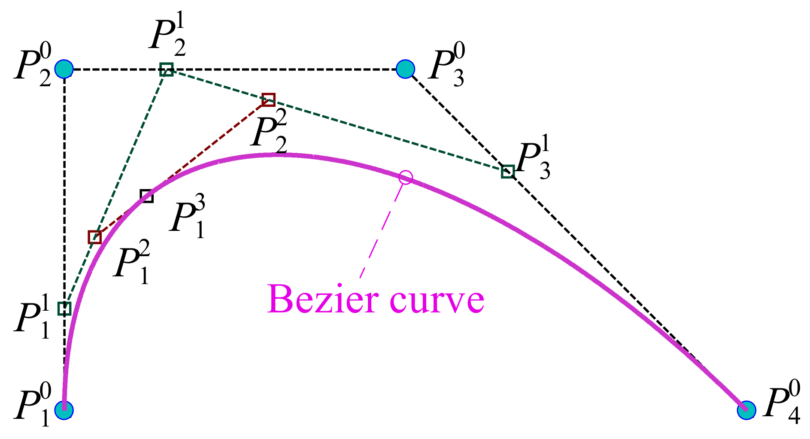

## Introduction to Bezier curves and Bezier surfaces

We start with a brief overview of Bezier curves and then move from this background to the particular formalism used in JOREK.

#### <u>Bezier curves</u>

Bezier curves are parametric curves $\mathbf{P}(t)$ which are controlled by a set of points, intuitively called *control points*.
The parameter $t$ is in the range $[0,1]$.
The first and the last points, namely $\mathbf{P}\_0$ and $\mathbf{P}\_{n - 1}$ on the sequence of control points are interpolation points, that is $\mathbf{P}(0) = \mathbf{P}\_0$ and $\mathbf{P}(1) = \mathbf{P}\_1$.
The influence of the control points on the shape of the curve is determined by the a base $\{B_0(t), \dots, B_n(t)\}$, called *Bernstein polynomials*. Point `i` is associated to the polynomial $\mathbf{P}\_i$, indeed the mathematical expression of the Bezier curve is

$$
\mathbf{P}(t) = \sum_{i = 0}^{n}\mathbf{P}_iB_i(t)
$$

Bernstein polynomial are defined by the following formula:

$$B_{i}^{n}(s) = \frac{n!}{i!(n - i)!} s^{i}(1 - s)^{n - i}\qquad i = 0\ldots n$$

Bernstein polynomials' basis is fundamental in the Bezier finite element framework. In JOREK, it is **not** the basis local to the single finite element, but the latter is derived from the Bernstein basis. More on this in the section [Bezier finite element nodal representation](#bezier-finite-element-nodal-representation).

When referring to Bezier curves of degree $n$ we mean that we have $n + 1$ points and $n + 1$ polynomials of degree $n$.

> **Intuition on Bezier curves**: Bezier curves were invented by the French engineer Pierre Bézier and the intuitive way of building them is through the [de Casteljau's algorithm](https://en.wikipedia.org/wiki/De_Casteljau%27s_algorithm). You can see Bezier curves as Linear intERPolation (in graphics vocabulary, LERP) applied recursively. First, you linearly interpolate with parameter `t` every two consecutivive control points, so you generate `n` points. Then you do the same with this new "derived" control point, again with parameter `t`, until you reach only one point. This is $\mathbf{P}(t)$ The following image depicts what just described:
> 
> 

> **Important note on dimensionality**: It is important to underline that points $\mathbf{P}_i$ can belong to a space $\mathbb{R}^m$ with **any** $m$, given that $m > 1$. Bezier curves are generally though with $\mathbf{P}_i \in \mathbb{R}^2$ but it my be as well $\mathbf{P}_i \in \mathbb{R}^{100}$! Indeed in JOREK the smallest space is $\mathbb{R}^8$ since at least $6$ variables are used.

#### <u>Bezier surfaces</u>

Bezier surfaces can be viewed as the cartesian product of Bezier curves. The basis has now the following form:

$$\{B_{i}(s)B_{j}(t)\}_{i = 0\ldots n,j = 0\ldots n}$$

and to each polynomial there is the corrspective $\mathbf{P}_{i,j}$ element. The Bezier surface then writes:

$$\mathbf{P}(s,t) = \sum_{i = 0}^{n}\sum_{j = 0}^{n}B_{i}^{n}(s)B_{j}^{n}(t)$$

### From Bezier surfaces to Bezier finite elements

In JOREK Bezier surfaces are used for the discretization on the poloidal plane. The points $\mathbf{P}_i$ has as first two coordinates the domain coordinates $R$ and $Z$, whereas the remaining $6+$ coordinates correspond to the variables (functions) of interest (see [here](http://localhost:4000/doc_repo/docs/physics/base_fluid_models/base_fluid_models.html) for the list of variables used).

In its most elementary version a Bezier finite element is nothing but a Bezier surface and the *degrees of freedom* are the points $\mathbf{P}_i$. To be precise, each entry of a point $\mathbf{P}_i \in \mathbb{R}^m$ is a degree of freedom, so the total number of degrees of freedom is $n \cdot m$.

The formulation gets more complex when patching together multiple finite elements to create the global representation. Indeed constraints on the continuity has to be added. We will give now an example with $G_0$ continuity, for a more in depth explanation of $G_0$ and $G_1$ look at [O. Czarny, G. Huysmans, J.Comput.Phys 227, 7423 (2008)](https://www.sciencedirect.com/science/article/pii/S0021999108002118) and for $G_2$ and a generalization for every $G_m$ look at [S. Pamela et al. J. Comput. Phys. 464, 111101 (2022)](https://www.sciencedirect.com/science/article/pii/S0021999122001632?via%3Dihub). 

#### Imposing $G_0$ continuity
In JOREK all the finite elements have $4$ interpolation points and they have $4$ neighbouring finite elements (except on the boundary or on particular points such as the center of the grid). Imposing $G_0$ continuity between two neighbouring finite elements means that all the control points on the "interfacing" edge, that is the 2 shared interpolation points plus the control points along the edge that connects those two interpolation points, must be **equal**. 

For example, with bi-cubic Bezier finite elements, $4$ control points (2 interpolation points and 2 non interpolation points) reside on the edge and has to be imposed equal to the $4$ points of the other finite element.

#### From imposing continuity to the nodal representation
Imposing high continuity involves a great number of control points and so there is not a clear vision of what are the degrees of freedom and what is instead fixed.

The nodal representation, discussed in [this section](#bezier-finite-element-nodal-representation), is meant to greatly simplify this, bringing clarity on what are the degrees of freedom. See the aforementioned section for more details on this.