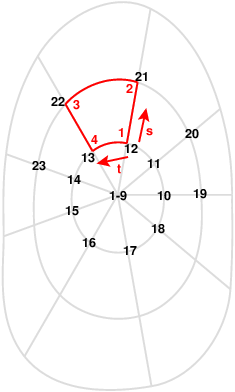

# How does the poloidal mesh uses Bezier finite elements
When building the mesh, formulation $(2)$ in [Introduction to spatial Discretization in JOREK](introduction.md) is used.  
Each element is required to have a certain shape. For example:

This means that $\vec{v}^{ivl}$ and $h^{ij}$ must be imposed accordingly such that formulation $(2)$ in [Introduction to spatial Discretization in JOREK](introduction.md) expresses the desired shape. 

How $\vec{v}^{ivl}$ and $h^{ij}$ are set depends from the type of mesh. 

## Poloidal mesh in tokamaks
Being axisymmetric, tokamaks have the same poloidal mesh for each $\phi_p$ ($p=1\dots \texttt{n_planes}$).
This means that `n_coord_tor=1`. 

## Mesh in stellarators
In stellarators it might be desired to set `n_coord_tor>1` to use Fourier harmonics to model the non axisimmetry of the grid.
