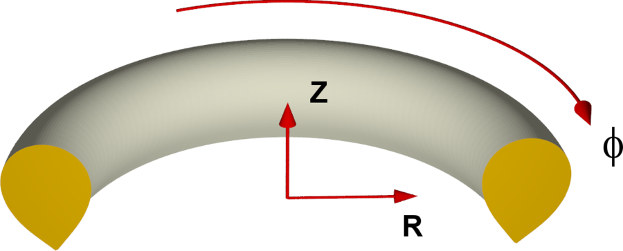

# Basic Cylindrical Coordinate System

Please also look at the [Notation Conventions](notation.md).

The basic cylindrical coordinate system $(u^1,u^2,u^3)=(R,Z,\phi)$ of JOREK is given by
$$\begin{align*}
x &= R~\mathrm{cos} \phi \\
y &= -R~\mathrm{sin} \phi \\
z &= Z,
\end{align*}$$
where $(x,y,z)$ denotes Cartesian coordinates. Thus, $\phi$ goes **clockwise** if looked at from above! **Note this is not always the same for different tokamaks**

**Note:** In element_matrix routines, x and y are used as synonyms for R and Z which must not be confused with the Cartesian coordinates.

## Basis Vectors

__Covariant basis vectors__ $\mathbf{a}_\alpha = \partial\mathbf{X}/\partial u^{\alpha}$ are:
$$\begin{align*}
\mathbf{a}_1 &= \begin{pmatrix} \mathrm{cos}\phi \\ -\mathrm{sin}\phi \\ 0\end{pmatrix}, \quad 
\mathbf{a}_2 &= \begin{pmatrix} 0 \\ 0 \\ 1\end{pmatrix}, \quad 
\mathbf{a}_3 &= \begin{pmatrix} -R~\mathrm{sin}\phi \\ -R~\mathrm{cos}\phi \\ 0\end{pmatrix}
\end{align*}$$

Cross products between the basis vectors:
$$\begin{align*}
\mathbf{a}_1 \times \mathbf{a}_2 &= \mathbf{a}_3/R \\
\mathbf{a}_1 \times \mathbf{a}_3 &= -R~\mathbf{a}_2 \\
\mathbf{a}_2 \times \mathbf{a}_3 &= R~\mathbf{a}_1 \\
\end{align*}$$
and of course: $\mathbf{a}_\alpha \times \mathbf{a}_\alpha = 0$ as well as $\mathbf{a}_\alpha \times \mathbf{a}_\beta = -\mathbf{a}_\beta \times \mathbf{a}_\alpha$. The __contravariant basis vectors__ are given by:
$$\begin{align*}
\mathbf{a}^1 &= \mathbf{a}_1 \\
\mathbf{a}^2 &= \mathbf{a}_2 \\
\mathbf{a}^3 &= \mathbf{a}_3 / R^2
\end{align*}$$

Of course, $\mathbf{a}_\alpha \cdot \mathbf{a}^\beta = \delta_\alpha^\beta$. Also:

$$\begin{align*}
%\begin{split}
\mathbf{a}^1 &= \nabla R  \qquad\qquad \mathbf{a}_1 = J \nabla Z \times \nabla \phi \\
\mathbf{a}^2 &= \nabla Z  \qquad\qquad \mathbf{a}_2 = J \nabla \phi \times \nabla R \\
\mathbf{a}^3 &= \nabla \phi \qquad\qquad \mathbf{a}_3 = J \nabla R \times \nabla Z \\
%\end{split}
\end{align*}$$

and
$$\begin{align*}
\mathbf{a}^1 \times \mathbf{a}^2 &= R\mathbf{a}^3 \\
\mathbf{a}^1 \times \mathbf{a}^3 &= -\mathbf{a}^2/R \\
\mathbf{a}^2 \times \mathbf{a}^3 &= \mathbf{a}^1/R \\
\end{align*}$$

With __J the Jacobian__:

$$\begin{equation*}
  J= \mathbf{a}_1\cdot(\mathbf{a_2}\times\mathbf{a}_3) = R
\end{equation*}$$

__Normalized basis vectors__ are given by:

$$\begin{align*}
  \mathbf{e}_1 \equiv \mathbf{e}^1 &= \mathbf{a}_1 = \mathbf{a}^1 \\
  \mathbf{e}_2 \equiv \mathbf{e}^2 &= \mathbf{a}_2 = \mathbf{a}^2 \\
  \mathbf{e}_3 \equiv \mathbf{e}^3 &= \mathbf{a}_3 / R = R~\mathbf{a}^3
\end{align*}$$

## Metric Tensor 

The co- and contravariant metric tensors are given by:
$$\begin{align*}
g_{\alpha\beta} = \mathbf{a}_\alpha\cdot\mathbf{a}_\beta &= \mathrm{diag}(1,~ 1, ~ R^2) \\
g^{\alpha\beta} = \mathbf{a}^\alpha\cdot\mathbf{a}^\beta &= \mathrm{diag}(1,~ 1, ~ 1/R^2)
\end{align*}$$

The determinant of the covariant metric tensor is
$$\begin{equation*}
g \equiv J^2 =\det{\left(g_{\alpha\beta}\right)}=R^2
\end{equation*}$$

## Differential Operators

### General expressions

$$\begin{align*}
  \nabla U &= \partial_i U \mathbf{a}^i \\
  \nabla \cdot \mathbf{V} &= \frac{1}{J} \partial_i (J V^i) \\
  \nabla \times \mathbf{V} &= \frac{1}{J}(\partial_2 V_3 - \partial_3 V_2)\mathbf{a}_1 + \frac{1}{J}(\partial_3 V_1 - \partial_1 V_3)\mathbf{a}_2 + \frac{1}{J}(\partial_1 V_2 - \partial_2 V_1)\mathbf{a}_3
\end{align*}$$

### Cylindrical coordinates

$$\begin{align*}
  \nabla U                &=\partial_1 U~\mathbf{a}^1
    + \partial_2 U~\mathbf{a}^2 + \partial_3 U~\mathbf{a}^3 \\
  \nabla_\text{pol} U                &=\partial_1 U~\mathbf{a}^1
    + \partial_2 U~\mathbf{a}^2 \\
  \nabla\cdot\mathbf{V}   &=\frac{1}{R}\partial_1 (R V^1) + \partial_2 V^2 + \partial_3 V^3 \\
\nabla \times \mathbf{V} &=  \frac{1}{R}\left(\partial_2 V_3 - \partial_3 V_2 \right)~\mathbf{a}_1
 + \frac{1}{R}\left(\partial_3 V_1 - \partial_1 V_3 \right)~\mathbf{a}_2
+ \frac{1}{R}\left(\partial_1 V_2 - \partial_2 V_1 \right)~\mathbf{a}_3 \\
  \Delta U &= \nabla\cdot\nabla U = \frac{1}{R}\partial_1(R \partial_1 U) + \partial_{2,2}U + \frac{1}{R^2}\partial_{3,3}U \\
  \Delta_\text{pol}U &= \nabla\cdot\nabla_\text{pol} U = \frac{1}{R}\partial_1(R \partial_1 U) + \partial_{2,2}U \\
  \Delta^*U &= R^2 \nabla\cdot\left(\frac{1}{R^2}\nabla_\text{pol} U\right)=R~\partial_1\left(\frac{1}{R}\partial_1 U\right)+\partial_{2,2} U \\
  [A,B] &= e_3 \cdot (\nabla A \times\nabla B) = \partial_1 A~\partial_2 B - \partial_2 A~\partial_1 B\\
  \nabla \cdot \mathbf{\Pi} &= \left[\partial_R \Pi^{RR}+\partial_Z \Pi^{ZR}+\frac{1}{R}\partial_\phi \Pi^{\phi R}+\frac{1}{R}\left(\Pi^{RR}-\Pi^{\phi\phi}\right)\right] \mathbf{e}_R\\
  &+ \left[\partial_R \Pi^{RZ}+\partial_Z \Pi^{ZZ}+\frac{1}{R}\partial_\phi \Pi^{\phi Z}+\frac{1}{R}\Pi^{RZ}\right]\mathbf{e}_Z\\
  &+\left[\partial_R\Pi^{R\phi}+\partial_Z \Pi^{Z\phi}+\frac{1}{R}\partial_\phi\Pi^{\phi\phi}+\frac{1}{R}\Pi^{\phi R}+\frac{1}{R}\Pi^{R\phi}\right]\mathbf{e}_\phi
\end{align*}$$

## Christoffel symbols

### General Expressions

$$\begin{align*}
   \mathbf{A} \cdot \nabla \mathbf{B} &= A^i \partial_i (B^j a_j) = A^i (\partial B^j)a_j + A^i B^j (\partial_i a_j
) = A^i(\partial_i B^j + \Gamma^j_{ik} B^k) a_j\\  (\mathbf{A} \cdot \nabla \mathbf{B})^j &= A^i (\partial_i B^j + \Gamma^j_{ik} B^k)

\end{align*}$$

### Cylindrical coordinates

$$\begin{align*}
\partial_3 \mathbf{a}^1 &= R \nabla \phi = R \mathbf{a}^3 \\
\partial_3 \mathbf{a}^3 &= -\frac{1}{R} \mathbf{a}^1 \\
\partial_1 \mathbf{a}^3 &= -\frac{1}{R} \mathbf{a}^3 \\
\end{align*}$$

## COCOS convention
The tokamak coordinate convention COCOS used by JOREK is 8. This implies the following COCOS coefficients: 
$$\begin{align*}
  e_{\mathrm{Bp}}         &= 0  \\
  \sigma_{\mathrm{Bp}}      &= -1 \\
  \sigma_{R\phi Z}          &= -1 \\
  \sigma_{\rho \theta \phi} &= 1 
\end{align*}$$

For details about the COCOS convention please see
[Sauter, O., Medvedev, S.Yu, Computer Physics Communications 184 (2), 293-302 (2013)](https://www.sciencedirect.com/science/article/pii/S0010465512002962).
