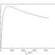

Atomic physics, especially those concerning the ionization-recombination as well as the radiation are frequently used in models with `with_neutrals` and `with_impurities`. This page is to provide a general explanation for our treatment in those models.

In general, we have three different ways of treating atomic physics:

1. Using simply analytically fitted curves, usually assuming Coronal Equilibrium;
2. Using ADAS data base and assuming Coronal Equilibrium for the charge state distribution;
3. Using ADAS data while consider a non-equilibrium charge state distribution using particle projections.

The first method is more or less obsolete and is only rarely used in recent runs.

Since we only have one fluid field to represent the impurity species in `with_impurities` models, currently we could only solve the continuity equation for one "main impurity species". Meanwhile, a number of "background impurity species" with constant density is admitted.

## Deuterium

There are currently three ways implemented to calculate the atomic coefficients for ionization, recombination and the radiation of Deuterium. A comparison is documented in [IMAS-3403](https://jira.iter.org/browse/IMAS-3403).

- An old fit, which is not recommended to use any more and only exists for backwards-compatibility. It's switched on by `old_deuterium_atomic=.true.`. Calculation of the ionization rate is given [below](#ionization-rate-for-deuterium-old-fit).
- A more precise fit of the ADAS coefficients. It is switched on by default, i.e. with `old_deuterium_atomic=.false.` and `deuterium_adas=.false.`.
- Use of the original (interpolated) ADAS coefficients. It is switched on by `deuterium_adas=.true.`. This requires to download the coefficients separately by `./util/fetch_openadas.sh 96_h`.

### Ionization rate for Deuterium (Old fit)

For the ionization rate we use a parameterization from [G. S. Voronov, “A practical fit formula for ionization rate coefficients of atoms and ions by electron impact: Z¼1-28,” At. Data Nucl. Data Tables 65(1), 1–35 (1997)](http://www.sciencedirect.com/science/article/pii/S0092640X97907324) (which is for Hydrogen actually):

\begin{aligned}
\langle \sigma v \rangle_{ion} \; [\mathrm{m}^3/\mathrm{s}] = C_1 \cdot (C_2 + C_3/T_e[\mathrm{eV}])^{-1} \cdot (C_3/T_e[\mathrm{eV}])^{\alpha} \cdot \exp(-C_3/T_e[\mathrm{eV}])
\end{aligned}

where $C_1 = 0.291 \cdot 10^{-13}$, $C_2 = 0.232$, $C_3 = 13.6$ and $\alpha = 0.39$.

In order to convert to JOREK units (JU), we have to pay attention to the fact that $\langle \sigma v \rangle_{ion}$ is to be used in a formulation of the type:

\begin{aligned}
\partial_t n_e = \ldots + n_e n_n \langle \sigma v \rangle_{ion}
\end{aligned}

whereas in JOREK we use mass densities and therefore use a formulation of the type:

\begin{aligned}
\partial_t \rho = \ldots + \rho \rho_n S_{ion}
\end{aligned}

The consequence is that $S_{ion} \; [\mathrm{JU}] = \mu_0^{1/2} \rho_0^{3/2} m_0^{-1} \langle \sigma v \rangle_{ion} \; [\mathrm{m}^3/\mathrm{s}]$ where $m_0$ is the ion (or neutral, which is the same) mass (in the code, $m_0$ corresponds to `central_mass*ATOMIC_MASS_UNIT`).

Using the JOREK temperature $T$ which is assumed to be $2 \cdot T_e$, we get, in JOREK units (which are implicit for concision):

\begin{aligned}
S_{ion} = C_{1J} \cdot (C_{2J} + C_{3J}/T)^{-1} \cdot (C_{3J}/T)^{\alpha} \cdot \exp(-C_{3J}/T)
\end{aligned}

where $C_{1J} = \mu_0^{1/2} \rho_0^{3/2} m_0^{-1} C_1$, $C_{2J} = C_2$ and $C_{3J} = C_3 T[\mathrm{JU}]/T_e[\mathrm{eV}] = 2 C_3 e \mu_0 n_0$.

In JOREK we also use $dS_{ion}/dT$, which can expressed like this (in JOREK units):

\begin{aligned}
dS_{ion}/dT = S_{ion} \cdot \left[ -\alpha/T + \frac{C_{3J}}{T(C_{2J}T+C_{3J})} + C_{3J} T^{-2} \right]
\end{aligned}

Note that to avoid any problems related to negative temperatures, in the code we cut the ionization for $T_e[\mathrm{eV}] < 0.1$.

## Radiative cooling rate for impurities

A more generic handling of the radiation from background impurities has been implemented in model 500, using ADAS data instead of hard-coded parameters. More details of the implementation can be found in [this pull request](https://git.iter.org/projects/STAB/repos/jorek/pull-requests/463/overview). Note that the original hard-coded fitting **for argon** is retained in the code, the users can set `use_imp_adas` to false if they would prefer using the fitting instead of calling open adas for argon.

To use the new features (for single impurity type), the users will need to specify the following parameters in the input file:

- `imp_type`: type of the impurity species such as argon (`'Ar'`), neon (`'Ne'`), tungsten (`'W'`), etc.
- `nimp_bg`: background impurity density (/m³); 0 by default
- `adas_dir`: directory where the adf11 files regarding ACD, SCD, PLT, PRB etc. are stored; these can be downloaded using `jorek/util/fetch_openadas.sh`

Further updates have been done to allow the user to use **multiple** (up to 5 for now) background impurities, as detailed in [another pull request](https://git.iter.org/projects/STAB/repos/jorek/pull-requests/600/overview). To use this new feature, one needs to specify `n_adas` in the input file, which represents the number of impurity species considered, and the `imp_type` and `nimp_bg` in this case should be arrays. For example, one can specify the following to use a mixture of neon (1e17 m⁻³) and tungsten (1e15 m⁻³), with the ADAS files stored in the same `adas_dir` (`'~/adas_data_files/'` for instance):

- n_adas = 2
- nimp_bg = 1.d17, 1.d15
- imp_type = 'Ne', 'W'
- adas_dir = '~/adas_data_files/'

**N.B.:**

- Only radiated power and emission coefficients are considered, assuming coronal equilibrium, whereas the ionization power sink caused by the background impurity is not included yet.
- In model 501, the same parameter `imp_type` is used to specify the impurity species of the injected material from MGI, SPI, etc.

## Main and background impurity species

In `with_impurities` models, one could specify one "main impurity species" along with the aforementioned background species. We will solve the continuity equation of this species instead of using a constant density. Users have to nominate the main species in the `index_main_imp` input parameter, for example:

- n_adas = 3
- index_main_imp = 1
- imp_type = 'Ne', 'Be', 'W'
- nimp_bg = 0., 3.5d17, 3.5d11
- adas_dir = '~/adas_data_files/'

In the above case, the total number of impurity species is 3. The first one, neon, is the main species. Since we are solving its continuity equation, the `nimp_bg` for neon is irrelevant. For the other two species, their constant density is given in `nimp_bg`.

Note that `n_adas` should not be larger than `n_imp_max` which is a hard-coded parameter.  
Also note that currently only one main species could be nominated at one time.

## Particle projection

Without particle model, we usually assume Coronal Equilibrium when treating impurity species. With particle model, the charge state distribution and accompanying radiation is projected from the particle moments, making non-equilibrium description of impurities possible.
