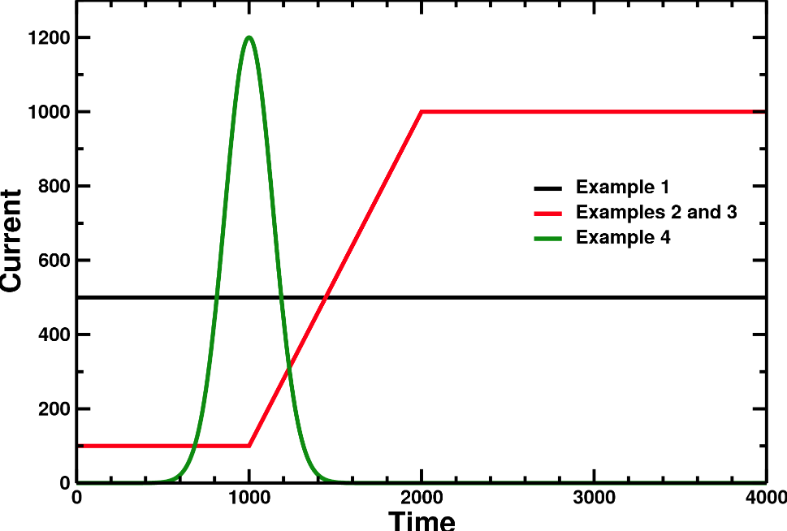

This page describes the JOREK setup for free-boundary mode that are common for both STARWALL and CARIDDI. In this page you will find

* [What do I need to run JOREK in free-boundary mode?](#what-do-i-need-to-run-jorek-in-free-boundary-mode)
    * [Getting the response file](#getting-the-response-file)
* [JOREK input file free-boundary parameters](#jorek-input-file-free-boundary-parameters)
    * [Main parameters](#main-parameters)
    * [Coil current parameters](#coil-current-parameters)
        * [Visualizing coil currents with plot_live_data.sh](#visualizing-coil-currents-with-plot_live_datash)
    * [Free-boundary equilibrium parameters and advices](#free-boundary-equilibrium-parameters-and-advices)

## What do I need to run JOREK in free-boundary mode?
1. A wall-vacuum response file within the JOREK running directory. For STARWAL this file's name is **starwall-response.dat**, which is computed by STARWALL.
2. Set specific input parameters in the JOREK input file.

See [this tutorial](./jorek_startwall_tutorial_ex1.md) to get started.

### Getting the response file
1. Run JOREK with `freeboundary=.t.` in the input file. JOREK will stop and the **boundary.txt** file with the geometry of the coupling surface will appear in the folder.
2. Copy **boundary.txt** to the STARWALl or CARIDDI run folder.
3. [Run STARWALL](./running_STARWALL.md) or [Run CARIDDI](./running_CARIDDI.md)
4. Copy the response.dat file produced by STARWALL or CARIDDI in the JOREK running directory

## JOREK input file free-boundary parameters

### Main parameters
| Parameter | Description |
|-----------|-------------|
| `freeboundary` | Run with free-boundary activated |
| `freeboundary_equil` | Run a free boundary equilibrium instead of a fixed boundary equilibrium, see [free-boundary equilibrium](#free-boundary-equilibrium-parameters-and-advices). |
| `wall_resistivity_fact` | Scale wall and coil resistivities by this factor (default=1.0). The nominal wall and coil resistivity is setup in the input files of STARWALL and CARIDDI |

### Coil current parameters

Sometimes coil currents are needed to run, for example to compute a free-boundary equilibrium or to do RMP studies. For each coil, the time trace of the current evolution (in **Amperes/turn**) can be prescribed in the JOREK namelist input file. This is done separately for:
- `rmp_coils(*)`
- `pf_coils(*)`

> **Note:** The `voltage_coils` are not yet completely implemented, and for `diag_coils` prescribing a current is usually not useful.

**Sign convention:** is such that a positive current in the input file follows the positive phi direction as in the [JOREK coordinate system](../../../physics/coordinates.md). 

> **IMPORTANT:** If you want the coils to have the exact currents you prescribe, you must set the coil resistance with a very high value (around `1.d0` will be ok). The coil currents will decay to the prescribed currents in the resistive time of the coils. See the [Run STARWALL](./running_STARWALL.md) or [Run CARIDDI](./running_CARIDDI.md) for more information.

There are several ways for prescribing the current time trace. The following examples illustrate different approaches:



#### 1) Constant in time

```fortran
rmp_coils(1)%current = 500.
```

#### 2) Constant in time plus a perturbation

```fortran
rmp_coils(1)%current          = 100.
rmp_coils(1)%pert             = 1000.
rmp_coils(1)%pert_start_time  = 1000.
rmp_coils(1)%pert_growth_time = 1000.
```

The current is ramped up linearly from `current` to `current+pert` from time `pert_start_time` to `pert_start_time+pert_growth_time` and then remains constant.

#### 3) Prescribed by an ASCII file

```fortran
rmp_coils(1)%curr_file = 'file_name'
```

The file needs to contain time points in the first column and current values in the second column. Example:

```
0.    100.
1000. 100.
2000. 1000.
1.e5  1000.
```

#### 4) Analytical expression

```fortran
rmp_coils(1)%curr_expr = '1200*exp(-(t-1000.)**2/(200.)**2)'
rmp_coils(1)%max_time  = 10000.
rmp_coils(1)%len       = 2000
```

An analytical expression can be provided and is evaluated at the beginning of the simulation by calling Python. **It is important** to specify:
- `max_time`: covers the complete simulation time
- `len`: number of points the expression is evaluated on

In the example, the expression is evaluated on 2000 points between t=0 and t=10000. **Set `max_time` and `len` carefully!**

#### Additional modifiers

Scale the time, shift the time, and scale the amplitude using the following parameters:

```fortran
rmp_coils(1)%time_scale  = 2.d0   ! slow down current evolution by factor two
rmp_coils(1)%time_shift  = 100.   ! shift the current evolution to take place dt=100 later
rmp_coils(1)%curr_scale  = 2.d0   ! increase currents by factor two
```

For time, the scaling factor is applied first, then the shift.

#### Visualizing coil currents with plot_live_data.sh: 
The input of the coils in the JOREK input files is done in amperes/turn (see above). However, the output in plot_live_data.sh is normalized by $I_{SI} = I/\mu_0$. You can plot the time trace with plot_live_data.sh with -q pf_coil, -q rmp, -q diag for the PF coils, RMP, coils and diagnostic coils respectively.

### Free-boundary equilibrium parameters and advices

To run a free-boundary equilibrium, include the mode n=0 in the response file. You also need a separate to specify the corresponding equilibrium coils in either STARWALL or CARIDDI.

With the correct response file, set the coil currents and free-boundary equilibrium parameters in the JOREK input file:

```fortran
freeboundary = .t.
freeboundary_equil = .t.

pf_coils(1)%current     =  2.6d+4     ! Amperes/turn
pf_coils(2)%current     = -2.6d+4
pf_coils(3)%current     =  1.0d+4
pf_coils(4)%current     =  1.0d+4

amix_freeb = 0.d0        ! To speed up convergence

use_mumps_eq = .t.       ! Optional, but works much faster than Pastix 5

cte_current_FB_fact = 1. ! Multiplies T and FF' profiles with this factor at start of freebnd iterations
```

Run the equilibrium. If coil geometry and currents are correct, it should converge. First, verify that the fixed boundary equilibrium converges to the right solution before running on free-boundary. If you experience convergence problems in free-boundary mode:
- Try increasing `amix_freeb` to values between 0.5 and 0.9 (helps when the fixed boundary equilibrium differs from the free-boundary solution)
- Use `cte_current_FB_fact` to scale the current density profile to obtain the desired final total plasma current

#### **OLD:** Controlling total current and vertical position during Grad-Shafranov (Picard) iterations

To use the old Picard iterations with feedback on vertical position and total current, set in the JOREK input file:

```fortran
newton_GS_freebnd = .f.
```

This feature remains useful if you want to impose a given plasma current and vertical position.

Free-boundary equilibrium computations require active feedback on the plasma total current ($I_p$) and vertical position ($Z_{axis}$ if vertically unstable) during Picard iterations. Tune these feedback parameters for convergence:

| Parameter | Description |
|-----------|-------------|
| `current_ref` | Target total plasma current (wished final current in Amperes) |
| `n_feedback_current` | Apply $I_p$ feedback each "n" Picard iterations |
| `FB_Ip_position` | Strength of $I_p$ correction per iteration, proportional to $(I_p - I_{p,ref})$ (experimental values: 0.1–2.0) |
| `FB_Ip_integral` | Integral feedback parameter for $I_p$ correction, accounts for feedback history (experimental values: ~0.01) |
| `Z_axis_ref` | Target $Z$ position of the magnetic axis (in meters) |
| `n_feedback_vertical` | Apply $Z_{axis}$ feedback each "n" Picard iterations |
| `FB_Zaxis_position` | Strength of $Z_{axis}$ correction per iteration, proportional to $(Z_{axis} - Z_{axis,ref})$ (experimental values: 1.0–20.0) |
| `FB_Zaxis_integral` | Integral feedback parameter for $Z_{axis}$ correction (experimental values: ~0.01) |
| `FB_Zaxis_derivative` | Derivative feedback parameter, proportional to $Z_{axis}-Z_{axis,old}$, where $Z_{axis,old}$ is the previous iteration position |
| `start_VFB` | Iteration number at which to begin $Z_{axis}$ feedback |

Indicate which coils are used for vertical feedback:

```fortran
vert_FB_amp(3) = -1.d0
vert_FB_amp(4) =  2.5d0
```

The coil number 4 will increase its current if plasma moves upwards (positive sign). Use minus sign for upper coils and plus for lower coils. The value 2.5 indicates relative feedback strength—coil 4 current changes 2.5 times faster than coil 3. Set to 0.0 to disable feedback for a coil.

#### Other useful free-boundary equilibrium parameters

| Parameter | Description |
|-----------|-------------|
| `n_iter_freeb` | Maximum number of iterations for the free-boundary equilibrium |
| `amix_freeb` | Mixing factor for free-boundary equilibrium; range (0.5–0.95) depending on case complexity |
| `equil_accuracy_freeb` | Convergence tolerance (1.d-6 is reasonable) |
| `freeb_equil_iterate_area` | Limiter plasmas only. Defines plasma boundary as the flux contour enclosing the final plasma area from fixed-boundary equilibrium. With $I_p$ feedback, ensures plasma resembles fixed-boundary solution (same area, same $I_p$) |
| `psi_offset_freeb` | Shift psi by a global constant to smooth transition between fixed-boundary and free-boundary equilibrium |


